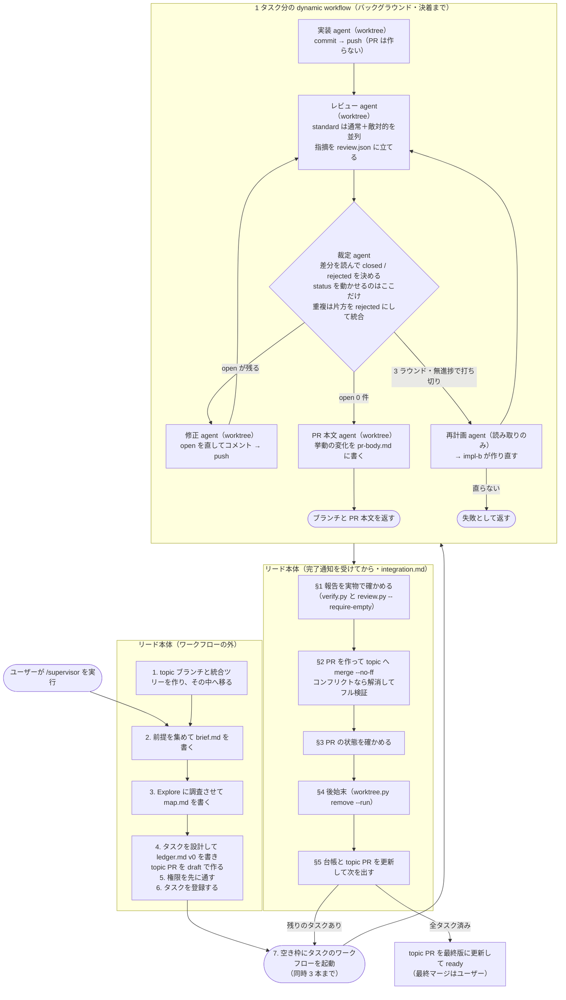

# 設計の理由（必要なときだけ読む）

`SKILL.md` 本体は「何をするか」だけを書く。読み込まれた本体はターン全体でコンテキストに残り、
毎ターン再送されてトークンになるためである（公式の
[スキルの書き方](https://code.claude.com/docs/ja/skills)が「実行内容を述べ、方法や理由を説明する
のではなく」と指示している）。「なぜその設計か」はこのファイルに置く。

ここに書いてあることの多くは、実運用で実際に起きた障害への対策である。各節に事象を添える。

## 目次

どの節に何が書いてあるか。必要な節だけ読めばよい。

- 用語
- 全体の流れ
- なぜ入れ子の subagent をやめて dynamic workflow にしたか
- なぜ 1 タスク = 1 ワークフローか
- なぜ同時 3 本までか
- ワークフローのエージェントは再開できない（調査で確定した制約）
- なぜ起動前の環境変数チェックをやめたか
- なぜ引き継ぎノートをファイルで渡すか
- なぜリードに専用の worktree を与えるか
  - なぜ `EnterWorktree` を必須にし、それでも `-C` を書くか
  - なぜベース資料を統合ツリーの中に置くか
  - なぜデフォルトブランチのポインタを force で戻さないか
- なぜ PR を最後に作るか
- なぜ最初に draft の topic PR を作るか
  - なぜ計画をファイルにしてコミットしないか
  - なぜ topic PR に付いたレビューコメントを扱わないか
- なぜ統合をワークフローに載せないか（最重要の安定性判断）
- なぜ裁定エージェントを毎ラウンド挟むか
  - なぜ `closed` と `rejected` を分けるか
- なぜエスカレーションが「再計画 → impl-b」の 2 段か
- worktree の注意（実害が積み上がっている領域）
- なぜ完了通知を実地検証するか
- なぜ `agent()` の null・no-op を 1 回リトライするか
- なぜ全件決着するまで回すか
- なぜ無進捗を 2 つの指標で測るか
- なぜ長時間ジョブの完了待ちを禁じるか
- なぜタスクのリスク階層でレビューの厳格さを変えるか
- なぜ機械的な段階に effort を効かせるか
- なぜ再レビューの軽重を changeKind で変えるか
- なぜ DoD が曖昧なら実装せず blocked で返すか
- なぜ目標変更・先送りを構造化して返させるか
- なぜレビューを review.json に置くか
  - なぜレビュアーが直接立て、裁定だけが status を動かすか
  - なぜレビュアーに却下を申し送りしないか
  - なぜ本文をスクリプト経由でファイルに置くか
  - なぜ rating を後から変えられなくしたか
  - なぜ再オープンを許すか
  - なぜ空の review.json を先に作らせるか
  - レビュアーが走ったことをどう担保するか
- 壊してはいけない線引き
- 部分統合の帰結
- 統合時の検証をどう絞るか
- サブエージェントの権限（起動前に解消する）
- レビュー精度を上げるプロンプト設計（調査に基づく）
- 引き継ぎノートは要約であって transcript ではない
- 出典

## 用語

このファイルだけを読む人のために、最初に定義する。

- **リード**: `/supervisor` を実行したセッション本体。タスクを設計し、ワークフローを起動し、
  承認済みブランチを topic へ取り込む。
- **dynamic workflow**: Claude Code の公式機能。JavaScript のオーケストレーションスクリプトを
  書くと、ランタイムがバックグラウンドで複数のサブエージェント（スクリプト中の `agent()`）を
  走らせる（[公式ドキュメント](https://code.claude.com/docs/ja/workflows)）。
- **タスク**: 1 ワークフローが完結させる作業単位。1 タスク = 1 ワークフロー = 1 worktree 群 =
  1 ブランチ = 1 PR。
- **topic PR**: base ブランチ（デフォルトブランチまたは `release/*`）へ向けた `topic/<作業名>` の
  PR。作業の初めに draft で作り、全体の計画とタスクの進行状況を本文に持つ
  （「なぜ最初に draft の topic PR を作るか」）。
- **裁定エージェント**: レビュアーが見つけた指摘を集約し、妥当性・重複・対応の必要性を判断して、
  **採用分だけを GitHub に投稿する**エージェント。畳むのもここが行う。
- **review.json**: タスクごとのレビュー記録（`<ベース>/notes/task<番号>/review.json`）。
  `review.py` で読み書きする。**GitHub には出ない。**
- **レビュー（指摘）**: レビュアーが見つけた問題 1 件。`rating` は `must-fix` / `should-fix` /
  `nit` の 3 段階、`status` は `open` / `closed` / `rejected`。
- **決着**: そのタスクの review.json に `open` が 1 件も無い状態。ここまで来て初めて PR を作る。
- **topic PR**: `topic/<作業名>` → base ブランチの PR。全体の計画と進行状況を本文に持ち、
  各タスクのマージコミットが載る。**最終マージはユーザーが 1 回行う。**

## 全体の流れ

リードが本体で行う作業（前提集め・設計・統合・topic PR）と、dynamic workflow がバックグラウンドで
回す作業（実装・レビュー・裁定・修正）を分けて示す。**点線で囲った範囲が 1 つの dynamic
workflow**（1 タスクにつき 1 本起動する）。



topic PR そのものは §4（タスク設計の直後）に draft で作ってあり、取り込みのたびに本文を
更新している（[topic-pr.md](topic-pr.md)）。上の図の最後は「作る」ではなく「仕上げる」である。

## なぜ入れ子の subagent をやめて dynamic workflow にしたか

以前は「リード → サブリーダー subagent → 実装・レビュー subagent」という入れ子で回していた。
サブリーダーに 1 タスクを丸ごと任せる形は、次の 2 点で不安定だった。

- **サブリーダーが turn を終えてしまう**。配下の subagent を `run_in_background: false` で
  同期起動し、結果をその turn の中で受け取る規律を契約に何度書いても、「起動しました。完了を
  待ちます」と言って turn を終える経路が残った。
- **状態がエージェントの頭の中にしかない**。3 ラウンドの修正ループ・打ち切り条件・再開回数の
  管理をサブリーダーの判断に委ねていたため、判断が飛べば静かに壊れた。

dynamic workflow はループ・分岐・打ち切り条件をスクリプト側の制御フローに置く。判断ではなく
コードなので飛ばない。中間結果もスクリプトが保持し、リードの文脈には最終結果だけが返る。

## なぜ 1 タスク = 1 ワークフローか

ワークフローは**完了時にしか通知が来ない**。1 本のワークフローに複数タスクを載せると、承認済み
ブランチの取り込みが全タスク完了後のまとめになり、「承認報告を受けたらその 1 本をその場で
topic へ取り込む。溜めない」（[integration.md](integration.md)）が崩れる。溜めたぶんだけ、
後から取り込むブランチのコンフリクトが増える（タスクブランチは承認時点の topic を起点にした
ままなので、その後に別のタスクが入っていると衝突する）。

Workflow ツールの呼び出しは即座に返るので、リードは複数のワークフローを同時に走らせられる。
1 タスク = 1 ワークフローにすると次が成り立つ。

- 完了通知がタスク単位で届き、届いた順に 1 本ずつ取り込める
- 1 タスクの失敗が他タスクのワークフローに波及しない
- `resumeFromRunId` の再実行が、そのタスクだけで済む
- 台帳の 1 行に `runId` を 1 つ持てばよい

## なぜ同時 3 本までか

律速はマシンではなく統合レーンである。取り込みは 1 本ずつ行う（並列マージはコンフリクトする）
と決めてあるので、本数を増やしても完了は早くならず、承認待ちの滞留とコンフリクトの解きにくさ
だけが増える。

1 タスクの内部は直列（実装 → レビュー → 裁定 → 修正 → …）で、同時に走るのは通常レビューと
敵対的レビューの 2 体だけである。3 本同時でも実際に動くエージェントは 6〜9 体で、ワークフロー
あたりの並列上限（`min(16, CPU コア数 - 2)`）には届かない。

## ワークフローのエージェントは再開できない（調査で確定した制約）

Claude Code 2.1.227 の実装を読んで確かめた事実である。**設計をこの制約の上に組んでいるので、
再開できる前提の手順を書き足さないこと。**

- `agent()` が受け取れるオプションは `label` / `phase` / `schema` / `model` / `effort` /
  `isolation` / `agentType` と、未文書の `disallowedTools` / `bashCommandClamp` / `stallMs`。
  **既存のエージェントを指す引数は無い。**
- ワークフローのサブエージェントは、`SendMessage` / `ListAgents` / `TaskStop` が宛先解決に使う
  レジストリに登録されない（ワークフロー全体が 1 個のタスクとして登録され、個々のエージェントは
  その内部の Map に入るだけ）。**宛先にできない。**
- `/workflows` の画面から個別エージェントにできるのは skip（`agent()` が `null` を返す）と
  retry の 2 つで、**retry は文脈を捨てて同じプロンプトで新規 spawn する**。
- `resumeFromRunId` は「会話の再開」ではなく `journal.jsonl` に記録済みの**戻り値の再生**である。
  キャッシュキーは直前のキーを含むチェーンハッシュで、最初に外れた時点で以降は全部再実行される
  （歯抜けの再利用はできない）。`label` と `phase` はキーに入らないので、変えても無効化されない。
- 「同一セッションのみ」の正体は保存パスである。transcript は
  `~/.claude/projects/<プロジェクトキー>/<セッション ID>/subagents/workflows/<runId>/` に置かれ、
  パスにセッション ID が入る。
- サブエージェントは自分の agent id も transcript のパスも知らない。Bash に渡る
  `CLAUDE_CODE_SESSION_ID` は**親セッションの ID** であって agent id ではない。

未文書のオプション（`disallowedTools` / `bashCommandClamp` / `stallMs`）は**使わない**。実装には
あるが公式ドキュメントに無く、バージョンで変わりうる。

## なぜ起動前の環境変数チェックをやめたか

入れ子で回していた頃は、`.claude/settings.json` の `env` に
`CLAUDE_CODE_MAX_SUBAGENT_SPAWN_DEPTH=5` を入れ、`CLAUDE_CODE_EXPERIMENTAL_AGENT_TEAMS` が
未設定であることを起動前に確かめていた。どちらも根拠が無くなった。

- 公式の[サブエージェント](https://code.claude.com/docs/ja/sub-agents)は「深さは、メイン会話の
  下のサブエージェントレベルの数として数えられます。深さ 5 のサブエージェントは Agent ツールを
  受け取らず、さらに生成することはできません。**制限は固定されており、設定不可能です**」と
  している。環境変数で広げられるものではない。
- ワークフローのサブエージェントは深さ 1 から始まる（transcript の `meta.json` に
  `"spawnDepth":1` が入る）。レビューが `/code-review` を走らせ、その子まで数えても上限に届かない。
- agent teams は `Agent` ツールの入れ子を使う機能で、dynamic workflow とは別の仕組みである。
  サブリーダーを立てなくなった以上、この確認は無関係になった。

## なぜ引き継ぎノートをファイルで渡すか

上の制約により、「同じレビュアーを起こして修正差分だけ見せる」ができない。毎ラウンド新しい
レビュアーが立つので、放っておくと毎回コードベースを一から読み直す。

削りたいのは再探索のコストなので、それをファイルで運ぶ。各エージェントは終える前に
`<ベース>/notes/task<番号>/<役割>-r<ラウンド>.md` へ、読んだ箇所・実行した検証と結果・コード構造の
要点・次に確かめる点を書く。次ラウンドのエージェントは、コードを読む前に同じディレクトリの
自分の役割の過去ノートを全部読む。

- **パスをこちらで決めるので、agent id が分からなくても引き継ぎ先が確定する。**
- 置き場は `place.py base-dir` が返すディレクトリ（統合ツリーの中）なので、git の追跡対象に
  入らず PR の差分を汚さず、どの worktree のエージェントからも読み書きできる
  （下の「なぜベース資料を統合ツリーの中に置くか」）。
- transcript 全文（実測平均 56.7 KB。ツール呼び出しの往復を含む）を読ませる案は採らない。
  ラン内ではスクリプトも各エージェントも対象の transcript のパスを特定できず、内容もノイズが多い。
  ラン跨ぎの立て直しでだけ、リードが前ランの `transcriptDir` を `args` に載せて渡す（リードは
  完了通知で `transcriptDir` を受け取れる）。

## なぜリードに専用の worktree を与えるか

統合レーンは `git checkout` → `git merge --no-ff` → `git push` を繰り返す。以前はこれを**リードが
自分の作業ツリーで**行っていた。つまり**ユーザーが作業しているツリーのカレントブランチを
supervisor が奪う**設計だった。実測すると 3 つの経路で壊れる。

| 状態 | 起きること（git 2.34.1 で実測） |
| --- | --- |
| 追跡ファイルに未コミット変更がある | `git checkout topic/x` が `Please commit your changes or stash them` で `Aborting`。統合が始まらない |
| 新規ファイルを stage している | checkout は通り、そのファイルが topic に持ち越される。続く `git merge --no-ff` が `Your local changes to the following files would be overwritten by merge` で exit 128 |
| 同じ topic が別の worktree で checkout 済み | `fatal: 'topic/x' is already checked out at ...` |

2 番目が最も危ない。コンフリクト解消の経路（[integration.md](integration.md) §2 手順 5）で
リードが `git commit` すると、**ユーザーの作業中ファイルが topic のコミットに混ざる**（実測で
確認した）。

そこで `topic/<作業名>` を載せた**リード専用の worktree**（`.claude/worktrees/supervisor-<作業名>`）
を作り、統合レーンの git をすべて `git -C <統合ツリー>` で打つことにした。得られるもの:

- **ユーザーの作業ツリーに触らない。** カレントブランチが何でも、未コミットの変更があってもよい。
  リードが走っている間もユーザーは自分の作業を続けられる
- **状態が作業名で分かれる。** topic ブランチ・統合ツリー・ベースディレクトリ（`lib/gitpath.py` の
  `base_dir()`）のパスがすべて作業名から決まるので、**別の作業の supervisor が同時に走っても
  衝突しない**（`git worktree list` に 2 本の `supervisor-*` が並ぶことを実測）。ベース資料は
  統合ツリーの中にあるので、`SKILL.md` §8 で統合ツリーを外せばその作業の分だけが消える
- 副産物として、リードの検証コマンドがユーザーの作業ツリーのビルド生成物を汚さない

代償はディスク 1 つ分と、統合レーンの全コマンドに `-C` が付くことである。

### なぜ `EnterWorktree` を必須にし、それでも `-C` を書くか

`-C <統合ツリー>` だけに頼る形は**散文の規律**である。16 か所で付け忘れないことを前提にしていて、
このファイルが他の場所で言っている「監督者の 1 手順にゲートを賭けない」に反する。とくに
`git reset --hard` を付け忘れると、ユーザーの未コミットの変更が消える。

そこで `EnterWorktree` でセッションの cwd を統合ツリーに移す（`SKILL.md` §1）。**素で
`git merge` と打っても統合ツリーに当たるので、付け忘れが無害になる。**

`EnterWorktree` は `allowed-tools` に入れてある。ワークフロー内のエージェントが権限プロンプトで
止まるのと同じ理由で、統合レーンの入口でプロンプトを出さないためである。**失敗したらそこで止める**
——`-C` に切り替えて進める道を用意しない。用意すれば、ユーザーの未コミット変更を 16 か所の
付け忘れに賭ける経路が常設される。統合レーンに到達している時点でセッションは統合ツリーの中に
居る、という不変条件を保つ方を採った。

それでも `-C` を書くのは、**セッションが落ちて別のセッションで再開したとき**に統合ツリーの外から
始まるからである（[ledger.md](ledger.md) の再開手順 1 で入り直すが、忘れることがある）。cwd が
正しいときの `-C` は無害なので、両方あって損がない。

**入っている間は Claude Code 自身が遮断する。** ここには以前「cwd の既定が変わるだけなので
`git -C <メインチェックアウト>` は止められない」と書いていたが、それは誤りだった。公式ドキュメント
（[worktrees](https://code.claude.com/docs/en/worktrees) の "How Claude Code enforces isolation"）に
4 つの検査が挙がっている。**メインチェックアウト**は最初にクローンした作業ツリー——ユーザーが
普段作業している場所で、worktree はそこから枝分かれする。

| 検査 | 遮断するもの |
| --- | --- |
| ファイル編集 | `Edit` / `Write` / `NotebookEdit` が**メインチェックアウト内のパス**を対象にしたとき |
| コマンドの作業ディレクトリ | Bash の cwd がメインチェックアウトに解決されるとき、または外に留まると確かめられないとき |
| git のリダイレクト | `git -C` / `--git-dir` / `GIT_DIR` / `GIT_WORK_TREE` / `cd` でメインチェックアウトへ向けたとき |
| コマンドの形 | worktree の中に収まると静的に追えない形（brace 展開、引用符なしのヒアドキュメント）。git を含まなくても遮断される |

**この 4 つはサブエージェントにも同じように効く**（自分の worktree で走るものも含む）。つまり
「リードがユーザーの作業ツリーを触らない」は散文ではなく Claude Code が担保する。`PreToolUse`
フックを足す案は要らなくなった。

残る散文は「`EnterWorktree` が失敗したら止める」だけである。**入る前は遮断が効かない**ので、
入らずに進めば `git -C` も `git reset --hard` も通る。ここは止める判断そのものに賭けている。

4 番目の検査は、コマンドを 1 行ずつ平たく書くことを要求する。公式ドキュメントが名前を挙げて
いるのは brace 展開と引用符なしのヒアドキュメントで、**コマンド置換（`$(...)`）が当たるかは
確かめていない。** 統合ツリーの中で `$(...)` を書く必要が出たら、パスを受け取る手順と使う手順に
分けるほうが安全である。

### なぜベース資料を統合ツリーの中に置くか

以前はベース資料（`brief.md` / `map.md` / `ledger.md` / `notes/`）を `.git/supervisor/` に置いていた。
作業ツリーに現れないので差分を汚さず、クローンが残る限り残る、という理由である。
**`EnterWorktree` を入れた時点でこれが壊れた。** 実運用で次のとおり観測した。

| 操作（統合ツリーに入った状態） | 結果 |
| --- | --- |
| `Write` で `<メインチェックアウト>/.git/supervisor/...` に書く | 拒否 |
| `Read` で同じパスを読む | 通る |
| Bash の `cp` で同じパスへ運ぶ | 通る |
| `Write` で `/tmp/...` に書く | 通る |
| `Write` で `<メインチェックアウト>/.git/...` に書く（`EnterWorktree` していないセッション） | 通る |

上の 1 番目は「ファイル編集」の検査に当たる。`.git` はメインチェックアウトの中だからである。
つまり**リードは統合ツリーに入った後、台帳を 1 文字も更新できない**。台帳は 1 タスク取り込むたびに
書き換えるものなので（[ledger.md](ledger.md)「台帳を書くタイミング」）、機能として死んでいた。

置き場の条件は「メインチェックアウトの中でないこと」だけである。統合ツリーはメインチェックアウトでは
ないので、リードは自分の cwd として書け、**別の worktree で走るサブエージェントから見ても
メインチェックアウトではない**ので引き継ぎノートを書ける。そこで `.claude/supervisor/` を統合ツリーの
中に作り、`*` の 1 行だけを書いた `.gitignore` を同じディレクトリに置く（`*` は `.gitignore` 自身にも
当たるので、ディレクトリごと `git status` から消えることを実測した）。

**代償は、統合ツリーを外すと台帳も消えることである。** `git worktree remove` は、無視された
ファイルだけが残っている worktree を dirty と見なさず、終了コード 0 で中身ごと消す（実測）。
`.git` 配下はこれに耐えていた。そのため:

- `SKILL.md` §8 は「台帳を消してよいか」と「統合ツリーを外してよいか」を 1 つの確認にまとめ、
  残すと言われたら統合ツリーも残す
- [ledger.md](ledger.md) の再開手順は、統合ツリーが無ければ台帳も無いものとして、git と gh の
  痕跡から書き直す経路に入る

リポジトリの外（`~/.claude/` など）に置けばこの代償は無いが、ユーザーが「worktree の中の git 管理
されない場所」を選んだ。クローンを消せば残骸も消える利点を取った形である。

### なぜデフォルトブランチのポインタを force で戻さないか

以前は「worktree のエージェントが共有側のポインタを動かしたら `git branch -f <デフォルト>
origin/<デフォルト>` で戻す」と書いていた。専用 worktree にすると**この操作が危険になる**。

```
main=a6c8a51  wt の HEAD=71fcdd1
$ git -C wt branch -f main HEAD
  exit=0
結果: main=71fcdd1   ← 動いた
```

**`git branch -f` は、そのブランチが別の worktree で checkout 済みでも通る**（git 2.34.1）。
ユーザーがデフォルトブランチで作業している最中に実行すると、ファイルは残ったまま HEAD だけが
飛び、作業ツリー全体が「大量の未コミット変更」に見える。

自分が起こしていない事故を、ユーザーの作業を壊す操作で直そうとしない。ずれた事実と両方の SHA を
報告して、判断をユーザーに渡す（[integration.md](integration.md) §4 手順 4）。

## なぜ PR を最後に作るか

以前は実装エージェントが最初に PR を作り、レビューの往復を PR のレビュースレッドで行っていた。
新しい形では**全レビューが決着してからリードが PR を作り、そのまま topic へ取り込む**。
理由は 3 つある。

- **人間が読むのは完成形だけになる。** 途中の往復（誤指摘・却下・修正）は PR に出ない。
  PR に載るのは決着した変更と、その挙動の変化である。
- **レビューの記録が GitHub の書式に縛られない。** review.json は 1 件 1 レコードで、
  status 遷移と往復がそのまま残る。GraphQL も隠しメタデータも要らない
  （「なぜレビューを review.json に置くか」）。
- **決着の判定が 1 つの数になる。** 「review.json の `open` が 0 件」だけで判定でき、
  未解決スレッドや PENDING レビューを GitHub に問い合わせる必要が無い。

代償は「**失敗したタスクは GitHub に何も残らない**」ことである。`failed` で終わるとブランチと
review.json だけが残り、ユーザーはリードの報告か push 済みブランチで結果を見る。以前は PR が
最初にあったので、失敗しても PR とスレッドが残っていた。

**PR を作ってすぐ取り込むのは無駄ではない。** PR は「そのタスクで何がどう変わったか」の記録として
残り（マージ後も本文と差分が読める）、topic PR の一覧から辿れる。ワークフローが PR 本文専用の
エージェントを 1 体持つのはこのためである（[pr-body-prompt.md](pr-body-prompt.md)）。

## なぜ最初に draft の topic PR を作るか

以前は topic → デフォルトブランチの PR を全タスク完了後に 1 回だけ作っていた。作業中の進捗は
台帳（`<ベース>/ledger.md`）にしか無く、台帳は git の追跡対象外で統合ツリーを外すと消える
（[ledger.md](ledger.md)）。この形には 3 つの穴があった。

- **走行中はユーザーが進捗を読めない。** 台帳はユーザーのチェックアウトの外（統合ツリーの中）に
  あり、GitHub には何も出ない。タスクが 5 本走っていても、ユーザーが見られるのは個別のタスク PR
  だけで、全体の計画とどこまで進んだかが分からない。
- **統合ツリーを外すと記録が消える。** `git worktree remove` は無視されたファイルを拒まずに消す
  （実測）。仕上げの直前に落ちると、分解も自律判断も残らない。
- **セッションを立て直すと足場が減る。** タスクリストはセッション ID に紐づくので引き継げず、
  台帳が消えていれば git と gh だけで組み直すことになる。

そこで §4（タスク設計の直後）に PR を作り、本文を進捗の置き場にした。空コミット 1 つを §1 で
載せておくのは、base と差分が 0 の状態では `gh pr create` が `No commits between ...` で失敗する
ためである。

**draft にするのは、仕上げが済むまで GitHub 側にマージを拒ませるためである。** 途中の topic は
検証を通していないタスクの組み合わせが載っていることがある（取り込み時に流すのはビルドだけで、
フル検証は後続タスクを起動する直前に行う。[integration.md](integration.md) §5）。§8 で
`merged` が 1 件以上あれば `gh pr ready` に上げ、1 件も無ければ draft のまま残してユーザーに
判断を渡す。**topic ブランチも消さない**——再開手順が `topic/<作業名>` の実在を足場にしている。

**タイトルに接頭辞を付けるのは、PR 一覧で supervisor が管理している PR を見分けるためである**
（`[supervisor]` / `[supervisor #<番号> task<番号>]` / `[supervisor #<番号> followup]`。
[topic-pr.md](topic-pr.md)）。タスク PR には topic PR の番号を入れて、どの作業に属するかを
一覧のタイトルだけで辿れるようにした。PR タイトルを検査する job があるリポジトリでは接頭辞が
先頭にあると落ちるので、そのときだけ末尾に回す。

### なぜ計画をファイルにしてコミットしないか

計画と進行状況を追跡対象のファイル（`docs/supervisor-plan.md` など）にすると、**作業の進め方の
記録がデフォルトブランチにマージされる**。取り込みごとに追記コミットが積み上がり、履歴が進捗の
更新で膨らむ。PR 本文（`gh pr edit --body-file`）はコミットを作らずに何度でも差し替えられるので、
topic に載るコミットは §1 の空コミットと各タスクのマージコミットだけで済む。

### なぜ topic PR に付いたレビューコメントを扱わないか

topic PR は取り込みのたびに差分が増えるので、人間や CI のレビューがそこに付くことがある。そこに
出る指摘の多くは、タスク PR で既に片づけた指摘の再掲である。これをリードに扱わせると、
取り込むたびに同じ指摘の再処理が挟まる。**判断と対応はユーザーに渡す**と決めた（タスク PR に
付いたものはリードが片づける。[integration.md](integration.md)「却下された残件の回収」）。

## なぜ統合をワークフローに載せないか（最重要の安定性判断）

以前はワークフロー内に「マージ準備 → コンフリクト解消レビュー → topic マージ」のエージェント群を
置いていた。廃止し、PR の作成と統合はリード本体が直接行う。

- **マージ担当エージェントは安全クラシファイアに確率的に遮断される**。マージ準備エージェント
  5 体のうち 3 体が「Merge Without Review / External System Writes」を理由に起動を遮断され、
  レビュー承認済みのタスクが未統合のまま失敗で返った実績がある。遮断は確率的で、同一プロンプト
  でも通ることがある——リトライでは安定しない。ユーザーが `/supervisor` を実行したという
  文脈はサブエージェントのトランスクリプトから見えないので、プロンプトの工夫では解決できない。
- **リードのセッションでも `gh pr merge` は遮断される**。許可リスト内の `git merge --no-ff` +
  `git push` なら通り、GitHub は head コミットが base に到達したことを検出してタスク PR を
  自動的に MERGED 判定にする。

副次効果としてコストと時間も下がる。旧構成はタスク 1 本の統合ごとにマージ準備・解消レビュー・
topic マージのエージェントを起動していた。新構成ではこれが全て消え、リードの git 操作に置き換わる。

**PR 作成をワークフローの中に置かないのも同じ判断である。** 外向きの GitHub 操作を 1 か所
（リード）に集めると、遮断されうる操作の場所が読める。

トレードオフ: コンフリクト解消をリードが行うと、そのコードは独立レビューを通らない。これは
(1) 解消後の検証一式と外形動作の実測、(2) 解消が大きいときは単発の fix エージェントと独立
レビューへの委譲（マージ自体は委譲しない）、(3) topic PR の「自律判断の記録」への明記、で補う。

## なぜ裁定エージェントを毎ラウンド挟むか

決着の条件は「review.json の open が 0 件」である。**status を動かせるのは裁定エージェントだけで
ある。** 実装もレビュアーも `review.py status` を呼べない（スクリプトが拒む）。自分で閉じられると
`open == 0` が自己承認になるためである。

裁定者がいないと穴が 3 つ開く。

1. **誤った指摘を下ろせる者がいなくなる。** レビュアーは自分の指摘を取り下げられないので、
   誤指摘は永久に open のまま残り、3 ラウンド打ち切り経由で全件エスカレーションになる。
2. **実装が「直せない・直さない」と判断した件が宙に浮く。** 直すか却下するかを決める主体が
   いないと、修正ラウンドが空回りする。
3. **重複が 2 件のまま残る。** 通常レビューと敵対的レビューは互いを見ないので同じ問題を 2 件
   立てる。統合する主体がいないと、同じ箇所を 2 回直させることになる。

以前はサブリーダーがこれを担っていた。ワークフロー化でサブリーダー層が消えるので、その §5 の
手順を 1 つの `agent()` として切り出した（[judge-prompt.md](judge-prompt.md)）。

**裁定は最後に未解決を残さない責任も負う。** 直さない should-fix / nit は、根拠と「残件である」
ことをコメントに書いて `rejected` にする。残すと `open` が 0 にならず、リードが積めない。
却下しても記録は消えない——リードは返り値の `deferrals` と review.json から残件を拾い、
全タスクが終わってからまとめて回収する（[integration.md](integration.md)「却下された残件の回収」）。

### なぜ `closed` と `rejected` を分けるか

「決着した」を 1 語で表すと、**正しい指摘が直った**のか**指摘を退けた**のかが後から読めない。
リードは決着した review を読んで残件をまとめるので、取り違えると残件表が狂う。`closed` は
「指摘は正しく、対応が済んだ」、`rejected` は「直さない」（誤り・重複・このタスクでは直さない
残件）である。

**却下にもコメントを必須にしている**のは、`rejected` の山が「なぜ直さなかったか」の説明無しに
残ると、リードも次のラウンドの裁定も判断を再現できないからである。

## なぜエスカレーションが「再計画 → impl-b」の 2 段か

修正ループは 3 ラウンド・無進捗で打ち切る。直せなかった指摘を同じやり方でもう一度回しても同じ壁に
当たるので、先に「なぜ直せなかったか」を分析して方針を立て直す。

以前は「実装を捨てて impl-b を立て、impl-b に先に計画を立てさせ、**サブリーダーが計画を読んで
前と同じ方針なら差し戻す**」という形だった。ワークフローにはこの検分の置き場が無い（スクリプトは
文字列の良し悪しを判定できない）。そこで計画を作る役を独立した読み取り専用の `agent()` に切り出し、
その方針をスクリプトが impl-b のプロンプトへ封入する。誰も判定しないまま impl-b の自己申告の計画で
走り出すことがなくなる。

**impl-b のレビューは新規に立てる。** impl-b は方針から作り直すので差分が全面的に入れ替わり、
前のラウンドで open だった指摘は別のコードを指した状態になる。初回レビューと同じ扱いにし、
残った open は裁定が作り直した差分を見て裁き直す。

## worktree の注意（実害が積み上がっている領域）

`isolation: "worktree"` の worktree には癖があり、契約に書いてある規律はすべて実際に起きた障害への
対策である。

- **起点がタスクブランチでも topic でもない。** 既定（設定 `worktree.baseRef` が `"fresh"`）では
  リモートのデフォルトブランチから分岐し、`"head"` にしているユーザーではセッションの HEAD から
  分岐する（公式ドキュメント [worktrees](https://code.claude.com/docs/en/worktrees) の
  "Choose the base branch"）。どちらでも topic にマージ済みの変更は起点に無いので、各エージェントの
  冒頭で `git fetch origin` → `git checkout --detach origin/<起点>` させて自分で載せ直す。
- **ブランチ名を checkout させない（detached HEAD 規律）**。worktree がブランチを掴むと
  `already used by worktree` で後続の checkout が失敗する。detached で作業し
  `git push origin HEAD:refs/heads/<ブランチ>` で push すれば、衝突が構造的に起きない。
- **worktree なしのエージェントに checkout を指示しない**。メイン作業ツリーのブランチを切り替えて
  並列エージェントの検証を汚染し、終了後もメインチェックアウトが一時ブランチに載ったままになった実績がある。
  ブランチを checkout する全エージェント（実装・修正・レビュー・裁定・再計画）に worktree を付ける。
- **プロンプトにリポジトリの絶対パスを書かない**。書くと、worktree 付きのエージェントでもメイン
  ツリー側で `git checkout --detach` を実行して HEAD を外す事故が起きた。「カレントディレクトリ
  （割り当てられた worktree）で作業する」と書く。
- **タスクブランチの先端を worktree のエージェントが置き換えると、PR の MERGED 自動判定が効かなく
  なる**（stale tip）。実体は topic にマージ済みなのに PR が OPEN のまま残った実績が 3 件ある。
  残った OPEN はリードが実体を検証してクローズする（[integration.md](integration.md) §3）。
- **共有側のブランチポインタが動くことがある**。実装エージェントがメインチェックアウト側で
  `git checkout -B` を実行し、デフォルトブランチのポインタを動かした実績がある。ワークフロー完了後に
  `git rev-parse <デフォルトブランチ> origin/<デフォルトブランチ>` の一致を確かめる。
- **後始末の除去は runId で名指しする**。`.claude/worktrees/` 配下を一括 `--force` 除去したら、
  他プロセスの worktree まで削除した事故がある。`worktree.py remove --run <runId>` は
  `git worktree list` に載っているものだけを対象にし、名前が runId で始まるものに限る。
- **ステージ間の受け渡しは worktree ではなく push 済みのタスクブランチで行う**（worktree は他の
  エージェントから見えない）。引き継ぎノートだけは統合ツリーの中に置き、絶対パスで読み書きする。

## なぜ完了通知を実地検証するか

実行中の run に対して「completed」通知が誤発火し、PR 番号・マージ済み報告・もっともらしい失敗談まで
含む**精巧な捏造レポート**が届いた実績がある（実際にはコミットも PR も一切なかった）。さらにその
とき「run は死んだ」と誤診して、生きているエージェントの worktree とブランチを削除する二次被害を
起こした。

完了通知・構造化された返り値・usage の数値のどれも真正性の証拠にならない。信用できるのは実物
（git・gh・transcript の mtime・journal の完了記録）だけなので、レポートに基づいて動く前に必ず
実地検証を挟む（[integration.md](integration.md) §1）。サブエージェントの `blocked` 報告にも誤認が
あった（実測で反証して再投入した実績がある）ので、同じく実物で確かめてから裁く。

## なぜ `agent()` の null・no-op を 1 回リトライするか

`agent()` は throw すると `null` を返す。また、サブエージェントが実作業ゼロ（ツール呼び出し 0 回・
数秒で終了）で「利用可能なスキル一覧」のような定型文だけを返して正常終了する事象がある。結果
テキストが存在するため、中身を確かめないと「レビューが承認した」と誤読して品質の門が素通りする。

同じプロンプトでの再実行で正常に走った実績があるので、1 回だけリトライする
（[workflow-script.md](workflow-script.md) の `agentRetry`）。レビューの schema で `notes`（実施した
検証の要約）を必須にして、指摘ゼロ・検証記録ゼロの応答を no-op として検出する。2 回目も失敗するなら
仕組みの問題の可能性が高いので、無限にはリトライしない。

## なぜ全件決着するまで回すか

以前は「must-fix が 0 件なら承認」とし、承認と同時に残った should-fix を polish で 1 回だけ
清掃していた。**承認と同時に報告された should-fix が一度も修正されないまま統合された実績**への
対策だったが、清掃という別の段を挟む形は「マージしてよいが直すべき」という中間状態を制御フローに
残したままだった。

新しい形では**すべての指摘に決着を要求する**。直すなら `closed`、直さないなら理由つきで
`rejected`。中間状態が無くなるので polish の段が要らなくなり、「直さない」という判断が必ず
記録に残る（却下にはコメントが必須である）。

代償は、`nit` にも毎回判断が要ることである。裁定は `nit` を却下してよいと決めてあるので
（[judge-prompt.md](judge-prompt.md) §3.2）、判断そのものは重くない。

## なぜ無進捗を 2 つの指標で測るか

回数上限だけだと、修正しても指摘が減らないタスクで上限までエージェント（トークン）を無駄に
消費する。公式の [dynamic workflows のドキュメント](https://code.claude.com/docs/en/workflows)も
「チェックが通るか、2 ラウンド連続で無進捗になるまで繰り返す」を推奨している。

判定は「**open の総数と open の must-fix が、両方とも前ラウンド以上**なら停止」とする。
must-fix だけで見ると穴が開く——must-fix が 0 件で should-fix だけが残っている局面では、
前ラウンドも今ラウンドも 0 件なので「前ラウンド以上」に当たり、**直せるはずの should-fix を
残したまま打ち切ってしまう**。総数だけで見るのも危うい。レビュアーが毎ラウンド新しい nit を
立てるので総数が減らず、must-fix が着実に減っていても打ち切られる。両方が減らないときだけ
止める。

## なぜ長時間ジョブの完了待ちを禁じるか

実装エージェントが長時間の fuzz（600 秒 × 3）をバックグラウンド起動して完了を待ったまま打ち切られ、
`agent()` が `null` を返してタスクが止まった実績がある。ジョブ自体は完走しており、変更も worktree に
未コミットで残っていた——失われたのは「成果」ではなく「成果の報告」だけだった。foreground の
`sleep` が塞がれているのでエージェントは `tail -f` 等で待ち続け、その間に打ち切られる。

対策は「待ちに入る前に必ず commit・push する」を契約に入れること、そもそも長時間ジョブはリードが
先に流すかタスクを分割することである。

## なぜタスクのリスク階層でレビューの厳格さを変えるか

全タスク・全ラウンドで「通常＋敵対的」の 2 本立てを `opus` で回すと、レビューだけで大きなトークンに
なる（1 タスクが 3 修正ラウンド回ると `opus` のレビューが 8 本）。品質を落とさずに削るため、各
タスクに `tier` を付けて厳格さを段階化する。

- **light**（docs 追随・生成物の機械的更新・中核ロジックに触れない小変更）: 敵対的レビューが拾う
  「前提の誤り」のリスクが小さい。通常レビュー 1 本・`sonnet` にする。
- **standard**（ロジック・中核・挙動の変更）: 通常＋敵対的・`opus`。**迷ったら standard にする**
  （誤って light にすると敵対的レビューの網が外れる）。

自己承認の防止（修正とレビューは別セッション）・統合時の実測検証・topic への人間ゲートといった中核の
保証は tier に関わらず維持する。削るのは「敵対的レビューの二重化」と「上位モデル」だけである。

同じ理由で、**敵対的レビューに検証コマンド一式の実測を繰り返させない**。同一ツリーに対する同じ
コマンド群の結果は決定的に同じで、再実行は純粋な重複になる。敵対的レビューが流すのは反証のために
的を絞ったテストに限る。

## なぜ機械的な段階に effort を効かせるか

`agent()` は `effort`（`low`〜`max`）を取れる。判断を伴わない機械的な作業（doc だけの修正の再確認
など）は低い effort でも結果が変わらないので、`effort: 'low'` に落として推論のオーバーヘッドを削る。
判断が質を左右する実装・レビューは既定〜`medium` を保つ。

入れ子の subagent で回していた頃は `Agent` ツールの spawn 時に effort を指定できず、軽くしたいときは
`model` を下げるしかなかった。ワークフローではこの制約が無い。

## なぜ再レビューの軽重を changeKind で変えるか

修正が doc・コメントだけなら、敵対的レビューまで回すのは過剰である。修正エージェントが
`changeKind` を返し、`"docs"` なら通常レビュー 1 本・`effort: 'low'`、`"logic"` ならタスクの tier
どおりのフルレビューにする。

## なぜ DoD が曖昧なら実装せず blocked で返すか

実装エージェントは自分で調べて実装するが、DoD の解釈が割れたまま推測で着手すると、意図と違うものを
作ってやり直しになり、修正ループ（トークン）を無駄に使う。計画の段階で DoD が一意に定まらないと
判断したら、推測で進めず `blocked` と疑問点を返す。曖昧さを実装前に潰す方が、作ってからやり直すより
安い。

**ワークフローの実行中はユーザーに確認できない**（権限プロンプト以外でワークフローを止められない）。
そのため確認が要る事態はタスクを `blocked` で返させ、リードが受け取ってユーザーに確認する。
1 タスク = 1 ワークフローなので、確認後はそのタスクだけを組み直して起動し直せばよい。

## なぜ目標変更・先送りを構造化して返させるか

自律進行では、実装・修正エージェントが「この部分は今回やらない」「DoD をこう解釈した」といった判断を
下すことがある。これがバックグラウンド実行の中に埋もれると、リードもユーザーも「いつの間にか目標が
変わった・やるはずの作業が消えた」ことに気づけない。

そこで返り値に `decisions`（変えた目標・DoD・スコープ）と `deferrals`（先送り・対象外）を持たせ、
スクリプトが `carry` に集めてリードまで上げる。リードは topic PR の専用セクションと最終報告にまとめる。
台帳は commit しないので、**PR 本文への転記を省くと記録がリポジトリに残らない。**

## なぜレビューを review.json に置くか

PR を最後に作るので、レビューが走っている間 GitHub 側に置き場が無い（「なぜ PR を最後に作るか」）。
そこでタスクごとのファイルに閉じ込め、`review.py` 経由でだけ読み書きする。

- **決着の判定が 1 つの数になる。** `open` が 0 件かどうかだけで、次のラウンドを回すか PR に
  進むかが決まる。GraphQL でスレッドを数える必要も、PENDING レビューの取りこぼしを心配する
  必要も無くなった。
- **本文がスクリプトの分岐を通らない。** `schema` で返させるのは件数と検証の要約だけである
  （本文と件数を両方 schema で返す設計では、`severity` を欠落させた指摘が分岐をすり抜けた実績が
  ある）。
- **往復がそのまま残る。** 誰が何を言って status がどう動いたかが 1 ファイルに並ぶので、
  次のラウンドの裁定も、立て直したワークフローも、続きから読める。
- **PR には決着した結果だけが出る。** 誤指摘も却下も PR には現れない。人間が読むのは完成形である。

### なぜレビュアーが直接立て、裁定だけが status を動かすか

以前は「レビュアーが下書きをファイルに書き、裁定が重複を統合して採用分だけを GitHub に投稿する」
形だった。**同じ nit がラウンドごとに新しいスレッドとして積み上がった**症状への対策で、
突き合わせを投稿の前に移したものである。

review.json では投稿という段が無くなるので、**レビュアーが直接立てて裁定が status で決着させる**
形にした。重複は「片方を `rejected` にして統合先を書く」で表す。PR に出ないので、却下が並んでも
人間の目には触れない。

この形の利点は、**レビュアーの原文がそのまま残る**ことである。裁定の要約に置き換わらないので、
裁定が誤って却下しても、原文と却下理由の両方が残る。

判断の主体を裁定 1 体に寄せているのは、下記「レビュー精度を上げるプロンプト設計」の
**「意見の統合は debate の往復ではなく結合＋重複排除。multi-agent debate はバイアスを増幅し、
meta-judge 型の集約の方が頑健」**に沿う。2 体が独立に同じ問題を挙げたことは、裁定の手元で
**その指摘が本物である証拠**として使える。

### なぜレビュアーに却下を申し送りしないか

「裁定が却下した指摘の一覧を次のラウンドのレビュアーに渡せば、再発見の手間も消える」案は退けた。
上記「cold-start / context asymmetry」（前提知識ゼロの新しいレビュアーが差分だけを見ることで
アンカリングの連鎖を断つ）を崩すからである。とくに**裁定が誤って退けた `must-fix` が、以後
どのラウンドでも掘り起こされなくなる**代償が重い。同じ節に「敵対的レビュアー 10 人が存在しない
脆弱性を全員一致で承認し、1 つのテスト実行だけがそれを却下した事例」も記録されている——裁定も
間違い得る。

代わりに**裁定が毎ラウンド黙って弾く**。レビュアーと裁定のトークンは毎ラウンド消費されるが、
アンカリングの原則は保たれる。ラウンドをまたいだ判断の一貫性は、裁定の引き継ぎノートの
「rejected にしたもの」で担保する（[judge-prompt.md](judge-prompt.md) §6）。

`review.py list` の既定を `open` だけにしてあるのは、この線引きをスクリプト側で担保するため
である。レビュアーが `--all` を付ければ読めてしまうが、契約で禁じ、既定では見えないようにした。

### なぜ本文をスクリプト経由でファイルに置くか

レビュアー → 裁定の受け渡しに `agent()` の `schema` を使う案は退けた。**本文と件数を両方 schema で
返す設計で `severity` を欠落させた指摘が分岐をすり抜けた実績**があるためで、ファイルで運べば
本文はスクリプトを一切通らない。

JSON を直接書かせないのは、書式の書き間違い（rating の綴り、許されない status 遷移、コメント
無しの status 変更）を**その場で拒む**ためである。落ちた指摘が静かに消えると、次のラウンドで
誰も気づけない。検査は `lib/reviewstore.py` の 1 か所に置き、全サブコマンドから呼ぶ。

同じタスクのレビュアー 2 体は同時に書きうるので、読み書きは `fcntl.flock` で直列化する。
ロック無しで「読む → 足す → 書く」を行うと、先に読んだ側が書き戻した時点で後から書かれた指摘が
消える（60 件を並行で書き込んで取りこぼしが無いことを実測した）。

### なぜ rating を後から変えられなくしたか

裁定が rating を動かせると、**無進捗の判定を潜り抜けられる**。打ち切りは「open の must-fix が
減らないこと」を見ているので、must-fix を should-fix に格下げすれば件数が減り、実際には何も
直っていなくてもループが続く。

代わりに、格下げしたい場面（実測の裏づけが無い推論だけの must-fix）は status で表す——直させるなら
`open` のまま、直させないなら `rejected` に理由を書く。重複の統合も「低い方を rejected にして
高い方を残す」で足りる。

### なぜ再オープンを許すか

`closed` を終局にすると、**裁定が誤って閉じた指摘を拾い直す経路が無くなる**。毎ラウンド新しい
レビュアーが立ち、その目で「まだ直っていない」と気づくことがあるので、戻す口を残した。

戻せるのは裁定だけで、コメントが必須である。**安易に戻すと修正ラウンドが 1 回増える**ので、
同じ問題の再発でなければ新しい指摘として立てさせる（[judge-prompt.md](judge-prompt.md) §3.5）。

### なぜ空の review.json を先に作らせるか

レビューエージェントはラウンドの先頭で `review.py init` を呼び、指摘が 0 件で終わる場合でも
空の review.json を残す。

きっかけは、リードが取り込む前に叩く `review.py list --require-empty` が**ファイルの無い
ディレクトリに対して終了コード 0 を返していた**ことである。ファイルが無ければレビュー 0 件、
つまり open 0 件と読めてしまうためで、次の 2 つが「決着した」として素通りしていた。

- `--dir` の打ち間違い（`notes/task4` を `notes/task-4` と書く）
- レビューが 1 体も起動しなかったラウンド

この検査は取り込み前の唯一の門なので、素通りすると未レビューのブランチが topic に入る。
GitHub にレビューを提出していた頃は提出物の実在を数えられたが、review.json に移してその手が
使えなくなった。

`init` を挟むことで、**ファイルの実在が「レビューが走った」の証拠になる。** 中身では
「走ったが指摘なし」と「走らなかった」を区別できない（どちらも記録が 0 件）ので、証拠を
中身の外に置く必要があった。

`--require-empty` に「ファイルが無ければ通す」以外の既定を選ぶ案（例: レビュー 0 件を無条件で
拒む）は退けた。指摘 0 件で決着するタスクは正常な結末であり、それを拒むと light タスクが
ほぼ必ず止まる。

### レビュアーが走ったことをどう担保するか

review.json を見ても、**「走ったが指摘 0 件」と「起動に失敗した」は区別が付かない**（どちらも
そのラウンドの記録が無い）。以前は GitHub に提出されたレビューを数えて担保していたが、投稿しなく
なったのでその手は使えない。

代わりの検査を 2 段に分けた。

1. **ワークフローの中**: `runReview` が `missing`（起動できなかったレビューの数）を返し、
   1 件でもあればそのラウンドで打ち切る。
2. **リードの手元**: 返り値の `reviewers`（決着したラウンドで実際に結果を返した体数）と
   `expectedReviewers`（`tier` から決まる期待体数）を突き合わせる
   （[integration.md](integration.md) §1 手順 4）。

**2 で 2 つの数を返しているのは、片方だけでは食い違いを表せないからである。** 以前は `tier` から
導いた役割の配列 1 つだけを返していたので、何が起きても `tier` と一致し、リードの突き合わせは
必ず成立してしまっていた（＝検査として働いていなかった）。実測値と期待値を別々に返して初めて、
「standard なのに 1 体しか走っていない」が数の差として出る。

1 だけに頼らないのは、**ワークフローのスクリプト自体が組み立てを誤りうる**ためである
（`agent()` の呼び出しをリードが毎回組み立てる設計なので、`adversarial` の分岐を落とす余地が
ある）。1 は走行中の打ち切り、2 は取り込み前の門で、見ている失敗が違う。

## 壊してはいけない線引き

- **topic → base ブランチの最終マージは人間が握る。** タスクブランチ → topic は作業用の統合
  ブランチへの内部マージでやり直しがきくが、topic → base（デフォルトブランチまたは `release/*`）は
  外向きで後戻りしにくい。自動化するのは前者だけ。リードは topic PR を `ready` にするところで
  手を止める。
- **検証に失敗したブランチは topic に残さない。** 取り込み時の検証が落ちて直せなければ、その
  ブランチを巻き戻して外し、ユーザーへ上げる材料にする。
- **PR の作成・マージ・クローズをサブエージェントに指示しない**（クラシファイア遮断の対象になる）。
- **冪等性**: 統合レーンは取り込みの前に `git merge-base --is-ancestor` で「そのブランチが既に
  topic に入っていないか」を確かめてから動く。
- **`TaskList` の `completed` を完了の根拠にしない。** subagent が終了すると harness が spawn 元の
  タスクを自動で `completed` にすることがある。完了の根拠はワークフローの返り値・`verify.py`・
  `review.py list --require-empty`・レビュアーの体数（`reviewers` と `expectedReviewers`）の
  4 つだけである。

## 部分統合の帰結

あるタスクが失敗・blocked で返っても、他のタスクの決着したブランチは統合してよい。topic は作業用の
統合ブランチでやり直しがきくため、部分統合は許容する。リードはユーザーへ上げるときに「どのタスク
まで topic に入ったか」を添える。統合レーンの冪等チェックにより、再開・再実行でも二重マージには
ならない。

## 統合時の検証をどう絞るか

統合レーンはブランチを 1 本ずつ取り込むため、毎回フル検証すると N 本で N 回直列に流れて所要時間を
押し上げる。削れる分だけ削る。**PR の CI は当てにしない**——PR を作った直後に取り込むので、
判定が出る前にマージが済んでしまう。

- **コンフリクトの無いマージはビルドだけに留める。** そのブランチの検証一式はレビューが決着前に
  自分の worktree で流している。
- **コンフリクトを解消したマージの直後はフル検証する。** 解消は新しいコードなので未検証である。
  検証の前に**まずビルド**を流す——機械的な解消（両側結合）は「共有末尾を含む hunk」で閉じ括弧を
  落として構文を壊すことがあり、ビルドが最速で検出する。コンフリクトにならない「片側だけの新規
  ファイル」が相手側の新しいフィールドを欠く問題も、テストを含む全体のコンパイルで洗い出せる。
- **後続タスクを起動する前に、検証一式と外形動作をフルで 1 回流す。** 後続はこの topic を起点に
  するので、ここで論理的な衝突を捕まえる。

## サブエージェントの権限（起動前に解消する）

ワークフロー内のサブエージェントはファイル編集を自動承認されるが、シェルコマンド・git・`gh`・
外形動作の起動コマンド・許可リスト外の MCP は、許可リストに無いと実行中に権限プロンプトを出して
**ワークフローを止める**。

`SKILL.md` の `allowed-tools` は**このスキルを実行しているセッション（リード）にしか効かない**
（公式ドキュメント: 「スキルがアクティブな場合、Claude が許可を求めずに使用できるツール」。利用可能な
ツールを制限するものではない）。ワークフロー内のエージェントも同じスクリプトを呼ぶので、起動前に
リードが許可リストへ入れる。

## レビュー精度を上げるプロンプト設計（調査に基づく）

`/deep-research` で「LLM にコードレビュー／敵対的レビューを高精度で行わせるプロンプト技法」を調査し
（22 ソース・25 主張を敵対的検証、23 確証）、確証された知見を
[review-prompt.md](review-prompt.md) の契約に反映した。

- **確証バイアスを断つ（見逃しの最大要因への対策）**: コードを「安全」と刷り込むフレーミングは検出率を
  97% → 3.6% まで落とすという実証がある。実装の報告・PR タイトル・説明・コミットメッセージを「主張」
  として扱い、差分そのものを根拠に判断させると検出がほぼ回復する。
- **確信した偽陽性は推論では殺せず、実測でのみ却下できる**: 敵対的レビュアー 10 人が存在しない脆弱性を
  全員一致で承認し、1 つのテスト実行だけがそれを却下した事例がある。must-fix は可能なら再現テストで
  裏づけ、裏が取れない推論だけの指摘は確信度を下げる。
- **敵対的レビューは「コメントの嘘」でなく構造的な盲点に集中させる**: 誤誘導コメントは LLM をほぼ
  騙せない（検出率の変化 -5%〜+4%、有意差なし）一方、見逃しは脆弱性の型（競合状態・TOCTOU、
  タイミング・side-channel、複雑な認可）で決まる。
- **cold-start / context asymmetry**: 前提知識ゼロの新しいレビュアーが差分だけを見ることで、
  アンカリングの連鎖を断てる。敵対的レビューに実装の説明・通常レビューの結論を持ち込ませない。
- **アンカー付きの重大度＋具体例（few-shot）で較正する**: 曖昧な定義は割り当てをぶらす。few-shot の
  具体例が一貫して最良で、冗長な CoT の強制はむしろ性能を落とす。
- **自己修正は外部の信号なしでは精度が上がらない（査読済み）**: 承認を自己完結させず、別セッションの
  レビュー・テストの実行・統合時の実測検証に接地させる。
- **意見の統合は debate の往復ではなく結合＋重複排除**: multi-agent debate はバイアスを増幅し、
  meta-judge 型の集約の方が頑健という実証がある。通常＋敵対的を議論させず、それぞれ独立に投稿させて
  裁定が突き合わせる。

**適用の判断**: 中核の知見の多くは 2026 年前半の未査読 arXiv プリント（単一研究・小〜中規模ベンチ）に
依存する。査読済みで頑健なもの（自己修正・multi-agent bias）と、効果量が大きく低リスクで汎用性の
高い指示（確証バイアス対策・実測での裏づけ・構造的な盲点・アンカー付きの重大度）だけを採用し、単一
プリント固有の具体的な数値やアーキテクチャはそのまま持ち込まない。

## 引き継ぎノートは要約であって transcript ではない

引き継ぎノートに「会話をそのまま貼る」ことは求めない。求めるのは、次のエージェントが**コードを
読み直さずに済む**情報である。読んだファイルとその要点、実行したコマンドとその結果、まだ確かめて
いない箇所。ノートが太ると、それを読むコスト自体が再探索のコストに近づく。

## 出典

- dynamic workflows: https://code.claude.com/docs/ja/workflows
- スキルの書き方: https://code.claude.com/docs/ja/skills
- サブエージェント: https://code.claude.com/docs/ja/sub-agents
- 長時間タスクの自律進行:
  https://www.anthropic.com/engineering/multi-agent-research-system ,
  https://www.anthropic.com/engineering/harness-design-long-running-apps
- レビュープロンプト設計（`/deep-research`、22 ソース・25 主張を敵対的検証、23 確証）:
  - Cloudflare「Orchestrating AI Code Review at scale」（専門レビュアー＋アンカー付き重大度＋judge 統合）:
    https://blog.cloudflare.com/ai-code-review/
  - 「安全」フレーミングが偽陰性を招く／diff だけを見ると回復（arXiv 2603.18740）:
    https://arxiv.org/html/2603.18740v1
  - 確信した偽陽性は実測でのみ却下できる（arXiv 2604.19049）: https://arxiv.org/pdf/2604.19049
  - 誤誘導コメントは効かず見逃しは脆弱性の型で決まる（arXiv 2602.16741）:
    https://arxiv.org/html/2602.16741v1
  - 偽陽性削減は few-shot ＞ 強制 CoT（Tencent, arXiv 2601.18844）: https://arxiv.org/abs/2601.18844
  - 自己修正は外部フィードバックなしでは精度が上がらない（ICLR 2024 / TACL 2024）:
    https://arxiv.org/pdf/2310.01798 ,
    https://direct.mit.edu/tacl/article/doi/10.1162/tacl_a_00713/125177/
  - multi-agent debate はバイアスを増幅、meta-judge 集約が頑健（EMNLP 2025 Findings, arXiv 2505.19477）:
    https://arxiv.org/pdf/2505.19477
