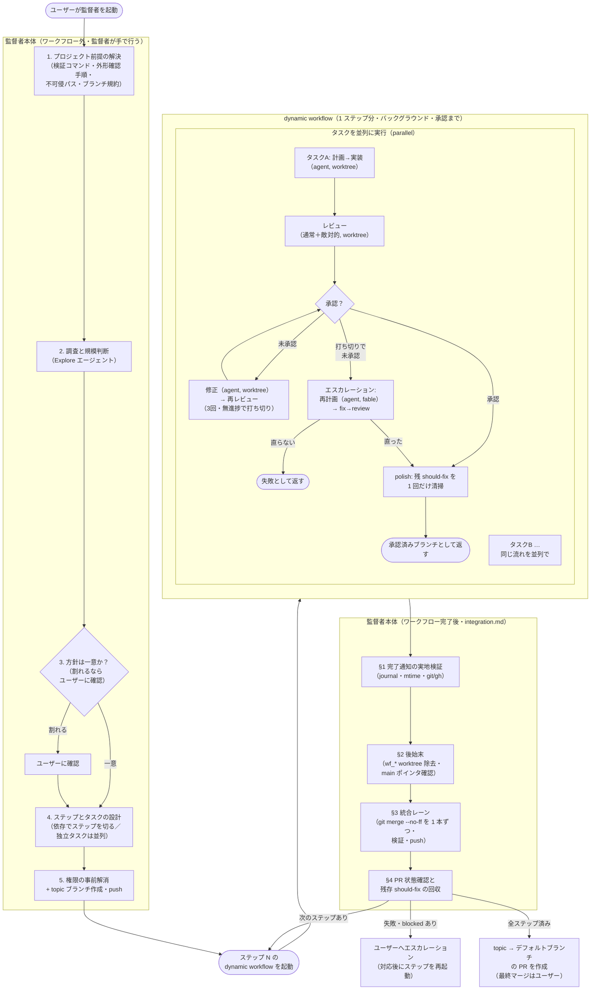

# 設計の理由（オンデマンド参照）

SKILL.md 本体は「何をするか」だけを書く（毎ターン再送されトークンになるため。公式の
[スキルの書き方](https://code.claude.com/docs/ja/skills)が「実行内容を述べ、方法や
理由を説明するな」と指示している）。「なぜその設計か」はここに置き、必要なときだけ読む。
この設計の多くは、実運用（複数マイルストーンの supervisor 実行）で実際に起きた障害への
対策であり、各節に事象を添える。

## 全体の流れ

監督者が本体で行う作業（前提解決・設計・統合・最終 PR）と、dynamic workflow がバックグラウンドで
回す作業（実装・レビュー・修正）を分けて示す。**点線で囲った範囲が dynamic workflow で
実装される部分**（1 ステップにつき 1 スクリプトを起動する）。監督者本体はスクリプトを
起動し、完了通知を受けたら実地検証・後始末・統合を行い、次のステップを起動する。
各ノードの `agent()` は個別のサブエージェント。

## なぜ統合をワークフローに載せないか（最重要の安定性判断）

以前はステップ内に「マージ準備 → コンフリクト解消レビュー → topic マージ」のエージェント群
（単一レーンのマージキュー）を置いていた。これを廃止し、統合は監督者本体が直接行う。理由:

- **マージ担当エージェントは安全クラシファイアに確率的に遮断される**。M25 のステップ 1 で、
  マージ準備エージェント 5 体のうち 3 体が「Merge Without Review / External System Writes」を
  理由に起動遮断され、レビュー承認済みタスクが未統合のままステップが失敗で返った。遮断は
  確率的で、同一プロンプトでも通ることがある——つまりリトライでは安定しない。ユーザー承認の
  文脈（/supervisor 起動）はサブエージェントのトランスクリプトからは見えないため、
  プロンプトの工夫では解決できない。
- **監督者セッションでも `gh pr merge` は遮断される**（M26 で確認）。許可リスト内の
  `git merge --no-ff` + `git push` なら通り、GitHub は head コミットの base 到達を検出して
  PR を自動的に MERGED 判定にする。
- 「ワークフローは承認まで・統合は監督者」の構成は M25 ステップ 2 以降、M30〜M32（4 ステップ
  構成）まで一貫して機能した実績がある。

副次効果としてコストと時間も大きく下がる。旧構成はタスク 1 本の統合につきマージ準備（opus・
worktree）＋コンフリクト時は解消レビュー 2 体（opus）＋fix ループ＋topic マージ（sonnet）を
起動していた。新構成ではこれが全て消え、監督者の git 操作（エージェント起動なし）に置き換わる。
マージレーンの直列待ち（各ブランチの検証がレーンを占有する）も消える。

トレードオフ: コンフリクト解消を監督者が行う場合、そのコードは独立レビューを通らない
（旧構成は解消差分に独立レビューを挟んでいた）。これは (1) 解消後の検証一式＋外形動作の実測、
(2) 解消の規模が大きいときは単発 fix エージェント＋独立レビューに委譲（マージ自体は委譲しない）、
(3) 最終 PR の「自律判断の記録」への明記、の 3 つで補う（[integration.md](integration.md) §3）。
クラシファイア遮断によるステップ全損・確率的な失敗と比べ、受け入れる価値のあるトレードオフと
判断した。

## なぜ 1 ステップ = 1 ワークフローか

以前はステップの連鎖（`for` で直列）を 1 つのワークフローに載せ、監督者の手番を減らしていた。
統合が監督者本体に移った今、**topic はワークフローの外でしか前進しない**ため、ステップ間の
依存（次のステップは統合済み topic を起点にする）はワークフロー内で表現できない。よって
1 ステップ = 1 ワークフローとし、監督者が「起動 → 実地検証 → 後始末 → 統合 → 次を起動」を
ステップごとに繰り返す。

監督者の手番は増えるが、得るものが 3 つある。(1) 確認が必要なタスク・失敗ステップが出たとき、
残りを新しいワークフローで組み直す作業が「次のステップを起動しない」だけになり単純になる。
(2) ステップごとに後始末（worktree 除去）が入るので、残留 worktree が溜まらない。
(3) ワークフロー 1 本が短くなり、途中で落ちたときの resume・再起動の被害範囲が 1 ステップに
収まる。

## なぜ subagent の入れ子をスクリプトの制御フローに開くか

**dynamic workflow では subagent は subagent を起動できない**（`agent()` の入れ子は 1 レベルまで）。
「エスカレーションの中で fix/review を回す」という入れ子は、そのままは書けない。そこで
エスカレーションはスクリプト側の制御フローとして書き、`agent()` には実務（再計画・fix・review）
だけを載せる（[workflow-script.md](workflow-script.md)）。この制約は fix と review を必ず
別 `agent()` にする方針（自己承認防止）とも噛み合う。

## なぜ dynamic workflow か（手作りの Agent 手動起動をやめた理由）

監督者がターンごとに `Agent` ツールを手で呼ぶと、完了通知を待って次のレビュー・修正を人手で
起動することになり、多数のエージェントの中間結果が監督者の文脈に積もって汚れる。dynamic
workflow はループ・分岐・中間結果をスクリプト側が保持し、監督者の文脈には最終結果だけを返す。
並列度も高い（1 run あたり最大 16 並列・1000 エージェント）。ステップ内の並列・修正ループ・
エスカレーション・polish まで、1 つのスクリプトに載る。

## なぜ agent teams ではなく dynamic workflow か

competing 案は agent teams（team lead と teammate が共有タスクリストと直接メッセージで
協調する公式機能）。依存管理を内蔵し差し戻しループにも向くが、退けた理由は次の 2 つ:

- **競合回避の粒度が足りない**: teammate 間の競合回避はタスク奪取レベル（file lock）で、
  同じファイルを触る teammate 同士のファイル編集は分離されない。結局 worktree が要る。
  dynamic workflow は `isolation: "worktree"` をそのまま持つ。
- **安定性**: agent teams は実験機能・既定無効（`CLAUDE_CODE_EXPERIMENTAL_AGENT_TEAMS`）で、
  タスク状態のラグも文書化されている。中核スキルの土台にするには時期尚早。

agent teams が安定したら再検討する。

## worktree の注意（実害が積み上がっている領域）

`isolation: "worktree"` の worktree には癖があり、SKILL.md とテンプレートの規律はすべて
実際に起きた障害への対策である。

- **デフォルトブランチから分岐する**（topic や親セッションの HEAD ではない）。topic に
  マージ済みの変更を前提にするタスクは、起点に必要なファイルが無い。各エージェントの
  冒頭で `git fetch origin` → `git checkout --detach origin/<起点>` させる。
- **ブランチ名を checkout させない（detached HEAD 規律）**。worktree がブランチを掴むと
  「already used by worktree」で後続の checkout が失敗する。正常完了した run でも worktree は
  大量に残留する（66 エージェントの run で数十個）ため、掴ませない設計が要る。detached HEAD で
  作業し `git push origin HEAD:refs/heads/<ブランチ>` で push すれば、衝突が構造的に起きない。
- **worktree なしのエージェントに checkout を指示しない**。レビュー系エージェント（worktree
  なし）に checkout を指示したところ、メイン作業ツリーのブランチを切り替えて並列エージェントの
  検証（clippy）を汚染し、終了後もメインツリーが一時ブランチに載ったままになった。レビュー・
  再計画にも worktree を付ける。
- **プロンプトにリポジトリの絶対パスを書かない**。書くと、worktree 付きのエージェントでも
  メインツリー側で `git checkout --detach` を実行して HEAD を外す事故が起きた。「カレント
  ディレクトリ（割り当てられた worktree）で作業する」と書く。
- **タスクブランチの先端を worktree エージェントが置き換えると、PR の MERGED 自動判定が
  効かなくなる**（stale tip）。実体は topic にマージ済みなのに PR が OPEN のまま残った実績が
  3 件ある。detached HEAD 規律と「タスクブランチに古い topic を取り込ませない」ことで予防し、
  残った OPEN は監督者が実体検証してクローズする（[integration.md](integration.md) §4）。
- **共有側のブランチポインタが動くことがある**。実装エージェントが共有チェックアウト側で
  `git checkout -B` を実行し、main のポインタを動かした実績がある。ワークフロー完了後に
  `git rev-parse main origin/main` の一致を確認する。
- **後始末の除去パターンは `wf_<runId>-*` に限定する**。`.claude/worktrees/` 配下を一括
  `--force` 除去したら、他プロセス（MCP サーバーの書き戻しレーン）の worktree まで削除した
  事故がある。自分が起動した run の worktree だけを名指しで除去する。
- **ランタイム管理で他ステージから見えない**。ステージ間の受け渡しとマージ前の実測検証は、
  worktree ではなく push 済みのタスクブランチ経由で行う。

## なぜ完了通知を実地検証するか

実行中の run に対して「completed」通知が誤発火し、PR 番号・マージ済み報告・もっともらしい
失敗談まで含む**精巧な捏造レポート**が届いた実績がある（実際にはコミットも PR も一切なし）。
さらにそのとき「run は死んだ」と誤診して、生きているエージェントの worktree とブランチを
削除する二次被害を起こした。完了通知・構造化 result・usage 値のどれも真正性の証拠にならない。
唯一信用できるのは実地の状態（git・gh・transcript の mtime・journal の完了記録）だけなので、
レポートに基づく行動の前に必ず実地検証を挟む（[integration.md](integration.md) §1）。
サブエージェントの `blocked` 上申にも誤認があった（実測で反証して再投入した実績がある）ため、
同様に実物で検証してから裁定する。

## なぜ `agent()` の null・no-op を 1 回リトライするか

`agent()` は throw すると null を返す。また、サブエージェントが実作業ゼロ（tool_uses 0・
数秒で終了）で「利用可能なスキル一覧」の定型文だけを返して正常終了する事象がある。結果
テキストが存在するため、内容を確認しないと「レビューが承認した」と誤読して品質ゲートが
素通りする。同じプロンプトでの再実行で正常に走った実績があるため、1 回だけリトライする
（[workflow-script.md](workflow-script.md) の `agentRetry`。REVIEW スキーマの `notes` を必須に
して、指摘ゼロ・検証記録ゼロの応答を no-op として検出する）。2 回目も失敗なら仕組みの問題の
可能性が高いので、無限リトライはしない。

## なぜ polish（should-fix の 1 回清掃）を入れ、severity を required にするか

レビューの承認条件を「must-fix が無ければ approved」とし、修正発火を「!approved」にすると、
承認と同時に報告された should-fix が一度も修正されないまま統合される（実際に素通りした実績が
ある）。「マージ可能だが直すべき」という中間状態が制御フローに存在しないのが原因。対策として
承認後に should-fix が残っていれば 1 回だけ fix→re-review を回す（polish）。

- **1 回で止める理由**: 再レビューは毎回新しい should-fix を見つけうるので、無限に回すと
  収束しない。polish 後に残った・新規に出た should-fix は findings として監督者へ返し、
  監督者が統合後に topic の実コードで「まだ未解決か」を確認してから回収する（レポートの
  findings はレビュー時点の記録で、polish で解決済みでも残る。レポートだけを根拠にすると
  解決済みの作業を重複発行する）。
- **severity を required にする理由**: severity フィールドを欠落させた指摘が polish 分岐
  （`severity === 'should-fix'` で発火）をすり抜けて素通りした実績がある。スキーマで強制し、
  監督者の回収では severity の有無に関わらず findings 全件を対象にする。
- **回収を 1 本の残件ブランチにまとめる理由**: 複数タスク由来の残件でも、ブランチを分けると
  レビュー・統合の往復がその数だけ発生する。1 本にまとめれば往復が 1 回で済む（実績あり）。

## なぜ長時間ジョブの完了待ちを禁じるか

実装エージェントが長時間 fuzz（600 秒 × 3）をバックグラウンド起動し完了待ちしたまま打ち切られ、
`agent()` が null を返してステップが止まった実績がある。ジョブ自体は完走しており、docs 変更も
worktree に未コミットで残っていた——つまり失われたのは「成果」ではなく「成果の報告」だけ。
foreground sleep が塞がれているためエージェントは `tail -f` 等で待ち続け、その間に打ち切られる。
対策は「待ちに入る前に必ず commit・push する」を契約に入れること、そもそも長時間ジョブは
監督者かスクリプト側で流すこと（[implementation-prompt.md](implementation-prompt.md) §6.5）。

## 部分統合の帰結（失敗タスクがあっても承認済み分は topic に載る)

あるタスクが失敗・blocked で返っても、兄弟タスクの承認済みブランチは統合してよい（監督者の
統合レーンは承認済み分だけを取り込む）。topic は作業用の統合ブランチでやり直しがきくため、
部分統合は許容する。監督者はエスカレーション時に「どのタスクまで topic に入ったか」を添えて
ユーザーに提示する。統合レーンの冪等チェック（`git merge-base --is-ancestor`）により、
再開・再実行時も二重マージにならない。

## 統合時の検証をどう絞るか（安全を落とさずに時間を削る）

統合レーンはブランチを 1 本ずつ取り込むため、毎回フル検証すると N 本で N 回直列に流れて
ステップの所要時間を押し上げる。削れる分だけ削る（[integration.md](integration.md) §3）:

- **コンフリクトの無いマージは速い検証（ビルド等）に留める**。タスク内レビューが承認した
  ツリーとの差は「topic 側の先行マージとの合成」だけで、その論理コンフリクトは最後のフル検証で
  捕まえる。
- **ステップの全ブランチを取り込み終えたら、必ずフル検証（検証コマンド一式＋外形動作）を
  1 回流す**。ファイル単位で独立でも論理コンフリクト（別ブランチの変更と噛み合わない）はあり得る
  ため、フル検証を丸ごと落とす案は採らない。
- **コンフリクトを解消したマージの直後はフル検証する**。解消は新しいコードなので未検証。
  さらに検証の前に**まずビルド**を流す——機械的な解消（両側結合）は「共有末尾を含む hunk」で
  閉じ括弧を落として構文を壊すことがあり、ビルドが最速で検出する（実績あり）。コンフリクトに
  ならない「片側だけの新規ファイル」が相手側の新フィールドを欠く問題も、テストを含む全体
  コンパイルで洗い出せる。

## なぜエスカレーション管理が「再計画」から入るか

タスク内の修正ループは 3 回・無進捗で打ち切る。直せなかった指摘を同じやり方でもう一度回しても
同じ壁に当たる。先に「なぜ直せなかったか」を分析して方針を立て直す再計画エージェントを 1 体
挟み、その方針を後続の fix プロンプトに封入する。再計画はコードを書かない（計画だけ返す）ので、
その後の fix・review はスクリプトが別 `agent()` として起動する（[escalation-prompt.md](escalation-prompt.md)）。

## 壊してはいけない線引き

- **topic → デフォルトブランチの最終マージは人間が握る**。タスクブランチ → topic は作業用の統合
  ブランチへの内部マージでやり直しがきくが、topic → デフォルトは外向きで後戻りしにくい。
  自動化するのは前者だけ。
- **検証に失敗したブランチは topic に残さない**。統合時の検証が落ちて直せなければ、そのブランチを
  巻き戻して外し、ユーザーへエスカレーションする（[integration.md](integration.md) §3）。
- **統合（マージ・PR クローズ）をサブエージェントに指示しない**。クラシファイア遮断の対象になる
  （上記「なぜ統合をワークフローに載せないか」）。
- **冪等性**: 統合レーンは取り込みの前に「そのブランチが既に topic に入っていないか」を
  `git merge-base --is-ancestor` で確認してから動く。

## ワークフロー実行中はユーザー確認ができない

ワークフローは実行中にユーザー入力を受け付けない（エージェントの権限プロンプトだけが
実行を一時停止できる）。そのため「確認方針」の判断はワークフロー起動前に解消し、途中で
確認が要る事態はタスクを `blocked` で返させて監督者が受け取る。確認後にタスクを組み直して
そのステップのワークフローを起動し直す。

## サブエージェントの権限（起動前に解消する）

ワークフロー内のサブエージェントは常に acceptEdits で走り、ファイル編集は自動承認される
が、シェルコマンド・git・`gh`・外形動作の起動コマンド・許可リスト外の MCP は許可リストに
無いと実行中に権限プロンプトを出し、ワークフローを止める。実装・レビュー・修正・再計画が
使うコマンドを起動前に許可リストへ入れておく。プロジェクト固有の検証・起動コマンドは
SKILL.md の `allowed-tools` に書けないので、監督者が起動前に許可リストへ追加する。

## 修正ループの打ち切り（無進捗検知）

修正ループは回数上限だけでなく「無進捗」でも打ち切る（[workflow-script.md](workflow-script.md)
の `fixReviewLoop`、[review-prompt.md](review-prompt.md) の修正ステージ）。公式の
[dynamic workflows ドキュメント](https://code.claude.com/docs/en/workflows)が
「チェックが通るか、2 ラウンド連続で無進捗になるまで繰り返す」を推奨しているのに合わせた。
回数上限だけだと、修正しても must-fix が減らないタスクで上限までエージェント（トークン）を
無駄に消費する。判定は must-fix 件数が前ラウンド以上なら停止とする。タスク内ループで打ち切った
タスクは未承認のままエスカレーション管理へ引き継ぎ、再計画してから直す。

## なぜタスクのリスク階層でレビューの厳格さを変えるか（コスト規律）

全タスク・全ラウンドで「通常＋敵対的」の 2 本立てを opus で回すと、レビューだけで大きなトークンに
なる（1 タスクが 3 修正ラウンド回ると opus レビュー 8 本）。品質を落とさずに削るため、各タスクに
`tier` を付けて厳格さを段階化する（[SKILL.md](SKILL.md) §4）。

- **light**（docs 追随・生成物の機械的更新・中核ロジックに触れない小変更）: 敵対的レビューが拾う
  「前提の誤り」のリスクが小さい。通常レビュー 1 本・`sonnet` にする。
- **standard**（ロジック・中核・挙動の変更）: 従来どおり通常＋敵対的・opus。迷ったら standard。

自己承認防止（fix と review は別セッション）・統合時の実測検証・topic への人間ゲートといった
中核の保証は tier に関わらず維持する。削るのは「敵対的レビューの二重化」と「上位モデル」だけ。

同じ理由で、**敵対的レビューには検証コマンド一式の実測を繰り返させない**。同一ツリーに対する
同じコマンド群の結果は決定的に同じで、再実行は純粋な重複になる（通常レビューが 1 回実測すれば
足りる）。敵対的レビューが流すのは反証のための的を絞ったテストに限る。

## なぜ機械的ステージに effort を効かせるか

公式の `agent()` は `effort`（`low`〜`max`）を取れる。判断を伴わない機械的な作業（doc のみ修正の
再確認など）は低 effort でも結果が変わらないので、`effort: 'low'` に落として推論のオーバーヘッドを
削る。判断が質を左右する実装・レビューは既定〜`medium` を保つ。

## なぜ fix の再レビューを changeKind で軽重を変えるか

修正が doc・コメントだけなら、ロジックの敵対的レビューまで回すのは過剰。fix が `changeKind` を返し、
`"docs"` なら通常レビュー 1 本・低 effort、`"logic"` ならタスク階層どおりのフルレビューにする
（[workflow-script.md](workflow-script.md) の `fixReviewLoop`）。review-prompt.md の
「再レビューの粒度」をスクリプトに反映したもの。

## なぜ DoD が曖昧なら実装せず blocked で返すか（計画精度）

実装エージェントは general-purpose と同じく自分で調べて実装するが、DoD の解釈が割れたまま推測で
着手すると、監督者の意図と違うものを作ってやり直しになり、修正ループ（トークン）を無駄に使う。
計画段階（Plan ツール）で DoD が一意に定まらないと判断したら、推測で進めず `blocked` と疑問点を
返す（[implementation-prompt.md](implementation-prompt.md) §3）。監督者がユーザーに確認してから
タスクを組み直す（ワークフロー中はユーザー確認ができないため、確認は監督者に上げる。SKILL.md §3）。
曖昧さを実装前に潰す方が、作ってからやり直すより安い。

## なぜ目標変更・先延ばしを構造化レポートで監督者まで上げるか

自律進行では、実装・修正エージェントが「この部分は今回やらない」「DoD をこう解釈した」といった
判断を下すことがある。これがバックグラウンド実行の中に埋もれると、監督者もユーザーも「いつの間にか
目標が変わった・やるはずの作業が消えた」ことに気づけない。そこで返り値に `decisions`（変えた目標・
DoD・スコープ）と `deferrals`（先延ばし・対象外）を持たせ、タスク→レポートと集約して監督者まで
上げる（fix エージェントの分も `fixReviewLoop` の `carry` で拾う）。監督者は最終 PR の専用
セクションと最終報告にまとめる（SKILL.md §8）。

## レビュー精度を上げるプロンプト設計（調査に基づく）

`/deep-research` で「LLM にコードレビュー／敵対的レビューを高精度で行わせるプロンプト技法」を調査し
（22 ソース・25 主張を敵対的検証、23 確証）、確証された知見を [review-prompt.md](review-prompt.md) の
契約に反映した。採用した知見と、なぜ精度が上がるか:

- **確証バイアスを断つ（偽陰性＝見逃しの最大要因への対策）**: コードを「安全」と刷り込むフレーミングは
  検出率を 97% → 3.6% まで落とすという実証がある。実装エージェントの報告・PR タイトル・説明・
  コミットメッセージを「主張」として扱い、差分そのものを根拠に判断させると検出がほぼ回復する。
  → レビューの前提に「コードが正しい・安全だと仮定しない／メタデータを鵜呑みにしない」を封入。
- **確信した偽陽性は推論では殺せず、実測でのみ却下できる**: 敵対的レビューア 10 人が存在しない脆弱性を
  全員一致で承認し、1 つのテスト実行だけがそれを却下した事例がある。→ must-fix は可能なら再現テストで
  裏づけ、裏が取れない推論だけの指摘は確信度を下げる（`confirmedBy` に裏づけ方法を記させる）。
- **敵対的レビューは「コメントの嘘」でなく構造的盲点に集中させる**: 誤誘導コメントは LLM をほぼ騙せない
  （検出率変化 -5%〜+4%、有意差なし）一方、見逃しは脆弱性の型（競合状態・TOCTOU、タイミング・
  side-channel、複雑な認可）で決まる。→ 敵対的レビューの反証観点をこれらの型に振り直した。
- **cold-start / context asymmetry**: 前提知識ゼロの新規レビューアが差分だけを見ることでアンカリングの
  連鎖を断てる。→ 敵対的レビューに実装の説明・通常レビューの結論を持ち込ませない。
- **アンカー付き重大度＋具体例（few-shot）で較正**: 曖昧な定義は割り当てをぶらす。few-shot の具体例が
  一貫して最良、冗長な CoT 強制はむしろ性能を落とす。→ must-fix / should-fix / nit に具体例を添えた。
- **自己修正は外部信号なしでは精度が上がらない（査読済み）**: intrinsic self-correction は精度を
  上げず時に下げる。→ 承認を自己完結させず、別セッションのレビュー・実行テスト・統合時の実測検証に
  接地させる現設計を裏づけ、レビューの前提に明記した。
- **意見統合は debate 往復でなく結合＋重複排除**: multi-agent debate はバイアスを増幅し、meta-judge 型
  集約の方が頑健という実証がある。→ 通常＋敵対的を debate させず、結合して file:line で重複除去する
  現設計（`runReview` / `dedupeFindings`）を維持。

**適用の判断**: 中核知見の多くは 2026 年前半の未査読 arXiv プリント（単一研究・小〜中規模ベンチ）に
依存する。そのため、査読済みで頑健なもの（自己修正・multi-agent bias）と、効果量が大きく低リスクで
汎用性の高い指示（確証バイアス対策・実測での裏づけ・構造的盲点・アンカー付き重大度）だけを採用し、
単一プリント固有の具体数値やアーキテクチャ（例: Refute-or-Promote の段階ゲート）はそのまま持ち込まない。

## 出典

- 調査（`/deep-research`、一次情報を 3-0 で検証）:
  https://code.claude.com/docs/en/workflows ,
  https://code.claude.com/docs/en/sub-agents ,
  https://code.claude.com/docs/en/agent-teams
- 長時間タスクの自律進行プラクティス（`/deep-research`）: タスク粒度は「1 エージェント
  セッションで完結・合否が一意」に割る、修正ループは無進捗で打ち切る。
  https://code.claude.com/docs/en/workflows ,
  https://www.anthropic.com/engineering/multi-agent-research-system ,
  https://www.anthropic.com/engineering/harness-design-long-running-apps
- dynamic workflows の仕様: https://code.claude.com/docs/ja/workflows
- スキルの書き方: https://code.claude.com/docs/ja/skills
- レビュープロンプト設計（`/deep-research`、22 ソース・25 主張を敵対的検証、23 確証）:
  - Cloudflare「Orchestrating AI Code Review at scale」（専門レビューア＋アンカー付き重大度＋judge 統合）:
    https://blog.cloudflare.com/ai-code-review/
  - 「安全」フレーミングが偽陰性を招く／diff だけを見ると回復（arXiv 2603.18740）:
    https://arxiv.org/html/2603.18740v1
  - 確信した偽陽性は実測でのみ却下できる／敵対的段階ゲート（Refute-or-Promote, arXiv 2604.19049）:
    https://arxiv.org/pdf/2604.19049
  - 誤誘導コメントは効かず見逃しは脆弱性の型で決まる（arXiv 2602.16741）:
    https://arxiv.org/html/2602.16741v1
  - 偽陽性削減は few-shot ＞ 強制 CoT、複数サンプリング多数決（Tencent, arXiv 2601.18844）:
    https://arxiv.org/abs/2601.18844
  - 自己修正は外部フィードバックなしでは精度が上がらない（ICLR 2024 / TACL 2024）:
    https://arxiv.org/pdf/2310.01798 ,
    https://direct.mit.edu/tacl/article/doi/10.1162/tacl_a_00713/125177/
  - multi-agent debate はバイアスを増幅、meta-judge 集約が頑健（EMNLP 2025 Findings, arXiv 2505.19477）:
    https://arxiv.org/pdf/2505.19477
