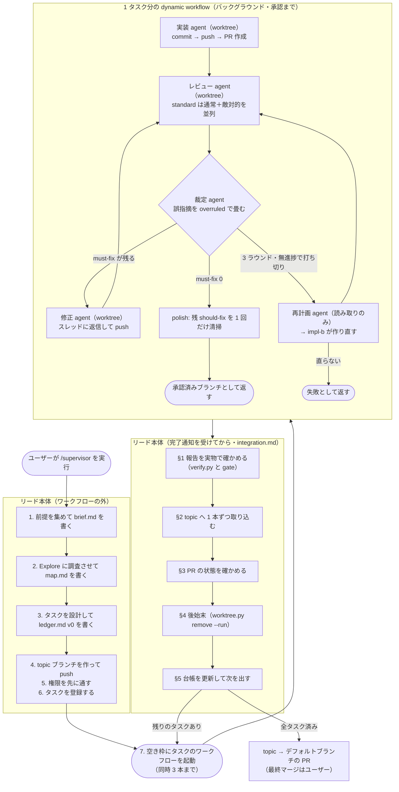

# 設計の理由（必要なときだけ読む）

`SKILL.md` 本体は「何をするか」だけを書く。読み込まれた本体はターン全体でコンテキストに残り、
毎ターン再送されてトークンになるためである（公式の
[スキルの書き方](https://code.claude.com/docs/ja/skills)が「実行内容を述べ、方法や理由を説明する
のではなく」と指示している）。「なぜその設計か」はこのファイルに置く。

ここに書いてあることの多くは、実運用で実際に起きた障害への対策である。各節に事象を添える。

## 用語

このファイルだけを読む人のために、最初に定義する。

- **リード**: `/supervisor` を実行したセッション本体。タスクを設計し、ワークフローを起動し、
  承認済みブランチを topic へ取り込む。
- **dynamic workflow**: Claude Code の公式機能。JavaScript のオーケストレーションスクリプトを
  書くと、ランタイムがバックグラウンドで複数のサブエージェント（スクリプト中の `agent()`）を
  走らせる（[公式ドキュメント](https://code.claude.com/docs/ja/workflows)）。
- **タスク**: 1 ワークフローが完結させる作業単位。1 タスク = 1 ワークフロー = 1 worktree 群 =
  1 ブランチ = 1 PR。
- **裁定エージェント**: レビュー指摘の妥当性を判断し、誤った指摘を根拠つきで畳むエージェント。
- **gate**: `gh-review.py gate`。未解決スレッド 0 件・自分の PENDING レビュー 0 件・要求した
  役割のレビューが提出済み、の 3 つを機械的に確かめる承認の門。
- **findings（指摘）**: レビューが見つけた問題。`must-fix` / `should-fix` / `nit` の 3 段階。

## 全体の流れ

リードが本体で行う作業（前提集め・設計・統合・最終 PR）と、dynamic workflow がバックグラウンドで
回す作業（実装・レビュー・裁定・修正）を分けて示す。**点線で囲った範囲が 1 つの dynamic
workflow**（1 タスクにつき 1 本起動する）。

## なぜ入れ子の subagent をやめて dynamic workflow にしたか

以前は「リード → サブリーダー subagent → 実装・レビュー subagent」という入れ子で回していた。
サブリーダーに 1 タスクを丸ごと任せる形は、次の 2 点で不安定だった。

- **サブリーダーが turn を終えてしまう**。配下の subagent を `run_in_background: false` で
  同期起動し、結果をその turn の中で受け取る規律を契約に何度書いても、「起動しました。完了を
  待ちます」と言って turn を終える経路が残った。
- **状態がエージェントの頭の中にしかない**。3 ラウンドの修正ループ・打ち切り条件・再開回数の
  管理をサブリーダーの判断に委ねていたため、判断が飛べば静かに壊れた。

dynamic workflow はループ・分岐・打ち切り条件をスクリプト側の制御フローに置く。判断ではなく
コードなので飛ばない。中間結果もスクリプトが保持し、リードの文脈には最終結果だけが返る。

## なぜ 1 タスク = 1 ワークフローか

ワークフローは**完了時にしか通知が来ない**。1 本のワークフローに複数タスクを載せると、承認済み
ブランチの取り込みが全タスク完了後のまとめになり、「承認報告を受けたらその 1 本をその場で
topic へ取り込む。溜めない」（[integration.md](integration.md)）が崩れる。溜めたぶんだけ、
後から取り込むブランチのコンフリクトが増える（タスクブランチは承認時点の topic を起点にした
ままなので、その後に別のタスクが入っていると衝突する）。

Workflow ツールの呼び出しは即座に返るので、リードは複数のワークフローを同時に走らせられる。
1 タスク = 1 ワークフローにすると次が成り立つ。

- 完了通知がタスク単位で届き、届いた順に 1 本ずつ取り込める
- 1 タスクの失敗が他タスクのワークフローに波及しない
- `resumeFromRunId` の再実行が、そのタスクだけで済む
- 台帳の 1 行に `runId` を 1 つ持てばよい

## なぜ同時 3 本までか

律速はマシンではなく統合レーンである。取り込みは 1 本ずつ行う（並列マージはコンフリクトする）
と決めてあるので、本数を増やしても完了は早くならず、承認待ちの滞留とコンフリクトの解きにくさ
だけが増える。

1 タスクの内部は直列（実装 → レビュー → 裁定 → 修正 → …）で、同時に走るのは通常レビューと
敵対的レビューの 2 体だけである。3 本同時でも実際に動くエージェントは 6〜9 体で、ワークフロー
あたりの並列上限（`min(16, CPU コア数 - 2)`）には届かない。

## ワークフローのエージェントは再開できない（調査で確定した制約）

Claude Code 2.1.227 の実装を読んで確かめた事実である。**設計をこの制約の上に組んでいるので、
再開できる前提の手順を書き足さないこと。**

- `agent()` が受け取れるオプションは `label` / `phase` / `schema` / `model` / `effort` /
  `isolation` / `agentType` と、未文書の `disallowedTools` / `bashCommandClamp` / `stallMs`。
  **既存のエージェントを指す引数は無い。**
- ワークフローのサブエージェントは、`SendMessage` / `ListAgents` / `TaskStop` が宛先解決に使う
  レジストリに登録されない（ワークフロー全体が 1 個のタスクとして登録され、個々のエージェントは
  その内部の Map に入るだけ）。**宛先にできない。**
- `/workflows` の画面から個別エージェントにできるのは skip（`agent()` が `null` を返す）と
  retry の 2 つで、**retry は文脈を捨てて同じプロンプトで新規 spawn する**。
- `resumeFromRunId` は「会話の再開」ではなく `journal.jsonl` に記録済みの**戻り値の再生**である。
  キャッシュキーは直前のキーを含むチェーンハッシュで、最初に外れた時点で以降は全部再実行される
  （歯抜けの再利用はできない）。`label` と `phase` はキーに入らないので、変えても無効化されない。
- 「同一セッションのみ」の正体は保存パスである。transcript は
  `~/.claude/projects/<プロジェクトキー>/<セッション ID>/subagents/workflows/<runId>/` に置かれ、
  パスにセッション ID が入る。
- サブエージェントは自分の agent id も transcript のパスも知らない。Bash に渡る
  `CLAUDE_CODE_SESSION_ID` は**親セッションの ID** であって agent id ではない。

未文書のオプション（`disallowedTools` / `bashCommandClamp` / `stallMs`）は**使わない**。実装には
あるが公式ドキュメントに無く、バージョンで変わりうる。

## なぜ起動前の環境変数チェックをやめたか

入れ子で回していた頃は、`.claude/settings.json` の `env` に
`CLAUDE_CODE_MAX_SUBAGENT_SPAWN_DEPTH=5` を入れ、`CLAUDE_CODE_EXPERIMENTAL_AGENT_TEAMS` が
未設定であることを起動前に確かめていた。どちらも根拠が無くなった。

- 公式の[サブエージェント](https://code.claude.com/docs/ja/sub-agents)は「深さは、メイン会話の
  下のサブエージェントレベルの数として数えられます。深さ 5 のサブエージェントは Agent ツールを
  受け取らず、さらに生成することはできません。**制限は固定されており、設定不可能です**」と
  している。環境変数で広げられるものではない。
- ワークフローのサブエージェントは深さ 1 から始まる（transcript の `meta.json` に
  `"spawnDepth":1` が入る）。レビューが `/code-review` を走らせ、その子まで数えても上限に届かない。
- agent teams は `Agent` ツールの入れ子を使う機能で、dynamic workflow とは別の仕組みである。
  サブリーダーを立てなくなった以上、この確認は無関係になった。

## なぜ引き継ぎノートをファイルで渡すか

上の制約により、「同じレビュアーを起こして修正差分だけ見せる」ができない。毎ラウンド新しい
レビュアーが立つので、放っておくと毎回コードベースを一から読み直す。

削りたいのは再探索のコストなので、それをファイルで運ぶ。各エージェントは終える前に
`<ベース>/notes/task<番号>/<役割>-r<ラウンド>.md` へ、読んだ箇所・実行した検証と結果・コード構造の
要点・次に確かめる点を書く。次ラウンドのエージェントは、コードを読む前に同じディレクトリの
自分の役割の過去ノートを全部読む。

- **パスをこちらで決めるので、agent id が分からなくても引き継ぎ先が確定する。**
- 置き場は `.git` 配下（`place.py base-dir` が返すディレクトリの下）なので、git の追跡対象に
  入らず PR の差分を汚さず、全 worktree から同じ絶対パスに解決でき、セッションをまたいで残る。
- transcript 全文（実測平均 56.7 KB。ツール呼び出しの往復を含む）を読ませる案は採らない。
  ラン内ではスクリプトも各エージェントも対象の transcript のパスを特定できず、内容もノイズが多い。
  ラン跨ぎの立て直しでだけ、リードが前ランの `transcriptDir` を `args` に載せて渡す（リードは
  完了通知で `transcriptDir` を受け取れる）。

## なぜ統合をワークフローに載せないか（最重要の安定性判断）

以前はワークフロー内に「マージ準備 → コンフリクト解消レビュー → topic マージ」のエージェント群を
置いていた。廃止し、統合はリード本体が直接行う。

- **マージ担当エージェントは安全クラシファイアに確率的に遮断される**。マージ準備エージェント
  5 体のうち 3 体が「Merge Without Review / External System Writes」を理由に起動を遮断され、
  レビュー承認済みのタスクが未統合のまま失敗で返った実績がある。遮断は確率的で、同一プロンプト
  でも通ることがある——リトライでは安定しない。ユーザーが `/supervisor` を実行したという
  文脈はサブエージェントのトランスクリプトから見えないので、プロンプトの工夫では解決できない。
- **リードのセッションでも `gh pr merge` は遮断される**。許可リスト内の `git merge --no-ff` +
  `git push` なら通り、GitHub は head コミットが base に到達したことを検出してタスク PR を
  自動的に MERGED 判定にする。

副次効果としてコストと時間も下がる。旧構成はタスク 1 本の統合ごとにマージ準備・解消レビュー・
topic マージのエージェントを起動していた。新構成ではこれが全て消え、リードの git 操作に置き換わる。

トレードオフ: コンフリクト解消をリードが行うと、そのコードは独立レビューを通らない。これは
(1) 解消後の検証一式と外形動作の実測、(2) 解消が大きいときは単発の fix エージェントと独立
レビューへの委譲（マージ自体は委譲しない）、(3) 最終 PR の「自律判断の記録」への明記、で補う。

## なぜ裁定エージェントを毎ラウンド挟むか

承認の門は「未解決スレッドが 0 件」を要求する。スレッドを畳んでよいのは再レビューエージェント
（直っていると確かめたもの）と裁定エージェント（誤りと裁定したもの）の 2 者だけで、実装
エージェントは `--resolve` をスクリプトに拒まれる（自分で畳めると `unresolved == 0` が自己承認に
なるため）。

裁定者がいないと穴が 2 つ開く。

1. **誤った指摘を畳める者がいなくなる。** レビュアーが下ろさない誤指摘は永久に残り、3 ラウンド
   打ち切り経由で全件エスカレーションになる。
2. **実装が `wont-fix` / `disputed` / `deferred` で返したスレッドが宙に浮く。** この 3 つは
   裁定者が裁く前提で用意された状態語である。

以前はサブリーダーがこれを担っていた。ワークフロー化でサブリーダー層が消えるので、その §5 の
手順を 1 つの `agent()` として切り出した（[judge-prompt.md](judge-prompt.md)）。

**裁定は最後に未解決を残さない責任も負う。** 直さない should-fix / nit は、根拠と「残件である」
ことを書いて `overruled --resolve` で畳む。畳まないと gate が通らず、リードが取り込めない。
畳んでも記録は消えない——リードは `threads --pr <番号> --all` で解決済みも含めて拾い、統合後に
まとめて回収する。

## なぜエスカレーションが「再計画 → impl-b」の 2 段か

修正ループは 3 ラウンド・無進捗で打ち切る。直せなかった指摘を同じやり方でもう一度回しても同じ壁に
当たるので、先に「なぜ直せなかったか」を分析して方針を立て直す。

以前は「実装を捨てて impl-b を立て、impl-b に先に計画を立てさせ、**サブリーダーが計画を読んで
前と同じ方針なら差し戻す**」という形だった。ワークフローにはこの検分の置き場が無い（スクリプトは
文字列の良し悪しを判定できない）。そこで計画を作る役を独立した読み取り専用の `agent()` に切り出し、
その方針をスクリプトが impl-b のプロンプトへ封入する。誰も判定しないまま impl-b の自己申告の計画で
走り出すことがなくなる。

**impl-b のレビューは新規に立てる。** impl-b は方針から作り直すので差分が全面的に入れ替わり、
前のレビューの未解決スレッドは別のコードを指した状態になる。初回レビューと同じ扱いにする。

## worktree の注意（実害が積み上がっている領域）

`isolation: "worktree"` の worktree には癖があり、契約に書いてある規律はすべて実際に起きた障害への
対策である。

- **デフォルトブランチから分岐する**（topic や親セッションの HEAD ではない）。topic にマージ済みの
  変更を前提にするタスクは、起点に必要なファイルが無い。各エージェントの冒頭で `git fetch origin`
  → `git checkout --detach origin/<起点>` させる。
- **ブランチ名を checkout させない（detached HEAD 規律）**。worktree がブランチを掴むと
  `already used by worktree` で後続の checkout が失敗する。detached で作業し
  `git push origin HEAD:refs/heads/<ブランチ>` で push すれば、衝突が構造的に起きない。
- **worktree なしのエージェントに checkout を指示しない**。メイン作業ツリーのブランチを切り替えて
  並列エージェントの検証を汚染し、終了後もメインツリーが一時ブランチに載ったままになった実績がある。
  ブランチを checkout する全エージェント（実装・修正・レビュー・裁定・再計画）に worktree を付ける。
- **プロンプトにリポジトリの絶対パスを書かない**。書くと、worktree 付きのエージェントでもメイン
  ツリー側で `git checkout --detach` を実行して HEAD を外す事故が起きた。「カレントディレクトリ
  （割り当てられた worktree）で作業する」と書く。
- **タスクブランチの先端を worktree のエージェントが置き換えると、PR の MERGED 自動判定が効かなく
  なる**（stale tip）。実体は topic にマージ済みなのに PR が OPEN のまま残った実績が 3 件ある。
  残った OPEN はリードが実体を検証してクローズする（[integration.md](integration.md) §3）。
- **共有側のブランチポインタが動くことがある**。実装エージェントが共有チェックアウト側で
  `git checkout -B` を実行し、デフォルトブランチのポインタを動かした実績がある。ワークフロー完了後に
  `git rev-parse <デフォルトブランチ> origin/<デフォルトブランチ>` の一致を確かめる。
- **後始末の除去は runId で名指しする**。`.claude/worktrees/` 配下を一括 `--force` 除去したら、
  他プロセスの worktree まで削除した事故がある。`worktree.py remove --run <runId>` は
  `git worktree list` に載っているものだけを対象にし、名前が runId で始まるものに限る。
- **ステージ間の受け渡しは worktree ではなく push 済みのタスクブランチで行う**（worktree は他の
  エージェントから見えない）。引き継ぎノートだけは `.git` 配下に置くので全 worktree から読める。

## なぜ完了通知を実地検証するか

実行中の run に対して「completed」通知が誤発火し、PR 番号・マージ済み報告・もっともらしい失敗談まで
含む**精巧な捏造レポート**が届いた実績がある（実際にはコミットも PR も一切なかった）。さらにその
とき「run は死んだ」と誤診して、生きているエージェントの worktree とブランチを削除する二次被害を
起こした。

完了通知・構造化された返り値・usage の数値のどれも真正性の証拠にならない。信用できるのは実物
（git・gh・transcript の mtime・journal の完了記録）だけなので、レポートに基づいて動く前に必ず
実地検証を挟む（[integration.md](integration.md) §1）。サブエージェントの `blocked` 報告にも誤認が
あった（実測で反証して再投入した実績がある）ので、同じく実物で確かめてから裁く。

## なぜ `agent()` の null・no-op を 1 回リトライするか

`agent()` は throw すると `null` を返す。また、サブエージェントが実作業ゼロ（ツール呼び出し 0 回・
数秒で終了）で「利用可能なスキル一覧」のような定型文だけを返して正常終了する事象がある。結果
テキストが存在するため、中身を確かめないと「レビューが承認した」と誤読して品質の門が素通りする。

同じプロンプトでの再実行で正常に走った実績があるので、1 回だけリトライする
（[workflow-script.md](workflow-script.md) の `agentRetry`）。レビューの schema で `notes`（実施した
検証の要約）を必須にして、指摘ゼロ・検証記録ゼロの応答を no-op として検出する。2 回目も失敗するなら
仕組みの問題の可能性が高いので、無限にはリトライしない。

## なぜ修正ループを無進捗で打ち切るか

回数上限だけだと、修正しても must-fix が減らないタスクで上限までエージェント（トークン）を無駄に
消費する。判定は「must-fix の件数が前ラウンド以上なら停止」とする。公式の
[dynamic workflows のドキュメント](https://code.claude.com/docs/en/workflows)も「チェックが通るか、
2 ラウンド連続で無進捗になるまで繰り返す」を推奨している。

## なぜ polish（should-fix の 1 回清掃）を入れるか

承認条件を「must-fix が無ければ approved」、修正の発火を「未承認のとき」にすると、承認と同時に
報告された should-fix が一度も修正されないまま統合される（実際に素通りした実績がある）。
「マージしてよいが直すべき」という中間状態が制御フローに無いのが原因である。

対策として、承認時に should-fix が残っていれば 1 回だけ修正と再レビューを回す。**1 回で止める**のは、
再レビューが毎回新しい should-fix を見つけうるので無限に回すと収束しないためである。残った
should-fix は裁定が根拠つきで畳み、リードが統合後に topic の実コードで「まだ未解決か」を確かめてから
回収する（スレッドの記述はレビュー時点の記録で、後で直っていることがある）。

**回収は 1 本の残件ブランチにまとめる。** 複数タスク由来でもブランチを分けると、レビューと統合の
往復がその数だけ発生する。1 本なら往復が 1 回で済む。

## なぜ長時間ジョブの完了待ちを禁じるか

実装エージェントが長時間の fuzz（600 秒 × 3）をバックグラウンド起動して完了を待ったまま打ち切られ、
`agent()` が `null` を返してタスクが止まった実績がある。ジョブ自体は完走しており、変更も worktree に
未コミットで残っていた——失われたのは「成果」ではなく「成果の報告」だけだった。foreground の
`sleep` が塞がれているのでエージェントは `tail -f` 等で待ち続け、その間に打ち切られる。

対策は「待ちに入る前に必ず commit・push する」を契約に入れること、そもそも長時間ジョブはリードが
先に流すかタスクを分割することである。

## なぜタスクのリスク階層でレビューの厳格さを変えるか

全タスク・全ラウンドで「通常＋敵対的」の 2 本立てを `opus` で回すと、レビューだけで大きなトークンに
なる（1 タスクが 3 修正ラウンド回ると `opus` のレビューが 8 本）。品質を落とさずに削るため、各
タスクに `tier` を付けて厳格さを段階化する。

- **light**（docs 追随・生成物の機械的更新・中核ロジックに触れない小変更）: 敵対的レビューが拾う
  「前提の誤り」のリスクが小さい。通常レビュー 1 本・`sonnet` にする。
- **standard**（ロジック・中核・挙動の変更）: 通常＋敵対的・`opus`。**迷ったら standard にする**
  （誤って light にすると敵対的レビューの網が外れる）。

自己承認の防止（修正とレビューは別セッション）・統合時の実測検証・topic への人間ゲートといった中核の
保証は tier に関わらず維持する。削るのは「敵対的レビューの二重化」と「上位モデル」だけである。

同じ理由で、**敵対的レビューに検証コマンド一式の実測を繰り返させない**。同一ツリーに対する同じ
コマンド群の結果は決定的に同じで、再実行は純粋な重複になる。敵対的レビューが流すのは反証のために
的を絞ったテストに限る。

## なぜ機械的な段階に effort を効かせるか

`agent()` は `effort`（`low`〜`max`）を取れる。判断を伴わない機械的な作業（doc だけの修正の再確認
など）は低い effort でも結果が変わらないので、`effort: 'low'` に落として推論のオーバーヘッドを削る。
判断が質を左右する実装・レビューは既定〜`medium` を保つ。

入れ子の subagent で回していた頃は `Agent` ツールの spawn 時に effort を指定できず、軽くしたいときは
`model` を下げるしかなかった。ワークフローではこの制約が無い。

## なぜ再レビューの軽重を changeKind で変えるか

修正が doc・コメントだけなら、敵対的レビューまで回すのは過剰である。修正エージェントが
`changeKind` を返し、`"docs"` なら通常レビュー 1 本・`effort: 'low'`、`"logic"` ならタスクの tier
どおりのフルレビューにする。

## なぜ DoD が曖昧なら実装せず blocked で返すか

実装エージェントは自分で調べて実装するが、DoD の解釈が割れたまま推測で着手すると、意図と違うものを
作ってやり直しになり、修正ループ（トークン）を無駄に使う。計画の段階で DoD が一意に定まらないと
判断したら、推測で進めず `blocked` と疑問点を返す。曖昧さを実装前に潰す方が、作ってからやり直すより
安い。

**ワークフローの実行中はユーザーに確認できない**（権限プロンプト以外でワークフローを止められない）。
そのため確認が要る事態はタスクを `blocked` で返させ、リードが受け取ってユーザーに確認する。
1 タスク = 1 ワークフローなので、確認後はそのタスクだけを組み直して起動し直せばよい。

## なぜ目標変更・先送りを構造化して返させるか

自律進行では、実装・修正エージェントが「この部分は今回やらない」「DoD をこう解釈した」といった判断を
下すことがある。これがバックグラウンド実行の中に埋もれると、リードもユーザーも「いつの間にか目標が
変わった・やるはずの作業が消えた」ことに気づけない。

そこで返り値に `decisions`（変えた目標・DoD・スコープ）と `deferrals`（先送り・対象外）を持たせ、
スクリプトが `carry` に集めてリードまで上げる。リードは最終 PR の専用セクションと最終報告にまとめる。
台帳は commit しないので、**PR 本文への転記を省くと記録がリポジトリに残らない。**

## なぜ指摘を GitHub のレビュースレッドに置くか

指摘をレビュー本文（サマリ）に書くと、解決済みかどうかを機械的に確かめられない。すべての指摘を
レビュースレッドとして投稿すれば、`unresolved == 0` が承認の条件になる。

スクリプトの分岐に要るのは件数だけなので、`schema` で返させるのは `approved` / must-fix 件数 /
should-fix 件数 / `changeKind` / 実施した検証の要約に留める。指摘の本文はスクリプトを通らない。

- 本文が返り値を通らないので、`severity` の欠落で分岐がすり抜ける事故が起きない（本文と件数を
  両方 schema で返す設計では、`severity` を欠落させた指摘が polish の分岐をすり抜けた実績がある）。
- 指摘が GitHub に残るので、ワークフローが落ちても次の起動が続きを読める。
- リードは統合前に `gate` で裏を取れる。**未解決スレッドが 0 件であることは「レビューが行われた」
  ことを意味しない**（レビューを 1 度も走らせていない PR ではスレッドがそもそも 0 件になる）ので、
  `--require-roles` を必須にして、要求した役割のレビューが実際に提出されたことも確かめる。

## 壊してはいけない線引き

- **topic → デフォルトブランチの最終マージは人間が握る。** タスクブランチ → topic は作業用の統合
  ブランチへの内部マージでやり直しがきくが、topic → デフォルトは外向きで後戻りしにくい。自動化
  するのは前者だけ。
- **検証に失敗したブランチは topic に残さない。** 統合時の検証が落ちて直せなければ、そのブランチを
  巻き戻して外し、ユーザーへ上げる材料にする。
- **統合（マージ・PR のクローズ）をサブエージェントに指示しない**（クラシファイア遮断の対象になる）。
- **冪等性**: 統合レーンは取り込みの前に `git merge-base --is-ancestor` で「そのブランチが既に
  topic に入っていないか」を確かめてから動く。
- **`TaskList` の `completed` を完了の根拠にしない。** subagent が終了すると harness が spawn 元の
  タスクを自動で `completed` にすることがある。完了の根拠はワークフローの返り値・`verify.py`・
  `gate` の 3 つだけである。

## 部分統合の帰結

あるタスクが失敗・blocked で返っても、他のタスクの承認済みブランチは統合してよい。topic は作業用の
統合ブランチでやり直しがきくため、部分統合は許容する。リードはユーザーへ上げるときに「どのタスク
まで topic に入ったか」を添える。統合レーンの冪等チェックにより、再開・再実行でも二重マージには
ならない。

## 統合時の検証をどう絞るか

統合レーンはブランチを 1 本ずつ取り込むため、毎回フル検証すると N 本で N 回直列に流れて所要時間を
押し上げる。削れる分だけ削る。

- **コンフリクトの無いマージはビルドだけに留める。** そのブランチの検証一式はレビューが承認前に
  自分の worktree で流している。
- **コンフリクトを解消したマージの直後はフル検証する。** 解消は新しいコードなので未検証である。
  検証の前に**まずビルド**を流す——機械的な解消（両側結合）は「共有末尾を含む hunk」で閉じ括弧を
  落として構文を壊すことがあり、ビルドが最速で検出する。コンフリクトにならない「片側だけの新規
  ファイル」が相手側の新しいフィールドを欠く問題も、テストを含む全体のコンパイルで洗い出せる。
- **後続タスクを起動する前に、検証一式と外形動作をフルで 1 回流す。** 後続はこの topic を起点に
  するので、ここで論理的な衝突を捕まえる。

## サブエージェントの権限（起動前に解消する）

ワークフロー内のサブエージェントはファイル編集を自動承認されるが、シェルコマンド・git・`gh`・
外形動作の起動コマンド・許可リスト外の MCP は、許可リストに無いと実行中に権限プロンプトを出して
**ワークフローを止める**。

`SKILL.md` の `allowed-tools` は**このスキルを実行しているセッション（リード）にしか効かない**
（公式ドキュメント: 「スキルがアクティブな場合、Claude が許可を求めずに使用できるツール」。利用可能な
ツールを制限するものではない）。ワークフロー内のエージェントも同じスクリプトを呼ぶので、起動前に
リードが許可リストへ入れる。

## レビュー精度を上げるプロンプト設計（調査に基づく）

`/deep-research` で「LLM にコードレビュー／敵対的レビューを高精度で行わせるプロンプト技法」を調査し
（22 ソース・25 主張を敵対的検証、23 確証）、確証された知見を
[review-prompt.md](review-prompt.md) の契約に反映した。

- **確証バイアスを断つ（見逃しの最大要因への対策）**: コードを「安全」と刷り込むフレーミングは検出率を
  97% → 3.6% まで落とすという実証がある。実装の報告・PR タイトル・説明・コミットメッセージを「主張」
  として扱い、差分そのものを根拠に判断させると検出がほぼ回復する。
- **確信した偽陽性は推論では殺せず、実測でのみ却下できる**: 敵対的レビュアー 10 人が存在しない脆弱性を
  全員一致で承認し、1 つのテスト実行だけがそれを却下した事例がある。must-fix は可能なら再現テストで
  裏づけ、裏が取れない推論だけの指摘は確信度を下げる。
- **敵対的レビューは「コメントの嘘」でなく構造的な盲点に集中させる**: 誤誘導コメントは LLM をほぼ
  騙せない（検出率の変化 -5%〜+4%、有意差なし）一方、見逃しは脆弱性の型（競合状態・TOCTOU、
  タイミング・side-channel、複雑な認可）で決まる。
- **cold-start / context asymmetry**: 前提知識ゼロの新しいレビュアーが差分だけを見ることで、
  アンカリングの連鎖を断てる。敵対的レビューに実装の説明・通常レビューの結論を持ち込ませない。
- **アンカー付きの重大度＋具体例（few-shot）で較正する**: 曖昧な定義は割り当てをぶらす。few-shot の
  具体例が一貫して最良で、冗長な CoT の強制はむしろ性能を落とす。
- **自己修正は外部の信号なしでは精度が上がらない（査読済み）**: 承認を自己完結させず、別セッションの
  レビュー・テストの実行・統合時の実測検証に接地させる。
- **意見の統合は debate の往復ではなく結合＋重複排除**: multi-agent debate はバイアスを増幅し、
  meta-judge 型の集約の方が頑健という実証がある。通常＋敵対的を議論させず、それぞれ独立に投稿させて
  裁定が突き合わせる。

**適用の判断**: 中核の知見の多くは 2026 年前半の未査読 arXiv プリント（単一研究・小〜中規模ベンチ）に
依存する。査読済みで頑健なもの（自己修正・multi-agent bias）と、効果量が大きく低リスクで汎用性の
高い指示（確証バイアス対策・実測での裏づけ・構造的な盲点・アンカー付きの重大度）だけを採用し、単一
プリント固有の具体的な数値やアーキテクチャはそのまま持ち込まない。

## 引き継ぎノートは要約であって transcript ではない

引き継ぎノートに「会話をそのまま貼る」ことは求めない。求めるのは、次のエージェントが**コードを
読み直さずに済む**情報である。読んだファイルとその要点、実行したコマンドとその結果、まだ確かめて
いない箇所。ノートが太ると、それを読むコスト自体が再探索のコストに近づく。

## 出典

- dynamic workflows: https://code.claude.com/docs/ja/workflows
- スキルの書き方: https://code.claude.com/docs/ja/skills
- サブエージェント: https://code.claude.com/docs/ja/sub-agents
- 長時間タスクの自律進行:
  https://www.anthropic.com/engineering/multi-agent-research-system ,
  https://www.anthropic.com/engineering/harness-design-long-running-apps
- レビュープロンプト設計（`/deep-research`、22 ソース・25 主張を敵対的検証、23 確証）:
  - Cloudflare「Orchestrating AI Code Review at scale」（専門レビュアー＋アンカー付き重大度＋judge 統合）:
    https://blog.cloudflare.com/ai-code-review/
  - 「安全」フレーミングが偽陰性を招く／diff だけを見ると回復（arXiv 2603.18740）:
    https://arxiv.org/html/2603.18740v1
  - 確信した偽陽性は実測でのみ却下できる（arXiv 2604.19049）: https://arxiv.org/pdf/2604.19049
  - 誤誘導コメントは効かず見逃しは脆弱性の型で決まる（arXiv 2602.16741）:
    https://arxiv.org/html/2602.16741v1
  - 偽陽性削減は few-shot ＞ 強制 CoT（Tencent, arXiv 2601.18844）: https://arxiv.org/abs/2601.18844
  - 自己修正は外部フィードバックなしでは精度が上がらない（ICLR 2024 / TACL 2024）:
    https://arxiv.org/pdf/2310.01798 ,
    https://direct.mit.edu/tacl/article/doi/10.1162/tacl_a_00713/125177/
  - multi-agent debate はバイアスを増幅、meta-judge 集約が頑健（EMNLP 2025 Findings, arXiv 2505.19477）:
    https://arxiv.org/pdf/2505.19477
