# 設計の理由（オンデマンド参照）

SKILL.md 本体は「何をするか」だけを書く（毎ターン再送されトークンになるため。公式の
[スキルの書き方](https://code.claude.com/docs/ja/skills)が「実行内容を述べ、方法や
理由を説明するな」と指示している）。「なぜその設計か」はここに置き、必要なときだけ読む。

## 全体の流れ

監督者が本体で行う作業（前提解決・設計・最終 PR）と、dynamic workflow がバックグラウンドで
回す作業（実装・レビュー・修正・統合）を分けて示す。**点線で囲った範囲が dynamic workflow で
実装される部分**（1 つのオーケストレーションスクリプトが起動する）。監督者本体はスクリプトを
起動し、完了通知を受けてから最終確認に入る。各ノードの `agent()` は個別のサブエージェント。

```mermaid
flowchart TB
  start([ユーザーが監督者を起動]) --> prep

  subgraph supervisor["監督者本体（ワークフロー外・監督者が手で行う）"]
    direction TB
    prep["1. プロジェクト前提の解決<br/>（検証コマンド・外形確認手順・不可侵パス・ブランチ規約）"]
    survey["2. 調査と規模判断（Explore エージェント）"]
    confirm{"3. 方針は一意か？<br/>（割れるならユーザーに確認）"}
    design["4. ステップとタスクの設計<br/>（依存でステップを切る／独立タスクは並列）"]
    perm["5. 権限の事前解消 + topic ブランチ作成・push"]
    launch(["6. dynamic workflow を起動"])
    prep --> survey --> confirm
    confirm -->|割れる| ask["ユーザーに確認"] --> design
    confirm -->|一意| design
    design --> perm --> launch
  end

  launch --> wf

  subgraph wf["dynamic workflow（バックグラウンド・スクリプトが多数の agent を起動）"]
    direction TB
    steploop{{"ステップを直列にループ（前のステップが topic を前進させてから次へ）"}}

    subgraph step["1 ステップ"]
      direction TB

      subgraph tasks["フェーズ1: 並列タスク（parallel）"]
        direction TB
        t1["タスクA: 計画→実装（agent, opus, worktree）"]
        t1r["レビュー（agent, opus）"]
        t1f{"承認？"}
        t1 --> t1r --> t1f
        t1f -->|未承認| t1fix["修正（agent, opus）→ 再レビュー<br/>（3回・無進捗で打ち切り）"]
        t1fix --> t1f
        t1f -->|承認 or 打ち切り| t1done([タスク結果])
        tN["タスクB … 同じ流れを並列で"]
      end

      subgraph esc["フェーズ2: エスカレーション管理（未承認タスクがあれば）"]
        direction TB
        replan["再計画（agent, fable・コードは書かない）"]
        escfix["未承認タスクごとに fix→review をループ<br/>（スクリプトの for）"]
        replan --> escfix
      end

      subgraph merge["フェーズ3: マージ管理（タスクブランチごとに逐次・for）"]
        direction TB
        prepare["マージ準備（agent, opus, worktree）<br/>最新 topic を取り込み・コンフリクト解消・動作検証"]
        hasconf{"コンフリクトを<br/>解消した？"}
        creview["解消差分をレビュー（agent, opus・別セッション）"]
        tmerge["topic へマージ（agent, sonnet・別セッション）<br/>冪等チェック→topic を前進"]
        prepare --> hasconf
        hasconf -->|無し| tmerge
        hasconf -->|有り| creview --> tmerge
      end

      tasks --> esc --> merge
    end

    steploop --> step
    step -->|マージ成功| steploop
    step -->|未マージ| stopwf(["ステップを止めて未マージで返す<br/>（後続ステップはスキップ）"])
  end

  wf --> report

  subgraph after["監督者本体（ワークフロー完了後）"]
    direction TB
    report["構造化レポートを受け取る<br/>（どのステップが統合済み／未マージか）"]
    check{"全ステップ<br/>マージ済み？"}
    escalate["未マージのステップをユーザーへエスカレーション<br/>（確認後、残りを新しいワークフローで再起動）"]
    finalpr["topic → デフォルトブランチの PR を作成<br/>（最終マージはユーザー）"]
    report --> check
    check -->|未マージあり| escalate
    check -->|全て済み| finalpr
  end
```

## なぜ「ステップ + エスカレーション管理 + マージ管理」の構造か

作業をステップに分け、各ステップの中で実装・レビュー・修正を並列に回し、ステップの最後を
「エスカレーション管理 → マージ管理」の 2 フェーズで締める。この構造にした理由:

- **ステップは依存の境界**: 前のステップの成果を前提にする作業は次のステップに置く。ステップを直列に流し、前のステップの
  マージ管理が topic を前進させてから次のステップが始まる。これで「並列に走ってよい作業」と「前の
  成果を待つべき作業」を混ぜずに済む。
- **ステップ内は並列**: 独立に進められるタスクは同じステップで `parallel()` に載せ、並列度を活かす。
- **ステップ後の責務を 2 つに分ける**: ステップの締めを 1 役に全部持たせると過積載になる（DoD 確認・外形
  確認・コンフリクト解消・エスカレーション修正・検証・マージ）。「未解決指摘を直す係
  （エスカレーション管理）」と「統合してマージする係（マージ管理）」に分け、各エージェントの
  文脈を絞る。

## なぜ subagent の入れ子をスクリプトの制御フローに開くか

**dynamic workflow では subagent は subagent を起動できない**（`agent()` の入れ子は 1 レベルまで）。
「エスカレーション管理の中で fix/review を回す」「マージ管理の中で fix/review を回す」という
入れ子は、そのままは書けない。そこでエスカレーション管理・マージ管理はスクリプト側の制御フロー
（`for`・`if`）として書き、`agent()` には実務（再計画・fix・review・マージ準備・topic マージ）だけを
載せる（[workflow-script.md](workflow-script.md)）。この制約は fix と review を必ず別 `agent()`
にする方針（自己承認防止）とも噛み合う。

## なぜ dynamic workflow か（手作りの Agent 手動起動をやめた理由）

監督者がターンごとに `Agent` ツールを手で呼ぶと、完了通知を待って次のレビュー・修正・
次のステップを人手で起動することになり、多数のエージェントの中間結果が監督者の文脈に積もって
汚れる。dynamic workflow はループ・分岐・中間結果をスクリプト側が保持し、監督者の文脈
には最終結果だけを返す。並列度も高い（1 run あたり最大 16 並列・1000 エージェント）。
ステップの直列・ステップ内の並列・修正ループ・エスカレーション・マージまで、すべて 1 つのスクリプトに載る。

## なぜ agent teams ではなく dynamic workflow か

competing 案は agent teams（team lead と teammate が共有タスクリストと直接メッセージで
協調する公式機能）。依存管理を内蔵し差し戻しループにも向くが、退けた理由は次の 2 つ:

- **競合回避の粒度が足りない**: teammate 間の競合回避はタスク奪取レベル（file lock）で、
  同じファイルを触る teammate 同士のファイル編集は分離されない。結局 worktree が要る。
  dynamic workflow は `isolation: "worktree"` をそのまま持つ。
- **安定性**: agent teams は実験機能・既定無効（`CLAUDE_CODE_EXPERIMENTAL_AGENT_TEAMS`）で、
  タスク状態のラグも文書化されている。中核スキルの土台にするには時期尚早。

差し戻しループ自体は永続する teammate と直接メッセージを持つ agent teams の方が自然に
書ける。agent teams が安定したら再検討する。

## worktree の注意（起点と可視性）

`isolation: "worktree"` の worktree には 2 つの癖があり、SKILL.md とテンプレートの手順は
これを前提にしている。

- **デフォルトブランチから分岐する**（topic や親セッションの HEAD ではない）。topic に
  マージ済みの変更を前提にするタスクは、起点に必要なファイルが無い。各エージェントの
  冒頭で topic（前のステップまでの成果が入っている）を取り込ませる。
- **ワークフローランタイムが管理し、監督者や他ステージの作業ツリーからは直接見えない**
  （変更が無ければ自動でクリーンアップされる）。ステージ間の受け渡しとマージ前の実測検証は、
  worktree ではなく push 済みのタスクブランチ経由で行う（マージ管理も `git fetch` で
  タスクブランチを取得してから統合・検証する）。

## なぜステップの連鎖を 1 つのワークフローに載せるか

ステップの区切りごとにワークフローを起動し直すと、ステップの数だけ監督者の手番（結果確認 → 再起動）が
挟まり、放置で進む度合いが下がる。ステップの連鎖も 1 つのワークフローの `for`（ステップを直列に await
する）に載せ、監督者の往復をなくす。ステップ間の依存は「前のステップのマージ管理が topic を前進させる →
次のステップはその topic を起点にする」で表現する。

例外時のみワークフローを分ける: 途中でユーザー確認が要るステップ・未マージで返ったステップがあれば、
そこで止めて監督者が受け取り、確認・対応後に残りのステップを新しいワークフローで起動し直す。

## なぜマージを実装ブランチごとの逐次ローカルマージにしたか

- **`gh pr merge --squash` を使わない**: マージ管理は最新 topic をタスクブランチ側に取り込んで
  コンフリクトを解消する。`gh pr merge --squash` はコンフリクトがあると失敗し、解消の場も
  提供しない。ローカルの `git merge` なら取り込み・解消・検証・push を 1 か所で行える。
- **逐次（`for` で 1 本ずつ）**: topic への並列マージはコンフリクトする。1 本ずつ取り込むと、
  各回で最新 topic（前のブランチが入った状態）に対する論理コンフリクトを実測で捕まえられる。

## なぜエスカレーション管理が「再計画」から入るか

タスク内の修正ループは 3 回・無進捗で打ち切る。直せなかった指摘を同じやり方でもう一度回しても
同じ壁に当たる。先に「なぜ直せなかったか」を分析して方針を立て直す再計画エージェントを 1 体
挟み、その方針を後続の fix プロンプトに封入する。再計画はコードを書かない（計画だけ返す）ので、
その後の fix・review はスクリプトが別 `agent()` として起動する（[escalation-prompt.md](escalation-prompt.md)）。

## なぜマージ管理が外形動作を自分で確認するか

実装エージェント・レビュアーの「テストは通った」「動く」という報告値には過去に誤りがあった。
レビューはコードの詳細を見るが、アプリ・CLI を実際に起動して外形の挙動を確かめるとは限らない。
ステップの成果物に責任を持つマージ管理（マージ準備エージェント）が、報告を鵜呑みにせず自分で駆動して
外形動作を確かめる。コードの詳細レビューはタスク内のレビューが済ませているので繰り返さない
（二重レビューを避ける）。マージ管理が見るのは「課題（各タスクの DoD）が解決されたか」と
「外形が動くか」。

## なぜコンフリクト解消に独立レビューを挟むか

コンフリクト解消はコードを書く行為なので、解消した本人（マージ準備エージェント）がそのまま
topic に載せると自己承認になる。そこで解消差分を別セッションのレビューアーが確認し（[merge-prompt.md](merge-prompt.md)
§B）、通れば別セッションの topic マージエージェントが topic を前進させる（§C）。これは fix に再レビューを
挟むのと同じ原則。コンフリクトの無いブランチは新規コードを書かないので、このレビューは飛ばす
（追加コストは同一ファイルを触る複数ブランチがあるステップに限られる）。

## 壊してはいけない線引き

- **topic → デフォルトブランチの最終マージは人間が握る**。タスクブランチ → topic は作業用の統合
  ブランチへの内部マージでやり直しがきくが、topic → デフォルトは外向きで後戻りしにくい。
  自動化するのは前者だけ。
- **検証に失敗したら必ずマージせずステップ全体を返す**。検証コマンドが落ちる・外形が動かない・
  コンフリクトが解けない・DoD が未達・エスカレーションが直しきれないステップは、未マージで返す。
  後続のステップは前のステップが未マージなので進まない。監督者がユーザーへエスカレーションする
  （修正ループの打ち切りと同じ規律）。
- **冪等性**: resume で topic マージが再実行されると topic を二重に進めうる。topic を前進させる前に
  「そのブランチが既に topic に入っていないか」を確認してから動く（[merge-prompt.md](merge-prompt.md) §C-1）。

## ワークフロー実行中はユーザー確認ができない

ワークフローは実行中にユーザー入力を受け付けない（エージェントの権限プロンプトだけが
実行を一時停止できる）。そのため「確認方針」の判断はワークフロー起動前に解消し、途中で
確認が要る事態はステップを未マージで返させて監督者が受け取る。確認後に残りのステップを新しいワークフローで
起動し直す。

## サブエージェントの権限（起動前に解消する）

ワークフロー内のサブエージェントは常に acceptEdits で走り、ファイル編集は自動承認される
が、シェルコマンド・git・`gh`・外形動作の起動コマンド・許可リスト外の MCP は許可リストに
無いと実行中に権限プロンプトを出し、ワークフローを止める。実装・レビュー・修正・再計画・
マージ準備・topic マージ が使うコマンドを起動前に許可リストへ入れておく。プロジェクト固有の検証・
起動コマンドは SKILL.md の `allowed-tools` に書けないので、監督者が起動前に許可リストへ追加する。

## 修正ループの打ち切り（無進捗検知）

修正ループは回数上限だけでなく「無進捗」でも打ち切る（[workflow-script.md](workflow-script.md)
の `fixReviewLoop`、[review-prompt.md](review-prompt.md) の修正ステージ）。公式の
[dynamic workflows ドキュメント](https://code.claude.com/docs/en/workflows)が
「チェックが通るか、2 ラウンド連続で無進捗になるまで繰り返す」を推奨しているのに合わせた。
回数上限だけだと、修正しても must-fix が減らないタスクで上限までエージェント（トークン）を
無駄に消費する。判定は must-fix 件数が前ラウンド以上なら停止とする。タスク内ループで打ち切った
タスクは未承認のままエスカレーション管理へ引き継ぎ、再計画してから直す。

## なぜタスクのリスク階層でレビューの厳格さを変えるか（コスト規律）

全タスク・全ラウンドで「通常＋敵対的」の 2 本立てを opus で回すと、レビューだけで大きなトークンに
なる（1 タスクが 3 修正ラウンド回ると opus レビュー 8 本）。品質を落とさずに削るため、各タスクに
`tier` を付けて厳格さを段階化する（[SKILL.md](SKILL.md) §4）。

- **light**（docs 追随・生成物の機械的更新・中核ロジックに触れない小変更）: 敵対的レビューが拾う
  「前提の誤り」のリスクが小さい。通常レビュー 1 本・`sonnet` にする。
- **standard**（ロジック・中核・挙動の変更）: 従来どおり通常＋敵対的・opus。迷ったら standard。

自己承認防止（fix と review は別セッション）・マージ前の実測検証・topic への人間ゲートといった
中核の保証は tier に関わらず維持する。削るのは「敵対的レビューの二重化」と「上位モデル」だけ。

## なぜ機械的ステージに effort を効かせるか

公式の `agent()` は `effort`（`low`〜`max`）を取れる。判断を伴わない機械的な作業（topic マージの
冪等チェック→merge→検証再実行、doc のみ修正の再確認）は低 effort でも結果が変わらないので、
`effort: 'low'` に落として推論のオーバーヘッドを削る。判断が質を左右する実装・レビュー・マージ準備は
既定 effort を保つ。

## なぜ fix の再レビューを changeKind で軽重を変えるか

修正が doc・コメントだけなら、ロジックの敵対的レビューまで回すのは過剰。fix が `changeKind` を返し、
`"docs"` なら通常レビュー 1 本・低 effort、`"logic"` ならタスク階層どおりのフルレビューにする
（[workflow-script.md](workflow-script.md) の `fixReviewLoop`）。review-prompt.md の
「再レビューの粒度」をスクリプトに反映したもの。

## なぜ DoD が曖昧なら実装せず blocked で返すか（計画精度）

実装エージェントは general-purpose と同じく自分で調べて実装するが、DoD の解釈が割れたまま推測で
着手すると、監督者の意図と違うものを作ってやり直しになり、修正ループ（トークン）を無駄に使う。
計画段階（Plan ツール）で DoD が一意に定まらないと判断したら、推測で進めず `blocked` と疑問点を
返す（[implementation-prompt.md](implementation-prompt.md) §3）。ステップは未マージで止まり、監督者が
ユーザーに確認してからタスクを組み直す（ワークフロー中はユーザー確認ができないため、確認は監督者に
上げる。SKILL.md §3）。曖昧さを実装前に潰す方が、作ってからやり直すより安い。

## なぜ目標変更・先延ばしを構造化レポートで監督者まで上げるか

自律進行では、実装・修正エージェントが「この部分は今回やらない」「DoD をこう解釈した」といった
判断を下すことがある。これがバックグラウンド実行の中に埋もれると、監督者もユーザーも「いつの間にか
目標が変わった・やるはずの作業が消えた」ことに気づけない。そこで返り値に `decisions`（変えた目標・
DoD・スコープ）と `deferrals`（先延ばし・対象外）を持たせ、タスク→ステップ→レポートと集約して
監督者まで上げる。監督者は最終 PR の専用セクションと最終報告にまとめる（SKILL.md §7）。ステップが
失敗して返るときも `fail` が tasks から集約するので取りこぼさない。

## 出典

- 調査（`/deep-research`、一次情報を 3-0 で検証）:
  https://code.claude.com/docs/en/workflows ,
  https://code.claude.com/docs/en/sub-agents ,
  https://code.claude.com/docs/en/agent-teams
- 長時間タスクの自律進行プラクティス（`/deep-research`）: タスク粒度は「1 エージェント
  セッションで完結・合否が一意」に割る、修正ループは無進捗で打ち切る。
  https://code.claude.com/docs/en/workflows ,
  https://www.anthropic.com/engineering/multi-agent-research-system ,
  https://www.anthropic.com/engineering/harness-design-long-running-apps
- dynamic workflows の仕様: https://code.claude.com/docs/ja/workflows
- スキルの書き方: https://code.claude.com/docs/ja/skills
