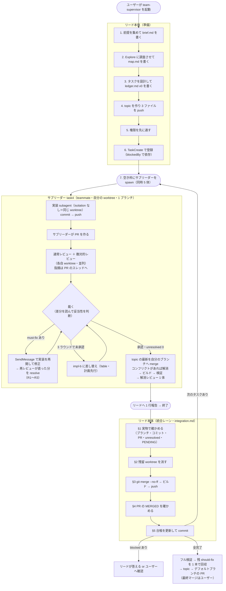

# 設計を選んだ理由（必要なときだけ読む）

SKILL.md 本体には「何をするか」だけを書く（呼び出すとターン全体でコンテキストに留まり、毎ターン
送り直されてトークンになるため。公式の[スキルの書き方](https://code.claude.com/docs/ja/skills)が
「実行内容を述べ、方法や理由を説明しない」と指示している）。「なぜその設計か」はここに置く。

## 全体図

## なぜ Agent Teams を使うか

`supervisor` スキル（dynamic workflow 版）の最大の弱点は、SKILL.md:247-252 が明記している
とおり「**ワークフロー実行中はユーザーに確認できない**（権限の確認以外で実行を止められない）」
ことだった。そのため確認が要る事柄はすべて起動前に潰す必要があり、途中で前提が割れたら
タスクを `blocked` で返させてワークフローの完了を待つしかなかった。

teammate は独立した Claude Code セッションなので、リードからもユーザーからも走行中に
話しかけられる。この 1 点のために階層を組み替える価値がある。

副次的に 2 つ直る。

- **ステップという完全な直列の器が要らなくなった**。組込タスクリストが `blockedBy` を持ち、
  依存が解けたタスクを自動で解放する。依存が無いのにステップを増やして直列化する問題が消える。
- **入れ子の禁止が緩んだ**。dynamic workflow では `agent()` の入れ子が 1 段までで、
  「エスカレーションの中で fix/review を回す」をスクリプトの制御フローに開く必要があった。
  teammate は自分の subagent を起動できる（前景のみ）ので、サブリーダーの中で fix ループが回る。

## なぜサブリーダーを挟むか（lead → subleader → subagent）

リードにレビューの文脈を載せたくないため。

公式 Limitations に「**No nested teams**: teammates cannot spawn their own teammates」とあるので
チームの入れ子は作れないが、**teammate → subagent は可能**（公式 sub-agents の
「an in-process teammate's own subagents run in the foreground」という制約記述が、起動できることを
前提にしている）。

この形にすると worktree の対応がきれいに決まる。公式 sub-agents に
「When the main conversation itself runs isolated in a worktree, Claude Code applies the same checks
to the session and to **every subagent it spawns, including subagents without `isolation: worktree`**」
とあるので、**サブリーダーに `isolation: "worktree"` を付ければ配下の subagent は同じ worktree で
動く**。結果として `1 サブリーダー = 1 worktree = 1 ブランチ = 1 タスク` が一対一で対応し、
旧 supervisor が SKILL.md:137-146 で個別に課していた「checkout する全エージェントに worktree を
付ける」規律が、階層 1 つで自動的に満たされる。

先行実装（narwhalishus/superpowered-teams）は teammate に worktree を配らず、セッション全体で
1 つの worktree を共有してファイル所有権の分割だけで衝突を防いでいる。タスクごとのブランチも
PR も持たない。この設計はそこから進んでいる。

## なぜサブリーダーは実装しないか

当初は「サブリーダー自身が実装する」案を推していた。理由は (1) レビュー指摘の妥当性を裁くには
実装の中身を知る必要がある、(2) 層が増えると伝言ゲームになる、(3) 待機コストが増える、だった。
このうち 2 つは崩れた。

- **(1) は崩れる。** 裁定に要るのは「コードを書いたこと」ではなく「差分を読めること」。
  サブリーダーは `git diff` を読めば裁ける。しかも**実装に思い入れがないぶん中立に裁ける**——
  自分で実装すると「自分の実装への指摘を自分で裁く」形になり、旧 supervisor の
  review-prompt.md:16「fix と review は必ず別 `agent()` にする（修正の自己承認を防ぐ）」が
  防ごうとしたものに近づく。
- **(3) も逆だった。** 待機コストは文脈の大きさに比例する。実装を抱えたサブリーダーの待機は高く、
  薄いサブリーダーの待機は安い。

決め手は**交代の粒度**。「3 ラウンドで直らなければ担い手を替える」を載せたとき、

| | 交代で捨てるもの |
| --- | --- |
| サブリーダーが実装する | サブリーダーごと落とすので**タスクの文脈も全部消える**（DoD の解釈・レビュー履歴・裁定） |
| 実装を subagent に出す | impl subagent だけ差し替え。タスクの理解は残る |

後者なら「実装の固執だけを捨てて、タスクの理解は残す」ができる。

## なぜ 3 ラウンドで交代するか

独立に作られた 3 実装が同じ結論に達している。

- superpowers `subagent-driven-development`: 「Fix round R of 5: **R≤3 resume implementer;
  R≥4 fresh implementer, more capable model**」
- superpowered-teams: 「after **2 full review cycles** without convergence, **shut down and
  respawn** with prior commit SHA as starting point and reviewer findings as context」
- 旧 supervisor: 3 回・無進捗で打ち切り → 再計画エージェント（`fable`）が方針を立て直す

打ち切りは 2〜3 ラウンド、打ち切ったら担い手を替える。旧 supervisor が挟んでいた再計画
エージェントは、impl-b 自身に計画を立てさせれば足りるので廃した。

## なぜタスクとサブリーダーを 1 対 1 にするか

役割ごとに永続する teammate（`impl-1` が複数タスクを次々こなす）も検討したが、
**古いタスクの調査結果と実装判断を次のタスクに引きずる**問題が残る。

`/compact` は使えない。公式 agent-teams に「While you're viewing an in-process teammate, plain
text and skills go to that teammate, but **built-in commands still run in the lead's session**」と
あり、teammate に compact を実行させる手段が無い。自動コンパクションは閾値でしか走らず、
タスクの境界とは一致しない。

先行実装も未解決のまま出荷している。superpowered-teams `SKILL.md:261`:
「**There is no reliable self-detection mechanism for context quality degradation.** If the user
observes a teammate making mistakes inconsistent with their earlier work, the user should prompt a
controlled refresh via shutdown + respawn.」——劣化の検出をユーザーの目視に頼っている。

タスクごとに新しいサブリーダーを立てれば、引きずりは構造的にゼロになる。ベースの文脈は
`brief.md` / `map.md` / `ledger.md` に外出ししてあるので、毎回の読み直しは再調査より安い。
公式のコスト指針が「**Shut down teammates when their work is done. Each active teammate continues
consuming tokens until it exits**」と言うとおり、待機する teammate を減らす効果もある。

代償として、teammate に「次のタスクを自己クレームさせる」（公式機能）は使えない。タスクの
割り当てはリードが全部行う。

## なぜ統合をリードに残すか

**マージを指示されたサブエージェントは安全クラシファイアに確率的に遮断される。** 旧 supervisor の
M25 ステップ 1 で、マージ準備エージェント 5 体のうち 3 体が「Merge Without Review / External
System Writes」を理由に起動を遮断され、承認済みタスクが未統合のままステップが失敗で返った。
遮断は確率的で、同じプロンプトでも通ることがある——リトライでは安定しない。ユーザーの承認の
文脈（スキルの起動）はサブエージェントのトランスクリプトから見えないので、プロンプトの工夫では
解決できない。

**リードのセッションでも `gh pr merge` は遮断される**（M26 で確認）。許可リスト内の
`git merge --no-ff` + `git push` なら通り、GitHub は head コミットが base に到達したことを検出して
PR を自動的に MERGED 判定にする。

auto モードでは**エージェント間のメッセージも classifier が審査し、ブロックされたメッセージは
届かない**（公式 agent-teams の Permissions）。Agent Teams に移してもこの制約は消えない。

トレードオフ: リードがコンフリクトを解消したコードは独立レビューを通らない。これを
(1) 解消後のビルドと検証一式の実測、(2) 規模が大きいときは単発 fix エージェントと独立レビューに
委ねる（マージ自体は委ねない）、(3) 台帳と最終 PR の「自律判断の記録」への明記、で補う。

## なぜ承認ごとに即統合するか

依存を `blockedBy` で表す以上、「ステップ」という完全な直列のバリアは要らない。残るのは
「topic をいつ前進させるか」の選択で、承認ごとに取り込むと 2 つ得がある。

- **コンフリクトが最小の状態で解ける。** 溜めると全タスクが同じ古い起点のまま並走し、
  旧 supervisor が記録した「並列書き換えで全損した」形に近づく。
- **後から始まるタスクほど新しい起点を持つ。** サブリーダーはタスクごとに立て直され、起点は
  spawn 時に決まるので、topic が進んでいれば累積の差分が小さくなる。

リードの手番は増えない。旧 supervisor もタスクの本数だけ `git merge --no-ff` を実行していた
（連続してやっていただけ）。変わるのは実行の時期であって回数ではない。

検証の重さは、ビルドを毎回・フル検証を「後続タスクを spawn する直前」と「全完了時」に絞ることで
旧構成と同水準に収まる。

## なぜ stacked PR（`gh stack`）を使わないか

GitHub の stacked PR は魅力的だが、この設計とは 3 点で衝突する。

- **cascade rebase が worktree 規律の真逆。** `gh stack rebase` / `gh stack sync` は下の層が
  動くと上の層すべてを rebase し直し、`--force-with-lease` で push する。SKILL.md:141-146 の
  detached HEAD 規律は「ブランチ先端の巻き戻しが構造的に起きない」ことを狙って組まれている。
- **`git merge --no-ff` と両立しない。** `gh stack modify` の前提条件に「Commit history must be
  linear」がある。classifier を通る唯一の統合経路（`git merge --no-ff` + `git push`）を捨てる
  ことになり、遮断リスクの検証をやり直す必要がある。
- **主構造が並列独立タスク。** スタックは直線なので、独立タスクを 1 本に並べると存在しない
  依存関係を作ることになる。

代わりに **merge で伝播させる**。結果の木は rebase と同じで、違いは 3 つ。

| | rebase | merge |
| --- | --- | --- |
| ブランチ先端 | 書き換わる（force push） | 前進するだけ |
| 同じコンフリクト | 再適用のたびに蘇る（だから `gh stack init` は `git rerere` を自動で有効にする） | 1 度解けば履歴に残り再発しない |
| `gh stack` | 使える | 使えない（が、そもそも不要になる） |

## なぜ「マージ直前」に取り込ませるか

旧 supervisor では、コンフリクトを**リードが 1 人で、直列に、後からまとめて**解いていた。
サブリーダーが承認直後に topic の最新を自分のブランチへ取り込めば、**変更の文脈を持っている者が、
並列で、小さいうちに解く**ことになる。

PR の diff は汚れない。承認ごとに topic へ即統合しているので、取り込む相手は「承認済みの他ブランチ」
ではなく「更新された topic」（＝ PR の base）になる。GitHub の PR diff はマージベースからの
three-dot diff なので、base が既に含む変更は diff に現れない。

取り込みでコンフリクトが出たときだけ解消レビューを 1 体走らせる。クリーンな取り込みは 1 行も
書いていないので、レビューを走らせるのは使い捨て subagent の無駄になる。この軽重の付け方は
旧 integration.md:59 の「コンフリクトを解消したマージの直後はフル、コンフリクトの無いマージは
速い検証」と同じ考え方で、新しい判断基準を増やしていない。

## なぜレビュー指摘をスレッドに投稿するか

指摘をレビュー本文に書くと、解決済みかどうかを機械的に確かめられない。すべてをスレッドにすれば
`unresolved == 0` が承認の条件になり、リードは findings の本文を読まずに承認を担保できる。

`event` を `COMMENT` に固定するのは、実装もレビューも同じ `gh` 認証で動くため必ず自分の PR に
なり、GitHub が `APPROVE` と `REQUEST_CHANGES` を拒否するから。

行を特定できない指摘も**サマリに落とさず**、ファイル単位のスレッド（`subjectType: FILE`）に
する。落とすと resolve できず、ゲートの網から外れる。`subjectType` は
`addPullRequestReviewThread` にしかなく、バッチ投稿の `DraftPullRequestReviewThread` には無い
（実 API への introspection で確認）ので、行単位はまとめて積み、ファイル単位は 1 件ずつ足す。

## なぜコメント操作をスクリプトにするか

上の手順（PENDING 作成 → 行単位をまとめて積む → ファイル単位を 1 件ずつ足す → `event: COMMENT`
で submit）を各エージェントに毎回手で書かせると、GraphQL の構文・JSON のエスケープ・順序の
3 か所で間違えられる。`scripts/gh-review.py` に閉じ込め、エージェントは引数だけを渡す。

副次的に、書式の規律をコードで守れるようになった。スクリプトは次を拒む——重大度が 3 種類以外、
`verdict` が 2 種類以外、`path` の無い finding、役割に許されない状態語、そして**実装 subagent に
よる resolve**（返信を投稿する前に止める）。役割タグと件数はスクリプトが組み立てるので、
書き忘れも起きない。

権限も狭くなった。`Bash(gh api graphql *)` を許すと GitHub API の全操作が通るが、
`Bash(~/.claude/skills/team-supervisor/scripts/gh-review.py *)` ならこの 6 サブコマンドに限られる。

## なぜ resolve の担い手を分けるか

`unresolved == 0` をゲートにするなら、**実装が自分で畳めるとゲートが自己承認になる**。

- **再レビュー subagent**: 実際の差分を見て直っていると確かめたスレッドを畳む。fix ラウンドで
  どのみち起動するので追加コストはゼロ。
- **サブリーダー**: 自分が `overruled` と裁定したスレッドを畳む。
- **実装 subagent**: 一切畳まない。

## なぜ light を束ねるか

統合レーンは単一で直列（並列マージはコンフリクトする）なので、**ブランチの本数がそのまま統合の
直列時間になる**。docs の追随を 5 件別々のブランチにすると、リードが 5 回 merge → 検証 → push を
回す。

旧 supervisor も残件回収について同じ判断をしている（integration.md:85「**件数が多くても
ブランチを分けない（往復が 1 回で済む）**」）。

加えて light タスク（検分・docs 記録）は兄弟の成果に盲目なので後段に置かれることが多く、
そのときには前段が全部 topic に入っている。束ねても依存関係で困らない。

## 未検証のこと

実運用で確かめて、必要ならこの設計を直す。

- **サブリーダーへの `git merge origin/topic` 指示が classifier に遮断されないか。** 遮断の実績は
  「タスクブランチを topic へマージする担当」で向きが逆だが、確率的である以上ゼロとは言えない。
  遮断されるなら、取り込みをリードが代行する形に退避する。
- **teammate に subagent 定義の `effort` が適用されるか。** 公式は `tools` と `model` の適用、
  `skills` と `mcpServers` の非適用を明記しているが `effort` に言及がない。適用されなければ
  サブリーダーの effort はリードと同じに固定される。
- **`~/.claude/tasks/` のファイル形式。** 公式に記載がなくバージョンで変わる。再開時の読み取りは
  できたら読む扱いにし、読めなければ台帳と git/gh だけで再開する（[ledger.md](ledger.md)）。
- **ファイル単位コメントの `path` が diff 内のファイルに限られるか。** 公式に明記が無い。
  段階 3 で必ず diff 内のファイルを選ぶ規律で回避しているが、422 が出たら規律を強める。
- **モデル表のサブリーダー以外の行。** 旧 supervisor SKILL.md:95-104 からの持ち越しで、
  この構造での妥当性は測っていない。
