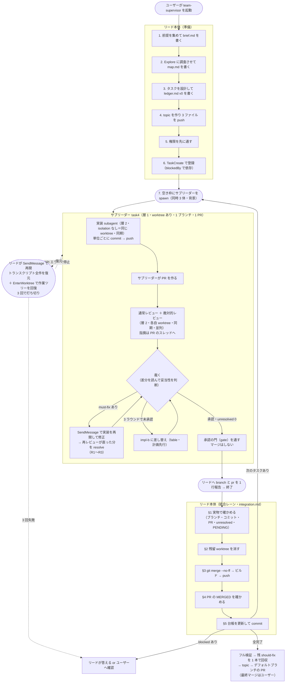

# 設計を選んだ理由（必要なときだけ読む）

SKILL.md 本体には「何をするか」だけを書く（呼び出すとターン全体でコンテキストに留まり、毎ターン
送り直されてトークンになるため。公式の[スキルの書き方](https://code.claude.com/docs/ja/skills)が
「実行内容を述べ、方法や理由を説明しない」と指示している）。「なぜその設計か」はここに置く。

## 全体図



## なぜ入れ子の subagent を使い、Agent Teams を使わないか

`supervisor` スキル（dynamic workflow 版）の弱点は、SKILL.md:247-252 が明記しているとおり
「**ワークフロー実行中はユーザーに確認できない**（権限の確認以外で実行を止められない）」こと。
確認が要る事柄をすべて起動前に潰す必要があり、途中で前提が割れたらタスクを `blocked` で返させて
ワークフローの完了を待つしかない。この構成ではリードが毎ターン戻ってくるので、走行中でも
ユーザーと話しながら方針を変えられる。

**Agent Teams（teammate）は使わない。teammate は worktree を持てないため。** 公式の並列実行の
比較ページ（`/docs/en/agents`）にこうある。

> Agent teams don't isolate teammates in worktrees, so partition the work so each teammate owns a
> different set of files.

これは運用上の推奨ではなく、**配れない**。Agent ツールの実装で teammate になる条件がこう分岐して
いる（v2.1.226 のバイナリで確認）。

```js
let { prompt, subagent_type, description, model,
      run_in_background, name: i, isolation: s, cwd: a } = input;
...
if (v && i && !P && !s && !a) {   // → spawnTeammate
```

`v` はチーム機能が有効かどうか、`P` は fork 種別かどうか。**`name` を渡し、`isolation` も `cwd` も
渡さなかったときだけ teammate になる。** teammate にすると
`1 タスク = 1 worktree = 1 ブランチ = 1 PR` が成立しない。`isolation: "worktree"` を渡した子は
teammate ではなく、worktree を持つ普通の subagent になる——それがこの設計のサブリーダーである。

**その代わり `CLAUDE_CODE_EXPERIMENTAL_AGENT_TEAMS` が有効なままだと事故になる。** その状態で
`name` を渡し `isolation` を渡さない子（＝実装 subagent）を起動すると、`run_in_background: false`
を明示していても teammate として非同期に起動される。実測した返り値:

```
agent_id: probe2-child@session-b17f4e9f
The agent is now running and will receive instructions via mailbox.
```

親が subagent でもバックグラウンドでも同じだった。この状態では、サブリーダーが実装 subagent を
起動して「完了を待ちます」と turn を終え、何も進まない。だから `SKILL.md` の起動前の確認で
env が空であることを確かめ、空でなければ停止する。

## なぜサブリーダーを挟むか（lead → subleader → subagent）

リードにレビューの文脈を載せたくないため。加えて、この階層にすると worktree の対応がきれいに決まる。

**worktree は親から子へ継承される**（実測）。`isolation: "worktree"` の subagent が起動した子は、
`isolation` を付けなければ親とまったく同じディレクトリで動く。

| | PWD | GIT_DIR |
| --- | --- | --- |
| 親（`isolation: "worktree"`） | `.claude/worktrees/agent-a7e0…` | `.git/worktrees/agent-a7e0…` |
| 子（`isolation` なし） | 同じ | 同じ |

結果として `1 サブリーダー = 1 worktree = 1 ブランチ = 1 PR = 1 タスク` が一対一で対応し、
旧 supervisor が SKILL.md:137-146 で個別に課していた「checkout する全エージェントに worktree を
付ける」規律が、階層 1 つで自動的に満たされる。レビューだけは `isolation: "worktree"` を付けて
分ける——2 体が同時に検証コマンドを走らせると互いの結果を汚し、実装 subagent と同じツリーだと
レビュー中に足元が書き換わるため。

**入れ子は 5 層まで許可している。** 公式の既定は 3 層。

> By default, a subagent can spawn subagents of its own, up to three layers below the main
> conversation. At the depth limit, Claude Code **withholds the `Agent` tool** from every subagent.

既定のままだと リード(0) → サブリーダー(1) → 実装・レビュー(2) → その子(3) でちょうど上限に達し、
層 3 に落ちるもの——実装が呼ぶ Explore、レビューが走らせる `/code-review` の子——から先が
一切委譲できない。`/code-review` は effort が高いと自分でも検証エージェントを spawn するので、
既定では黙って失敗する余地が残る。

そこで `.claude/settings.json` の `env` に `"CLAUDE_CODE_MAX_SUBAGENT_SPAWN_DEPTH": "5"` を
入れて 2 層分の余裕を持たせている。この設定はリポジトリ全体に効くので、このスキル以外の
セッションでも入れ子が深くなりうる。歯止めは同時実行数の上限（下記）が担う。

**同時に走る subagent は 20 体まで**（公式の既定。`CLAUDE_CODE_MAX_CONCURRENT_SUBAGENTS`）。
サブリーダー自身も 1 枠を使う。3 体なら、レビュー段階の最悪ケースで 3 ＋ 6 ＋ 6 = 15 体に収まる。
5 体にすると 5 ＋ 10 ＋ 10 = 25 体で超過し、`Concurrent subagent limit reached`（リトライ禁止）で
落ちる。だから同時 3 体にしている。

先行実装（narwhalishus/superpowered-teams）はセッション全体で 1 つの worktree を共有し、ファイル
所有権の分割だけで衝突を防いでいる。タスクごとのブランチも PR も持たない。この設計はそこから
進んでいる。

## なぜサブリーダーは実装しないか

当初は「サブリーダー自身が実装する」案を推していた。理由は (1) レビュー指摘の妥当性を裁くには
実装の中身を知る必要がある、(2) 層が増えると伝言ゲームになる、(3) 待機コストが増える、だった。
このうち 2 つは崩れた。

- **(1) は崩れる。** 裁定に要るのは「コードを書いたこと」ではなく「差分を読めること」。
  サブリーダーは `git diff` を読めば裁ける。しかも**実装に思い入れがないぶん中立に裁ける**——
  自分で実装すると「自分の実装への指摘を自分で裁く」形になり、旧 supervisor の
  review-prompt.md:16「fix と review は必ず別 `agent()` にする（修正の自己承認を防ぐ）」が
  防ごうとしたものに近づく。
- **(3) も逆だった。** 待機コストは文脈の大きさに比例する。実装を抱えたサブリーダーの待機は高く、
  薄いサブリーダーの待機は安い。

決め手は**交代の粒度**。「3 ラウンドで直らなければ担い手を替える」を載せたとき、

| | 交代で捨てるもの |
| --- | --- |
| サブリーダーが実装する | サブリーダーごと落とすので**タスクの文脈も全部消える**（DoD の解釈・レビュー履歴・裁定） |
| 実装を subagent に出す | impl subagent だけ差し替え。タスクの理解は残る |

後者なら「実装の固執だけを捨てて、タスクの理解は残す」ができる。

## なぜ 3 ラウンドで交代するか

独立に作られた 3 実装が同じ結論に達している。

- superpowers `subagent-driven-development`: 「Fix round R of 5: **R≤3 resume implementer;
  R≥4 fresh implementer, more capable model**」
- superpowered-teams: 「after **2 full review cycles** without convergence, **shut down and
  respawn** with prior commit SHA as starting point and reviewer findings as context」
- 旧 supervisor: 3 回・無進捗で打ち切り → 再計画エージェント（`fable`）が方針を立て直す

打ち切りは 2〜3 ラウンド、打ち切ったら担い手を替える。旧 supervisor が挟んでいた再計画
エージェントは、impl-b 自身に計画を立てさせれば足りるので置いていない。

## なぜタスクとサブリーダーを 1 対 1 にするか

役割ごとに永続するサブリーダー（`impl-1` が複数タスクを次々こなす）も検討したが、
**古いタスクの調査結果と実装判断を次のタスクに引きずる**問題が残る。

`/compact` は使えない。組込コマンドはリードのセッションで走るので、subagent に compact を
実行させる手段が無い。自動コンパクションは閾値でしか走らず、タスクの境界とは一致しない。

先行実装も未解決のまま出荷している。superpowered-teams `SKILL.md:261`:
「**There is no reliable self-detection mechanism for context quality degradation.** If the user
observes a teammate making mistakes inconsistent with their earlier work, the user should prompt a
controlled refresh via shutdown + respawn.」——劣化の検出をユーザーの目視に頼っている。

タスクごとに新しいサブリーダーを立てれば、引きずりは構造的にゼロになる。ベースの文脈は
`brief.md` / `map.md` / `ledger.md` に外出ししてあるので、毎回の読み直しは再調査より安い。
1 タスク = 1 worktree = 1 ブランチ = 1 PR という対応も、この 1 対 1 があって初めて崩れない。

代償として、タスクの割り当てはリードが全部行う。サブリーダーが自分で次のタスクを取ることはない。
組込タスクリストもリード専用になる——バックグラウンドの subagent には `TaskCreate` /
`TaskUpdate` / `TaskList` が渡らない（公式のツール絞り込み）。

## なぜ統合をリードに残すか

**マージを指示されたサブエージェントは安全クラシファイアに確率的に遮断される。** 旧 supervisor の
運用 M25（「M+数字」は旧 supervisor スキルを実運用したワークフロー実行の通し番号。以下同じ）の
ステップ 1 で、マージ準備エージェント 5 体のうち 3 体が「Merge Without Review / External
System Writes」を理由に起動を遮断され、承認済みタスクが未統合のままステップが失敗で返った。
遮断は確率的で、同じプロンプトでも通ることがある——リトライでは安定しない。ユーザーの承認の
文脈（スキルの起動）はサブエージェントのトランスクリプトから見えないので、プロンプトの工夫では
解決できない。

**リードのセッションでも `gh pr merge` は遮断される**（M26 で確認）。許可リスト内の
`git merge --no-ff` + `git push` なら通り、GitHub は head コミットが base に到達したことを検出して
PR を自動的に MERGED 判定にする。

auto モードでは**エージェント間のメッセージも classifier が審査し、ブロックされたメッセージは
届かない**。`SendMessage` で再開を指示する経路もこの審査を通る。

トレードオフ: リードがコンフリクトを解消したコードは独立レビューを通らない。これを
(1) 解消後のビルドと検証一式の実測、(2) 規模が大きいときは単発 fix エージェントと独立レビューに
委ねる（マージ自体は委ねない）、(3) 台帳と最終 PR の「自律判断の記録」への明記、で補う。

## なぜ承認ごとに即統合するか

依存を `blockedBy` で表す以上、「ステップ」という完全な直列のバリアは要らない。残るのは
「topic をいつ前進させるか」の選択で、承認ごとに取り込むと 2 つ得がある。

- **コンフリクトが最小の状態で解ける。** 溜めると全タスクが同じ古い起点のまま並走し、
  旧 supervisor が記録した「並列書き換えで全損した」形
  （`.claude/skills/supervisor/SKILL.md:262`）に近づく。
- **後から始まるタスクほど新しい起点を持つ。** サブリーダーはタスクごとに立て直され、起点は
  spawn 時に決まるので、topic が進んでいれば累積の差分が小さくなる。

リードの手番は増えない。旧 supervisor もタスクの本数だけ `git merge --no-ff` を実行していた
（連続してやっていただけ）。変わるのは実行の時期であって回数ではない。

検証の重さは、ビルドを毎回・フル検証を「後続タスクを spawn する直前」と「全完了時」に絞ることで
旧 supervisor と同水準に収まる。

## なぜ stacked PR（`gh stack`）を使わないか

GitHub の stacked PR は魅力的だが、この設計とは 3 点で衝突する。

- **cascade rebase が worktree 規律の真逆。** `gh stack rebase` / `gh stack sync` は下の層が
  動くと上の層すべてを rebase し直し、`--force-with-lease` で push する。このスキルの
  detached HEAD 規律（`subleader-prompt.md` §1 と `implementation-prompt.md` §1。ブランチ名を
  checkout せず `git push origin HEAD:refs/heads/<ブランチ>` でリモートにだけ作る）は
  「ブランチ先端の巻き戻しが構造的に起きない」ことを狙って組んでいる。
- **`git merge --no-ff` と両立しない。** `gh stack modify` の前提条件に「Commit history must be
  linear」がある。classifier を通る唯一の統合経路（`git merge --no-ff` + `git push`）を捨てる
  ことになり、遮断リスクの検証をやり直す必要がある。
- **主構造が並列独立タスク。** スタックは直線なので、独立タスクを 1 本に並べると存在しない
  依存関係を作ることになる。

代わりに **merge で伝播させる**。結果の木は rebase と同じで、違いは 3 つ。

| | rebase | merge |
| --- | --- | --- |
| ブランチ先端 | 書き換わる（force push） | 前進するだけ |
| 同じコンフリクト | 再適用のたびに蘇る（だから `gh stack init` は `git rerere` を自動で有効にする） | 1 度解けば履歴に残り再発しない |
| `gh stack` | 使える | 使えない（が、そもそも不要になる） |

## なぜマージをすべてリードに集めるか

マージは**どちらの向きもリードだけ**が行う。サブリーダーは承認まで面倒を見て、ブランチ名と
PR 番号を渡して終わる。

退けた案は「サブリーダーが承認直後に topic の最新を自分のブランチへ取り込む」形である。狙いは
**変更の文脈を持っている者が、並列で、小さいうちに解く**ことで、旧 supervisor の「リードが 1 人で、
直列に、後からまとめて解く」より速い。だがこの形は次の 3 つを抱える。

- **同じマージが 2 か所に現れる。** リードは結局タスクブランチを topic へ merge するので、
  コンフリクトの解消手順が統合レーンとサブリーダー側の両方に書かれ、食い違うと壊れる。
- **失敗経路が増える。** サブリーダーが再開直後だと作業ツリーが worktree に戻っていないので、
  取り込みの前にその回復を挟む分岐が要る。
- **責任の所在がぼやける。** マージが遮断されたときの担い手が状況によって変わる。

集めた代わりに、この案が狙っていた「文脈を持つ者が解く」は**リードがサブリーダーに聞く**ことで
満たす。サブリーダーは報告を終えて止まっていても `SendMessage` でトランスクリプト全件ごと
再開するので、「この hunk はどちらの意図か」を本人に確かめられる
（[integration.md](integration.md) §3）。コードを書くのはリード自身か、リードが立てた
fix エージェントに限る。

PR の diff は汚れない。承認ごとに topic へ即統合しているので、後続タスクの起点は更新された topic
（＝ PR の base）になる。GitHub の PR diff はマージベースからの three-dot diff なので、base が
既に含む変更は diff に現れない。

## なぜレビュー指摘をスレッドに投稿するか

指摘をレビュー本文に書くと、解決済みかどうかを機械的に確かめられない。すべてをスレッドにすれば
`unresolved == 0` が承認の条件になり、リードは findings の本文を読まずに承認を担保できる。

`event` を `COMMENT` に固定するのは、実装もレビューも同じ `gh` 認証で動くため必ず自分の PR に
なり、GitHub が `APPROVE` と `REQUEST_CHANGES` を拒否するから。

行を特定できない指摘も**サマリに落とさず**、ファイル単位のスレッド（`subjectType: FILE`）に
する。落とすと resolve できず、ゲートの網から外れる。`subjectType` は
`addPullRequestReviewThread` にしかなく、バッチ投稿の `DraftPullRequestReviewThread` には無い
（実 API への introspection で確認）ので、行単位はまとめて積み、ファイル単位は 1 件ずつ足す。

## なぜコメント操作をスクリプトにするか

上の手順（PENDING 作成 → 行単位をまとめて積む → ファイル単位を 1 件ずつ足す → `event: COMMENT`
で submit）を各エージェントに毎回手で書かせると、GraphQL の構文・JSON のエスケープ・順序の
3 か所で間違えられる。`scripts/gh-review.py` に閉じ込め、エージェントは引数だけを渡す。

副次的に、書式の規律をコードで守れるようになった。スクリプトは次を拒む——重大度が 3 種類以外、
`verdict` が 2 種類以外、`path` の無い finding、役割に許されない状態語、そして**実装 subagent に
よる resolve**（返信を投稿する前に止める）。役割タグと件数はスクリプトが組み立てるので、
書き忘れも起きない。

権限も狭くなった。`Bash(gh api graphql *)` を許すと GitHub API の全操作が通るが、
`Bash(~/.claude/skills/team-supervisor/scripts/gh-review.py *)` ならこの 6 サブコマンドに限られる。

## なぜ resolve の担い手を分けるか

`unresolved == 0` をゲートにするなら、**実装が自分で畳めるとゲートが自己承認になる**。

- **再レビュー subagent**: 実際の差分を見て直っていると確かめたスレッドを畳む。fix ラウンドで
  どのみち起動するので追加コストはゼロ。
- **サブリーダー**: 自分が `overruled` と裁定したスレッドを畳む。
- **実装 subagent**: 一切畳まない。

## なぜ light を束ねるか

統合レーンは単一で直列（並列マージはコンフリクトする）なので、**ブランチの本数がそのまま統合の
直列時間になる**。docs の追随を 5 件別々のブランチにすると、リードが 5 回 merge → 検証 → push を
回す。

旧 supervisor も残件回収について同じ判断をしている（integration.md:85「**件数が多くても
ブランチを分けない（往復が 1 回で済む）**」）。

加えて light タスク（検分・docs 記録）は兄弟の成果に盲目なので後段に置かれることが多く、
そのときには前段が全部 topic に入っている。束ねても依存関係で困らない。

## なぜ立て直しより再開を優先するか

止まったエージェントに `SendMessage` を送ると、Claude Code はディスクに残ったトランスクリプトを
読み直して**同じエージェントを全メッセージ付きで起こし直す**。`Agent` ツールの案内文が
「retains its full prior transcript — every tool call, file read, and decision — **not a summary**」
と書いているとおり、要約ではない。

立て直しで残るのは push 済みのコミットと PR のスレッドだけで、DoD の解釈・レビュー指摘の裁定・
実装とのやり取りは消える。再開ならそれが全部残るので、**再開を第一手、立て直しをフォールバック**
にしている。

**ただし再開すると作業ツリーが失われる。** 実測した挙動:

| | 作業ディレクトリ |
| --- | --- |
| 初回（`isolation: "worktree"`） | `.claude/worktrees/agent-<agentId>` |
| `SendMessage` で再開後 | **リードの現在の作業ディレクトリ**（メインツリー内。リポジトリの
ルートとは限らず、リードが `cd` していればそのサブディレクトリになる） |

再開の経路には `isolation` を渡す口が無い。そのまま実装 subagent を起動すると、worktree の継承に
より**メインの作業ツリーにコードが書き込まれる**——リードの統合レーンと他タスクが使っている
同じチェックアウトである。だから再開したエージェントは、何かを書く前にメインツリーを検出し、
`EnterWorktree` で作業ツリーを回復する（[subleader-prompt.md](subleader-prompt.md) §1-b、
[implementation-prompt.md](implementation-prompt.md) §1-b）。

検出は `--git-dir` と `--git-common-dir` の一致で行う。**両方に `--path-format=absolute` を付ける。**
付けないとサブディレクトリで `--git-dir` が絶対パス、`--git-common-dir` が相対パス
（`../../../.git`）になり、メインツリーを WORKTREE と誤判定して素通ししてしまう。再開先が
サブディレクトリになるのは実際に観測されたので、この指定は必須である。

元の worktree は当てにできない。未追跡ファイルだけの変更では自動削除を免れず、実測でも初回の
完了時に消えていた。**push 済みのコミットだけが再開後に引き継げる成果**なので、実装 subagent には
意味のある単位ごとの commit・push を義務づけている。

**利用制限には効かない。** 制限はアカウント単位なのでリードも同時に止まり、リードは再開の
メッセージ自体を送れない。「リードが再び動けるようになってから再開する」以上のことは書けない
ので、rate limit 固有の制御はスキルに入れていない。

## 実測で確かめたこと

Claude Code v2.1.226、`CLAUDE_CODE_EXPERIMENTAL_AGENT_TEAMS` 未設定・
`CLAUDE_CODE_MAX_SUBAGENT_SPAWN_DEPTH=5` の状態で測った。

- **worktree は親から子へ継承される。** `isolation: "worktree"` の親が起動した子は、`isolation` を
  付けなければ親と同じ作業ディレクトリで動く。
- **`name` あり・`isolation` なし・`run_in_background: false` の子は同期実行される。** 結果が
  同じ turn にインラインで返る。teams が有効だとここが teammate 化して非同期になる。
- **`name` は `SendMessage` の宛先として機能する。** 完了した subagent も名前で再開できる。
- **再開すると作業ツリーがメインツリーに戻る。** しかもリポジトリのルートとは限らない。

## 未検証のこと

実運用で確かめて、必要ならこの設計を直す。公式に記載が無い項目はバージョンで変わりうる。

- **深さを 5 層に開けたことで枠をどれだけ食うか。** レビューが走らせる `/code-review` が
  1 体あたり何体を spawn し、それがさらに何層降りるかを測っていない。同時実行の上限 20 体は
  据え置きなので、`Concurrent subagent limit reached` が出たら、同時サブリーダー数を 2 に
  下げるか `CLAUDE_CODE_MAX_CONCURRENT_SUBAGENTS` を上げる。
- **`SubagentStop` フックが API エラーでの終了でも発火するか。** 発火するなら、押し戻しが無意味な
  リトライを 3 回まで生む。`blocked-<agentId>` で止められる範囲に収めてある。
- **subagent 定義の `effort` が適用されるか。** 公式は `tools` と `model` の適用、`skills` と
  `mcpServers` の非適用を明記しているが `effort` に言及がない。適用されなければサブリーダーの
  effort はリードと同じに固定される。
- **`~/.claude/tasks/` のファイル形式。** 公式に記載がなくバージョンで変わる。再開時の読み取りは
  できたら読む扱いにし、読めなければ台帳と git/gh だけで再開する（[ledger.md](ledger.md)）。
- **ファイル単位コメントの `path` が diff 内のファイルに限られるか。** 公式に明記が無い。
  段階 3 で必ず diff 内のファイルを選ぶ規律で回避しているが、422 が出たら規律を強める。
- **モデル表のサブリーダー以外の行。** 旧 supervisor SKILL.md:95-104 の割り当てをそのまま使って
  おり、この構造での妥当性は測っていない。
