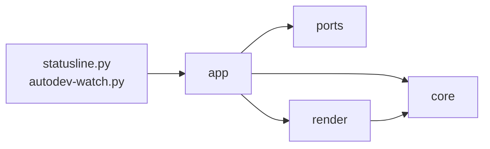

# dotfiles

## Install
1. download
    ```shell
    git clone https://github.com/Luna-rab/dotfiles.git $HOME/dotfiles
    cd $HOME/dotfiles
    ````

2. install

    `install.sh` が `dist/` の設定ファイルを symlink し、
    `dist/dot-config/mise/config.toml` に書いたツールを入れる。

    ```shell
    ./install.sh
    ```

3. zsh を起動する

    `exec zsh` すると、`install.sh` が入れた
    [sheldon](https://github.com/rossmacarthur/sheldon)（zsh のプラグインマネージャ）が
    `~/.config/sheldon/plugins.toml`（`dist/dot-config/sheldon/plugins.toml` への
    symlink）に従ってプラグインを取得する。

    ```shell
    exec zsh
    ```

## 配るもの（`dist/`）と、このリポジトリで使うもの（`.claude/`）

**`dist/` に置いたものだけが $HOME へ配られる。** 中身は $HOME の写しで、`dot-` で始まる
名前が $HOME では先頭にドットの付く名前になる。

| リポジトリ | 配布先 | 方式 |
| --- | --- | --- |
| `dist/dot-zshrc` | `~/.zshrc` | symlink |
| `dist/dot-claude/` | `~/.claude/` | 項目ごと（下の「Claude Code」を見る） |
| `dist/dot-config/git/ignore` | `~/.config/git/ignore` | コピー |
| `dist/dot-config/mise/config.toml` | `~/.config/mise/config.toml` | symlink |
| `dist/dot-vscode-server/data/Machine/settings.json` | `~/.vscode-server/data/Machine/settings.json` | ディープマージ（VS Code のリモート先だけ） |
| `dist/dot-config/sheldon/plugins.toml` | `~/.config/sheldon/plugins.toml` | symlink |

**ファイルを足しただけでは配られない。** `dist/dot-*`（`$HOME` の直下に行くもの）は
`install.sh` の `link_to_homedir()` が名前から配布先を作るので、足せばそのまま配られる。
`dist/dot-config/` の下は関数が 1 つずつ名指ししているので、
`dist/dot-config/gh/config.yml` のようなファイルを足すときは `install.sh` にも 1 行足す。
足し忘れても警告は出ない。

**`dist/` の外にあるものは配らない。** `test/` と `.claude/` がそれで、どちらもこのリポジトリで
作業するときだけ使う。

| 置き場 | 中身 |
| --- | --- |
| `test/` | `uv run pytest` が集める検査。下は対象を写した形で、`test/autodev/` が `dist/dot-claude/skills/autodev/`、`test/dot-claude/` が `dist/dot-claude/` を見る |
| `.claude/scripts/check-skills.py` | スキルの frontmatter・行数・リンク・実行権限を検査する |

`.claude/` を `dist/dot-claude/` と分けるのは、1 つの `.claude/` が「全プロジェクトへ配る元」と
「このリポジトリのプロジェクト設定」を兼ねられないため。兼ねると、配布用の `settings.json` が
このリポジトリでは project スコープとしても読まれ、検査だけに使うスクリプトまで
`~/.claude/` に並ぶ。

## ツール管理（`dist/dot-config/mise/config.toml`）

全環境に入れるツールは
[mise](https://mise.jdx.dev)（プログラミング言語やコマンドラインツールのバージョンを
管理するツール）に任せ、一覧を `dist/dot-config/mise/config.toml` に書く。
`install.sh` はこのファイルを `~/.config/mise/config.toml` に symlink したあと、
`mise install` を実行する。

- **入れる処理は `install.sh` だけが持つ。** `dist/dot-zshrc` は `mise activate` で PATH に
  載せるだけで、インストールを試さない。ツールが足りないときは `./install.sh` を
  実行し直す。
- **`install.sh` は何度実行してもよい。** `mise install` は未インストールのツールだけを
  入れる。全部入っていれば「mise all tools are installed」と出して 0.011 秒で終わる。
- **mise 本体が無ければ、`https://mise.run` のインストーラで `~/.local/bin/mise` に
  入れる。** curl が無い環境では警告を出して、symlink の作成だけを続ける。
- **ツールを増やすときは `dist/dot-config/mise/config.toml` に 1 行足してコミットする。**
  `mise use -g <tool>@latest` を実行してもよい。symlink 越しにこのファイルへ
  書き込まれるので、`git diff` に出る。

devcontainer（VS Code が開発用に作るコンテナ）は毎回まっさらなコンテナから始まるので、
ホストに入れたツールをコンテナは引き継がない。VS Code はコンテナを作るときに
dotfiles の `installCommand`（下記の Dev Containers 参照）を実行するため、
上の仕組みで sheldon や uv などが新しいコンテナにも入る。

## Claude Code (`~/.claude/`)

`dist/dot-claude/` 配下を全環境で共通利用する。`install.sh` が次を行う:

- `commands/` `agents/` `rules/` `scripts/` `hooks/` と `CLAUDE.md` / `keybindings.json` を
  `~/.claude/` に symlink（編集が即反映）
- `skills/` は中のスキルを 1 つずつ symlink する（`~/.claude/skills` 自体は実ディレクトリ。
  理由は下の「スキル」）
- `settings.json` は symlink せず、`dist/dot-claude/settings.json` を `jq` で
  `~/.claude/settings.json` にディープマージ（理由は下の「設定ファイルのマージ」）

既存の `projects/` `history.jsonl` 等ランタイムデータは温存される。

### スキル（`~/.claude/skills/`）

`~/.claude/skills` はディレクトリごと symlink にしてはいけない。ここは第三者スキルの
インストーラ（`npx skills add <owner>/<repo> -g`）が実体をコピーする先でもあり、
symlink にしているとコピーがこのリポジトリの中に落ちる。archify を入れただけで
`dist/dot-claude/skills/archify` に 214 ファイル / 8.5MB が現れ、`.gitignore` が `!/dist/**` で
それを追跡対象に戻すので、`git status` がその 214 ファイルで埋まる。

そこで `install.sh` は `~/.claude/skills` を実ディレクトリのまま置き、
`dist/dot-claude/skills/` の中の
スキルだけを 1 つずつ symlink する。Claude Code はスキル 1 つ単位の symlink も辿る
（v2.1.273 で確認）。リポジトリから消したスキルの symlink は次の `./install.sh` が片付ける。
手で入れたスキルは symlink ではないので残る。

### autodev（指示 1 つを stacked PR にするスキル）

`/autodev` から起動する。実装・レビュー・ジャッジ・修正を無人で回して、タスク PR をスタックに追加する。
ステージは `claude -p` を 1 プロセスずつ起動して走らせ、進行の決定（ステージの順序・回数の上限・
打ち切り・git と gh の操作）は Python の driver
（`dist/dot-claude/skills/autodev/scripts/`）が持つ。skill がやるのは入口（リポジトリ・
ラン名・指示の確定）と出口（終了コードと `autodev status` の読み取り）だけである。
**マージはしない**——人間がレビューして `gh stack merge` で下から行う。

**資格情報は `claude` のログインだけである。** Anthropic Console の API キーは要らない。
driver はステージを起動するとき `ANTHROPIC_API_KEY` などを外す——残っていると claude が
サブスクリプションではなく従量課金に切り替わる。無人のマシンでは
`CLAUDE_CODE_OAUTH_TOKEN` を置く。

設計と落とし穴は
[dist/dot-claude/skills/autodev/README.md](dist/dot-claude/skills/autodev/README.md) に書いた。

### archify（図を作るスキル）

[archify](https://github.com/tt-a1i/archify) は構成図・フロー図・シーケンス図・データフロー図・
状態遷移図を、ブラウザで開いて操作できる 1 ファイルの HTML にする。`install.sh` が release に
添付された配布用 zip を取り、sha256 を照合してから `~/.claude/skills/archify` に展開する。
入れるバージョンと sha256 は `install.sh` の `install_archify_skill()` に書いてある。

- **上げ方**: <https://tt-a1i.github.io/archify/skill-updates/archify/stable.json> の `version` と
  `artifact.sha256` を `install_archify_skill()` に写して `./install.sh` を実行する。
- **`npx skills add tt-a1i/archify -g` は使わない**。default ブランチの HEAD を丸ごとコピーする
  ので、devcontainer を作り直すたびに別のバージョン（実測では開発版 2.17.0-dev.1）が入り、
  テスト一式まで付いてくる。
- 動かすのに要るのは `node` だけ（`dist/dot-config/mise/config.toml` の `node = "lts"` が入れる）。
  npm パッケージは要らない。
- **PNG / WebM の書き出しと `archify visual-check` は Chrome か Chromium を PATH から探す**。
  devcontainer にはどちらも無いのでその 2 つは動かない。HTML を作る `validate` / `deliver` は動く。
  ブラウザの場所を渡すなら `ARCHIFY_CHROME`、コンテナで sandbox を切るなら
  `ARCHIFY_CHROME_NO_SANDBOX=1`。
- 使うたびに上の URL へ更新の有無を問い合わせる。止めるなら `ARCHIFY_UPDATE_CHECK_DISABLED=1`。

### statusline（`dist/dot-claude/scripts/statusline.py`、中身は `hud/`）

[rich](https://github.com/Textualize/rich) で 24bit カラーの行を組み立てて標準出力に出す。

```
Opus 5.5 · high   ctx ━━━━━───── 47%   $3.21
dotfiles   feature/x +2 ~1 ?3
5h ━━━━━━━━━━━━━━━━━━━━━━━━┃━━━━╾─────────── 72% ▲12 1h59m
7d ━━━━━━━━━━━━╾───────────────────┃─────── 31% ▼4 5d14h
```

- 1 行目は使っている量（モデル・コンテキスト・費用）、2 行目はリポジトリとブランチ、
  3・4 行目は利用枠。PR 番号は Claude Code 自身が出すので出さない。
- **利用枠の棒は 40 マスで、0.5 マスまで刻む**（境目のマスは左半分だけ太い `╾`）。
  棒は罫線で描く。ブロック要素（`█` `▌`）はもっと細かく刻めるが、マスの高さいっぱいを
  塗るので、5h と 7d の棒が上下でくっついて見える。
  `┃` は窓の時間が過ぎた位置で、棒がこれを越えていれば使いすぎている。
- **端末の幅を変えても描き直されない**（Claude Code の描き直すきっかけに入っていない）。
  次に描き直すまで前の幅の出力が残るので、右寄せや行末の空白で幅を埋めず、大事なものを
  左から並べる。`settings.json` の `refreshInterval: 2` で 2 秒ごとに描き直させ、幅の変化に
  追いつかせる（1 回の実行は約 50ms）。
- **`▲12` は、利用枠の窓の時間が過ぎた割合より 12 ポイント多く使っているという意味。**
  このままでは窓の途中で尽きる。`▼` は余裕がある側。後ろはリセットまでの残り時間。
- **Ink のような常駐する描画はできない。** Claude Code はコマンドを起動し直して標準出力を
  受け取るだけで、端末につながない。描き方は「1 回出して終わる」ものに限られる。
- **端末の幅は `COLUMNS` から読む。** 収まらない行は優先度の低い部品（費用・worktree・
  コンテキスト・ブランチ）から落とす。
- **Nerd Font を前提にしない。** 既定のフォントにもある文字（`│` `━` `╾` `─` `✔` `◼` `◻`）で描く。
- **`rich` は PEP 723 で宣言し、uv が取り寄せる。** 初回だけダウンロードで遅れるので、
  `install.sh` の `warm_claude_hooks()` が先に 1 回起動しておく。

#### autodev のタスクリスト

autodev のランが動いている間は、Claude Code のタスクリストのように足す。**幅が足りれば
右に、足りなければ下に置く。**

```
autodev range-field ▸ task2 レビュー r1 · 4m12s 26ターン Read · 概要 PR #4
  ✔ task1 パーサの土台を作る      #5
  ◼ task2 範囲指定を足す          テスト作成 ✔ › 実装 ✔ › レビュー ◼ › ジャッジ › PR 本文
  ◻ task3 CLI に出す
  ✘ task4 設定の移行              受入条件が曖昧: 旧形式 …
```

- 読むのは `~/.local/state/autodev/<ラン名>/state.json`。済んだステージはタスクごとの `stages`
  （driver がステージの終わりに成否つきで足す）、走っているステージは `running`（走行中は 5 秒ごとに
  ターン数と直前のツールを上書きする）から取る。
- これからのステージは決まった並び（テスト作成 › 実装 › レビュー › ジャッジ › PR 本文）から出す。ジャッジで指摘が
  残ると修正 › レビュー › ジャッジに戻るが、戻るかどうかはジャッジが終わるまで分からない。
  2 ラウンド目からは `レビュー r2` のようにラウンドを添え、済んだステージが 4 つを超えたら古いものを `…` にする。
- タスクが 5 本を超えたら、今のタスクの前後だけに窓を切る。完了は `✔ 3 件完了` の 1 行、
  未着手は次の 2 本だけ出して残りを `◻ 他 4 件` にまとめる。実行中と要対応は必ず出す。
- ステージとステージの間（検証・push・PR 作成）は `running` が空になるが、タスクが running のあいだは
  出し続ける。`!` はステージの制限時間（1 時間）を超えた印で、3 時間更新の無いランは driver が
  落ちたものとして出さない。

#### 全部を見る画面（`dist/dot-claude/scripts/autodev-watch.py`）

statusline はキーもホイールも受け取れない（Claude Code は標準出力を受け取るだけ）。全タスクと
細かい進捗は、別のタブで開いたこの画面で見る。

**VS Code では、ターミナルのパネルの「＋」の横の ▼ から「autodev watch」を選ぶと開く。**
このプロファイルは `install.sh` の `merge_vscode_settings()` が
`dist/dot-vscode-server/data/Machine/settings.json` をリモート側の設定
（`~/.vscode-server/data/Machine/settings.json`）にディープマージして入れる。

ショートカットで開きたければ、任意で足す。**母艦（Windows 側）の `keybindings.json` にしか
置けない**ので dotfiles からは配らない。コマンドパレットの「Preferences: Open Keyboard
Shortcuts (JSON)」で開いて、次を足すと、エディタの新しいタブに開く。

```json
{
  "key": "ctrl+alt+w",
  "command": "workbench.action.terminal.newWithProfile",
  "args": { "profileName": "autodev watch", "location": "editor" }
}
```

プロファイルは `zsh -lic` を通して起動する。VS Code はプロファイルの `path` をシェルを通さずに
起動するので、直接 `autodev-watch.py` を指すと、mise が PATH に載せる `uv` が見つからないことがある。

VS Code の外では、コマンドで開く。

```shell
~/.claude/scripts/autodev-watch.py            # 動いているランを開く
~/.claude/scripts/autodev-watch.py <ラン名>   # そのランを開く
```

| ペイン | 出すもの |
| --- | --- |
| 左 | 全タスクの表。↑↓ かホイールで選ぶ |
| 右 | 選んだタスクのステージの並び・ステージの履歴（成否・ラウンド・ターン数）・レビューの件数と未解決の指摘・受入条件・DoD・範囲 |
| 下 | そのタスクで走っているステージ（無ければ最後のステージ）のログから、ツールの呼び出しと発言の 1 行目 |

`[` `]` でランを切り替え、`l` でログのペインを隠し、`q` で終わる。2 秒ごとに読み直すだけで、
何も書き込まない。

- **Textual で描く。** Textual は rich の上に作られていて、statusline と部品を共有する。
  statusline は 2 秒ごとに起動し直すので、起動の軽い rich だけを使う。
- autodev の `scripts/` には置かない。そこは `python3` 単体で動かす決まり（`test_layers.py` が
  第三者パッケージの import を拒む）なので、PEP 723 で依存を宣言するこの画面は
  `dist/dot-claude/scripts/` に置く。

#### 中身の置き場（`dist/dot-claude/scripts/hud/`）

`statusline.py` と `autodev-watch.py` は PEP 723 で依存を宣言するだけの入口で、中身は `hud/` に
ある。入口を薄くするのは、ty が PEP 723 のスクリプトを別の環境で検査し、`pyproject.toml` の
`extra-paths` を見ないため。`hud/` の中は通常どおり検査される。



| 層 | 受け持つこと | 使ってはいけないもの |
| --- | --- | --- |
| `core` | 決めること（ステージの並び・窓切り・見出し・ペース）。dict と文字列を受けてデータを返す | ファイル・`subprocess`・`os`・rich・Textual |
| `ports` | ファイルと git を読む。読んだものを解釈しない | rich・Textual・hud のほかの層 |
| `render` | `core` のデータを rich の `Text` にする | ファイル・`subprocess`・`os`・Textual |
| `app` | `ports` で読み、`core` で決め、`render` で描く。statusline の 1 回と Textual の画面 | — |

この向きは `test/dot-claude/hud/test_hud_layers.py` が import を読んで守らせる。`core` が 1 行
`subprocess` を import すると、ステージの並びや窓切りを git とファイル無しでは試せなくなり、しかも
ほかの検査は全部通るので誰も気づけない。

### 設定ファイルのマージ（`~/.claude/settings.json`）

`~/.claude/settings.json` は symlink にしない。Claude Code 自身がここへ書き込むためで
（`/plugin` が `extraKnownMarketplaces` と `enabledPlugins` を足し、`/config` が
`effortLevel` などを書く）、symlink にするとその書き込みがこのリポジトリへ漏れる。

`./install.sh` は `dist/dot-claude/settings.json` を素材として実体へディープマージする
（`jq -s '.[0] * .[1]'`）。リポジトリが持つキーはリポジトリ側で上書きし、実体にしか
無いキーはそのまま残る。だからそのマシンだけで使う設定は `~/.claude/settings.json` に
直接書けばよく、次の `./install.sh` でも消えない。マージ前の実体は
`~/.dotbackup/settings.json.<epoch>` に取ってある。

### タスクリストのツール（`CLAUDE_CODE_ENABLE_TODO_TOOLS`）

`dist/dot-claude/settings.json` の `env` にこのキーを入れてある。**入れないと、新しいモデルでは
`TaskCreate` / `TaskUpdate` / `TaskGet` / `TaskList` の 4 ツールが Claude に渡らず、作業中の
タスクリストに何も載らない**（画面のパネルにも出ない）。

これは公式に文書化された opt-in である。[Tools reference の「Task tool
availability」](https://code.claude.com/docs/en/tools-reference#task-tool-availability)（Claude
Code v2.1.233 以降）が、次の 2 点を述べている。

- 対象は **Opus 4.8 / Sonnet 5 / Fable 5 / Mythos 5 と、それぞれの系列のそれ以降**。
  このリポジトリの `model` は `opus[1m]`（= `claude-opus-5`）なので当たる。
- 既定で外している理由は「これらのモデルは書かれたチェックリスト無しでも複数手順の作業を追え、
  ツールの定義とリマインダーがコンテキストを食う」から。**廃止ではない**（廃止されたのは
  `TodoWrite` の方で、`TaskCreate` などの 4 ツールに置き換わった）。

opt-in の方法は 4 つ挙げられている。ここでは 1 つ目を使っている。

| 方法 | 効く範囲 |
| --- | --- |
| `env` に `CLAUDE_CODE_ENABLE_TODO_TOOLS=1`（ここで採用） | 全セッション・全モデル・全プロバイダ |
| `claude --allowedTools TaskCreate` | その起動だけ |
| `claude --tools …`（並べたものだけに絞る） | その起動だけ |
| Agent SDK の `allowedTools` / `tools` / `env` | その呼び出しだけ |

受け付ける値は `1` / `true` / `yes` / `on`（大文字小文字とも）。プロジェクトの
`dist/dot-claude/settings.json` に足したときは、**走っているセッションでもその場で 4 ツールが増えた**
（Claude Code は設定ファイルの変更を監視している。2.1.234 で実測）。増えなければ再起動する。
同じモデルでキーの有無だけを変えた実測:

| 実行 | `TaskCreate` があるか |
| --- | --- |
| `claude -p "…"` | ない |
| `CLAUDE_CODE_ENABLE_TODO_TOOLS=1 claude -p "…"` | ある |

**このリポジトリで opt-in する理由は、進捗を人が見るためである。** モデルの側は無くても困らない
（上の公式の記述）。**払っているのは 4 ツールの定義とリマインダーのぶんのコンテキストである。**

サブエージェントには、**セッションがツールを持っているときだけ**同じものが渡る（モデルが違っても
同じ。上の公式ページ）。

### Opus の 1M コンテキスト（`"model": "opus[1m]"`）

`dist/dot-claude/settings.json` の `"model": "opus[1m]"` は、Opus のコンテキストウィンドウ（1 回の
やり取りでモデルが読める最大トークン数）を 100 万トークンにする指定。末尾の `[1m]` が
Claude Code に long context のベータ機能（`context-1m-2025-08-07`）を要求させる印で、
これが無いと 20 万トークンで打ち切られる。

`ANTHROPIC_DEFAULT_OPUS_MODEL` ではなく `model` キーに書く。Claude Code 2.1.226 で
実測した結果:

| 指定 | 実際のウィンドウ |
| --- | --- |
| `dist/dot-claude/settings.json` の `"model": "opus[1m]"` | 1,000,000 |
| `ANTHROPIC_DEFAULT_OPUS_MODEL` に `[1m]` を付けるだけ | 200,000（`[1m]` が落ちる） |

環境変数に `[1m]` を付けても、`claude --model opus` のように別名を明示しない限り
Claude Code が `[1m]` を落とし、20 万トークンのままになる。

トークン単価は `[1m]` の有無で変わらない（long context の割増は無い）。ただしウィンドウが
5 倍になると自動 compact（会話履歴の自動要約）が起きるまでが長くなり、1 リクエストあたりの
入力トークンが増えるので支払総額は増える。手前で compact させたいときは
`CLAUDE_CODE_AUTO_COMPACT_WINDOW`（または `autoCompactWindow` 設定）でトークン数を指定する。

Sonnet 5 は既定で 100 万トークンなので、`[1m]` を付ける必要はない。

### 言語サーバ（LSP）

Claude Code は言語サーバから定義・参照・シンボル検索・型エラーを引く。使えるようにするには
2 つ揃える必要があり、置き場所が分かれている。

| 何を決めるか | どこに書くか |
| --- | --- |
| どの拡張子をどのサーバに渡すか | `dist/dot-claude/settings.json` の `enabledPlugins`（公式 plugin の `typescript-lsp` / `pyright-lsp` / `php-lsp`） |
| サーバの実行ファイル | `dist/dot-config/mise/config.toml`（`npm:typescript-language-server` / `npm:pyright` / `npm:intelephense`） |

公式 plugin が持つのは起動コマンドと拡張子の対応だけで、実行ファイルは PATH から探す。
plugin を有効にしても実行ファイルが無ければ、その言語では何も引けない。

**TypeScript は、開いているリポジトリの `node_modules/typescript` が要る。**
`typescript-language-server` は解析を tsserver に任せ、それをワークスペース直下から探す。
`dist/dot-config/mise/config.toml` に `npm:typescript` を足しても効かない。mise は npm パッケージごとに別の
node_modules を作るので、サーバからは見えないため。`npm ci` を通していないリポジトリでは
initialize が `Could not find a valid TypeScript installation` で失敗する。

### Dev Containers

VS Code のユーザ設定に以下を追加すると、コンテナ作成時に自動適用される:

```json
"dotfiles.repository": "<owner>/dotfiles",
"dotfiles.targetPath": "~/dotfiles",
"dotfiles.installCommand": "install.sh"
```
