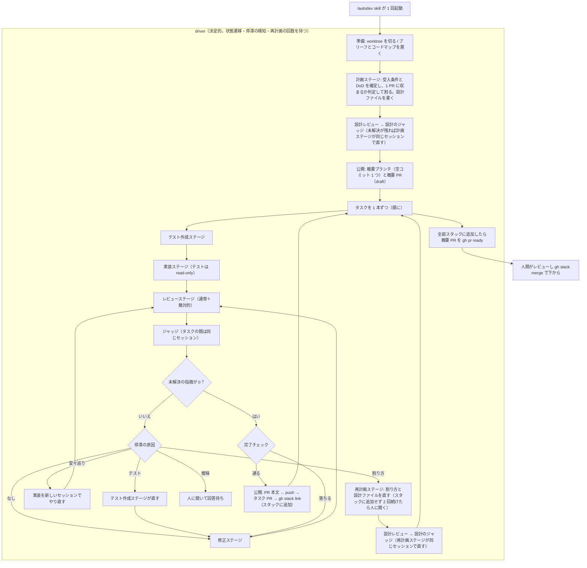

# autodev の設計と実測

autodev を直す人が知っておくことの詳細。何をするスキルかの概観は [README.md](README.md)、
用語の意味は [GLOSSARY.md](GLOSSARY.md) にある。

ステージはすべて `claude -p` を 1 プロセス起動して走らせ、**進行は driver が持つ**（ラン 1 回は
`scripts/autodevlib/app/drive.py`、ステージの順番と打ち切りは `scripts/autodevlib/app/` の
各ファイル）。モデルが決めるのは各ステージの中身だけである。

## 資格情報

**資格情報は `claude` 自身のログインである。** Anthropic Console の API キーは要らない。
driver はステージを起動するとき `ANTHROPIC_API_KEY` / `ANTHROPIC_AUTH_TOKEN` /
`ANTHROPIC_BASE_URL` を**外す**。残っていると claude がサブスクリプションではなく従量課金に
切り替わる。無人のマシンでは `CLAUDE_CODE_OAUTH_TOKEN` を置く（`claude setup-token` で作る）。

## ランを片付ける

`purge` は GitHub の PR とリモートのブランチには触らず、残っている PR 番号を出すだけにする。
push していないコミットがあるか、ステージが走っている記録があると何も消さずに止まる
（`--force` で消す）。

**やり直すときは `autodev clean` を先に打つ。** ランディレクトリを手で消すと worktree の
実体は消えるが git 側の登録は残り、ブランチが「別の場所でチェックアウト中」として扱われる。
消してしまった場合は `git -C <対象> worktree prune` で外す（`autodev run` も起動時に
`prune` を通すので、作り直しは通る）。

## ステージは聞いて待てる。回答すると続きから進む

計画ステージが受入条件の曖昧さに当たったら、**推測せずに聞いて止まる。**

```
<autodev> ask --id range-empty --question "空入力の range は None か 0.0 か"
```

フックが `defer` を返すのでステージはそこで止まり、driver は質問を出して終了コード 4 で返る。
回答を置いて呼び直すと、**同じツール呼び出しから続く**——読んだ内容も文脈も失われない。

```bash
scripts/autodev.py answer --name <ラン名> --id range-empty --body "None。mean と揃える"
scripts/autodev.py run --name <ラン名>
```

**止まったステージを再開するときはプロンプトを渡さない**（渡すと新しいターンが始まって、止まった
ツール呼び出しが再開されない）。判断するのは**回答のファイルが在るかどうかだけ**なので、
何度呼び直しても同じ結果になる。

実測では、聞いて止まるまでが 9 ターン / $0.519、回答してから計画が終わるまでが 4 ターン /
$0.907 だった。同じ曖昧さで `blocked` を返して全部やり直した経路は 20 ターン / $1.204 を
2 回払っていた。

**ステージが `ask` で聞けるのは計画ステージだけである。** タスクの途中では driver が質問を出す
（次の節）。回答は「人が決めたこと」としてタスクの `notes` に入り、そのタスクのステージに毎回渡る。
タスクはどこまで進んだか（`phase`: テスト作成・実装・レビュー・完了チェック）を state.json に
持っているので、回答して呼び直すとその続きから進む。

**回答を作るかどうか、呼び直すかどうかを決めるのは呼び出し元のエージェントである。** driver は待っている
事実と質問だけを返す。

## 停滞の検知で知っておくこと

停滞したときの手の全体は [README.md](README.md) の「直らないときの手」にある。

- **ラウンドに上限は無い。** 止まらずに回り続けるのを防ぐ最後の歯止めは、**タスクをスタックに追加しないまま
  続けた再計画の回数**（2 回）である。スタックに追加するたびに 0 に戻す。ラン全体の回数で止めないのは、
  設計を直すたびに再計画を通るので、真っ当に進むランでも回数が増えるからである
- タスクを足し続けるランを止める条件は置いていない（再計画のたびにタスクを 1 本足し、そのタスクは
  スタックに追加される、という回り方は数え直しで止まらない）
- 停滞に数えるのは「同じ指摘が修正を 2 回受けても未解決」だけで、**ラウンドごとに新しく立つ指摘は数えない**
- 停滞しているのにジャッジが原因を分類しなかったら、再計画に回す（分類が無いまま修正を繰り返さない）
- 移した指摘は、移した先のタスクの `review.json` に未解決として立て直す。そのタスクのジャッジが閉じるまで、
  そのタスクはスタックに追加されない
- 完了チェックが落ちたら、落ちた項目を must-fix の指摘にして修正のループへ戻す。コードの直しで解けない項目
  （④レビューステージが走り終えていない）は人に聞く

## driver の流れ



## 崩してはいけない線引き

この 8 つは、どれか 1 つを崩すと**この仕組みが成り立たなくなる。**

1. **進行をモデルに持たせない。** どのステージを何回呼ぶか、停滞したときにどの手を打つか、完了チェックの合否は driver に
   ある。モデルが進行役になると、完了チェックを飛ばすことも「通った」と言うこともできる。
2. **インフラと実装を混ぜない。** GitHub を触るのは driver の公開だけ。
   ステージは `gh` を叩かず、push もしない。コンテナで走らせたときに GitHub の
   資格情報を渡さずに済む。
3. **テストを書けるのはテスト作成ステージだけ。** 実装ステージはフック（`hooks/deny-writes.py`）で
   止まる。テストが仕様と矛盾していたら、直さずに `testConflict` で報告する。テスト作成ステージが
   テスト以外に書いてよいのは、`<設計>` のシグネチャのスタブだけである。
4. **指摘の状態を動かせるのはジャッジだけ。** driver がジャッジトークン（`AUTODEV_JUDGE_TOKEN`）を
   ジャッジの process にだけ渡す。他のステージは名乗っても拒まれる。自分で閉じられると
   「未解決が 0 件」が自己承認になる。
5. **完了の根拠はステージの報告ではない。** 完了チェック（証拠を集めるのは
   `scripts/autodevlib/ports/evidence.py`、合否を決めるのは
   `scripts/autodevlib/core/verdict.py`）を
   driver が毎回通す。
   検証コマンドは driver が自分で流す。
6. **レビューは毎ラウンドまっさらにする。** 1 ラウンド目の結論を持ち込むと、それがフレーミングに
   なって検出が落ちる。セッションを続けるのは実装・修正（同じセッション）とジャッジ・設計のジャッジ
   だけで、ジャッジは経緯を覚えていることが停滞の見分けに要る。設計レビューにも前の版を渡さない。
   前の版に戻ったかを見比べるのは設計のジャッジである。
7. **マージしない。** 概要 PR が draft のあいだは上のタスク PR もマージできない。
   全部スタックに追加し終わってから `gh pr ready` に上げる。
8. **進行状態を agent に書かせない。** タスクの一覧・状態・PR 番号・要対応のタスクの出所は
   state.json だけで、driver が本文のマーカーへ毎回組み立てて差す。agent が書くのは
   マーカーの周りの文章だけである。

## 設計を確かめてからタスクを動かす

**テストを書くには、呼ぶ関数の名前・置き場所・型・失敗の返し方を決めなければならない。** これを
テスト作成ステージに決めさせると、誰も確かめないまま設計がテストに固定され、実装はテストを
変えられないのでその設計に縛られる。だから計画ステージに設計ファイル（`<設計>`）を書かせ、
テスト作成より前に確かめる。

- **計画ステージの結果はすぐ state.json に写さない。** 提案として `state.json` の `design.proposal`
  に持ち、設計の指摘が 0 件になってから写す（`app/drive.py` の `settle_proposal()`）。写す前に
  確かめるので、却下された割り方でタスクが動き出さない。判断ログも写すときに 1 回だけ残る
- **再計画ステージの結果も同じく提案として確かめる。** 割り方を変えると境界の形が変わり、形を変えると
  後ろのタスクの受入条件が変わるので、再計画ステージは設計ファイルも丸ごと返す。指摘の移管は
  写すときに 1 回だけ行う（二度移すと、移した先に同じ指摘が 2 件立つ）
- **設計の指摘を直すのは設計を書いたステージ（計画か再計画）で、同じセッションの続きで呼ぶ**（`continue_from`）。
  読んだコードを読み直させない。直すたびに結果を丸ごと返させ、設計ファイルは新しい版になる
- **版は消さない**（`<ランディレクトリ>/design/v<版>.md`）。設計のジャッジはランの間ずっと同じ
  セッションで、過去の版と見比べて**前の版の形に戻った**ら `reverted` を返す。driver はそこで
  人に聞く。driver は版を比べない（形が戻ったかを文字の差から判定できない）
- 設計の指摘が停滞したら（直しを 2 回受けても未解決）、ジャッジが分類しなくても人に聞く。
  タスクと違って、割り方を直す先（再計画）が無いからである
- **タスクがすべて `light` なら設計レビューを飛ばす。** `light` のタスクは新しい公開インターフェースを
  作らないので、テストに縛られる設計がほとんど無い。飛ばしても設計ファイルは書き出す。飛ばすかは
  直す前の最初の提案で決めて、直した提案に引き継ぐ（直した版がたまたま light だけになったときに、
  未解決の指摘を残したまま写さない）
- 直した結果の `design` が空なら、前の版の設計を残す（以後のテスト作成ステージが呼べる形を失う）
- 設計のジャッジが 2 回続けてエラーで終わったら、セッションを捨ててから人に聞く。同じセッションを
  持ち越すと、回答しても落ち続ける。過去の版は `<設計の履歴>` から読み直せる
- 直しの途中で計画ステージが `blocked` を返したら、終了コード 2 で終えずに人に聞いて続ける。
  指示を書き直して呼び直すと、それまでの設計の経緯を失う
- 割り方（1 タスク・層ごと・task1 で全層を最小の機能だけ通して以降は層ごと）は計画ステージが選び、
  理由を `decisions` に書く。**どれも選択肢の 1 つで、設計レビューは割り方の種類を指摘しない**
- 敵対的レビューには `<設計>` を渡さない（`config/stages.py` の `reads_design`）。前提知識ゼロで
  差分だけを読むことが、そのステージの役割の全部である

## テストと実装は設計に沿い、テストは実装の前に落ちる

- **テスト作成ステージは `<設計>` にある形だけを呼ぶ。** 足りない形があれば、テストを書かずに
  `designGap` を返す。driver はそれを再計画（`kind: design-gap`）に回し、設計レビューを通してから
  テスト作成を呼び直す
- **スタブを置いてよい。** まだ無い関数を呼ぶと import エラーで落ちて期待値の比較に届かないので、
  `<設計>` のシグネチャで中身が未実装を示す例外だけのスタブを許す。フックは中身を見分けられないので、
  driver はテスト作成ステージがテスト以外に触ったファイル（`stubFiles`）を控え、通常レビューに渡して
  確かめさせる。敵対的レビューには渡さない
- **そのタスクで初めてテストを書いたら、driver が検証コマンド一式を流す**（`app/build.py` の
  `confirm_red()`）。全部通ったら新しいテストが 1 本も落ちていないので、1 回だけ書き直させ、
  それでも通るなら人に聞く。流すのはテスト作成ステージが返す `commands` ではなく、完了チェック⑥と
  同じ検証コマンドである。ステージが選んだコマンドだと、いつも落ちるもの（パスの誤り・テストが 1 本も
  集まらない）でも「落ちた」になる。検証コマンドは完了チェック⑥で実装の後に通ることも確かめるので、
  前で落ちて後で通れば新しいテストが流れている
- **流す検証コマンドはタスクごとに決まる**（`core/task_order.py` の `verify_commands()`）。ラン共通の
  `verify` に、そのタスクと前のタスクが足した `verify` を加える。後ろのタスクが足したものは流さない。
  後ろのタスクで作るファイルを確かめるコマンドは、前のタスクの時点では必ず落ち、直しようがない
- 確かめの途中で止まったら、タスクの `redCheck` から続ける。`running`（検証コマンドを流している間に
  driver が落ちた）なら確かめだけやり直す。`asked`（人に聞いた）なら回答に沿って 1 回書き直させ、
  もう確かめない。確かめ直すと「このまま進めてよい」という回答でも同じ質問に戻る
- テスト作成・実装の報告（`designGap` / `interfaceChange`）から回った再計画は、タスクが `light` でも
  設計レビューを通す。報告が来た時点で「light は新しい公開インターフェースを作らない」が崩れている
- **実装・修正ステージは設計の形を黙って変えない。** 変える必要があれば `interfaceChange` を返し、
  driver は**報告の時点で**再計画（`kind: interface-change`）に回す。スタックに追加してからでは、
  設計レビューが却下しても形を戻せない（スタック済みのタスクは変えない）。設計を写したら
  タスクをテスト作成に戻し、何がなぜ変わったか（`resumeNote`）をテスト作成と実装に渡す。
  報告しないで形を変えた実装は、通常レビューが `<設計>` と照らして `must-fix` にする
- **テストの抜けはレビューで見る。** 通常レビューは、受入条件の 1 つでもテストが確かめていなければ
  `must-fix` を立て、ジャッジは停滞を待たずに `tests` に分類する。修正ステージはテストを変えられない
  ので、回しても直らない
- **見分けられるのは「全部通った」だけである。** lint などテスト以外で落ちても Red とみなすので、
  落ちたことはテストが正しいことの証明にならない。テスト 1 本ずつが落ちるかは、テストフレームワーク
  ごとに出力を読み分けないと分からないので見ていない。検証コマンドを 1 回多く流す時間がかかる

## ステージごとに変えるもの

`scripts/autodevlib/config/stages.py` の `TABLE` にある。**体数の計算も停滞の条件も
ここには無い**（`scripts/autodevlib/core/review_policy.py` と driver にある）ので、
レビューステージを 1 体増やしても
完了判定のコードに手が入らない。

| | 効くもの |
| --- | --- |
| モデルと思考量 | 読んで決めるステージは `opus`、文章を組むだけのステージ（PR 本文・まとめ）は `sonnet`。思考量は計画・再計画・ジャッジ・設計レビュー・設計のジャッジが `high`、ほかは `medium` |
| 書き込みの範囲 | `edits` が偽のステージは worktree の中を書き換えられない（フックが止める） |
| ターンの上限 | `--max-turns`。超えるとステージが失敗する |
| 環境変数 | ジャッジトークンとテストの解禁は、それが要るステージにだけ渡す |
| `<設計>` | `reads_design` のステージにだけ渡す。敵対的レビューには渡さない |

書き込みを止めるのは `hooks/deny-writes.py` で、**`--disallowedTools` は使わない。**
ツールごと消すと、読むだけのステージが自分の結果の JSON を書けなくなる（`Write` が要る）。
フックなら宛先で分けられる——worktree の中は止め、結果を書く `<ランディレクトリ>/` の下は通す。
Bash のリダイレクトも同じ 1 か所で見る。

それでも完全には止められないので、ソースが動いていないことは完了チェック②（コミット数）と
完了チェック⑤（テストの差分）で git から確かめる。

## 走行中に driver が見て、打ち切る

ステージの JSONL は**走りながら 1 行ずつ**読む。読んだ行はその場でログへ落とすので、打ち切った
ステージにも記録が残る。

見ているのは 2 つで、**判断するのは driver のコードである。モデルは入らない。**

- **進行**——ターン数と直前のツールを state.json の `running` に書く（5 秒ごと）。statusline と
  `autodev status` がこれを読む
- **ガードとの衝突**——フックに 10 回止められたステージは打ち切る。指示書を読み違えているので、
  ターンの上限まで使い切っても直らない

打ち切りは**プロセスを kill せず、標準入力へ制御要求を送る。**

```json
{"type":"control_request","request_id":"…","request":{"subtype":"interrupt"}}
```

こうすると `result` イベントが返るので、usage と停止理由（`subtype:
error_during_execution` / `terminal_reason: aborted_streaming`）が残る。制限時間の超過も
同じ経路を通る。`cancel_queued` は `system/init` の `capabilities` に
`interrupt_cancel_queued_v1` があるときだけ付ける——**版の文字列で比べない**（公式もそう
指示している）。

**ツール 1 回ごとの承認はしない。** 同期の関門を挟むと、答える相手が生きていないと進めず、
無人で回せなくなる。ツール単位で止めるのはフック（`hooks/deny-writes.py`）の仕事で、
そちらは即答する。

## 文面はテンプレートにあり、数は state.json から入る

**Python の中に Markdown を書かない。** 文面は `templates/*.md` か、agent が書いて
`<ランディレクトリ>/prose/*.md` に置いたものにある。数と状態は、どちらの場合も driver が
state.json / config.json から組み立ててマーカーの位置に差す。

**概要 PR の本文はまとめステージ**（`summary`）**が全体を書く。** driver はそれをマーカー入りのまま
`prose/overview.md` に保存し、書き出すたびに次のマーカーを置き換えて、末尾に署名
（`templates/overview-pr-body.md`）を足す。

| マーカー | 差す中身 | 中身が無いとき |
| --- | --- | --- |
| `<!-- autodev:tasks -->` | タスク表 | `タスクはありません。` |
| `<!-- autodev:held -->` | 要確認・失敗のタスクと理由の箇条書き | `要対応はありません。` |
| `<!-- autodev:deferrals -->` | スコープ外にしたものの箇条書き | `スコープ外にしたものはありません。` |
| `<!-- autodev:decisions -->` | 判断ログの箇条書き | `判断ログはありません。` |

- 差すのは中身だけで、見出しと `<details>` はステージが書く。マーカーを置くかどうかも
  ステージが決め、driver は足さない・検査しない
- 置き換えは `string.Template` ではなく、決まった文字列を探して行う（`str.replace` と同じく
  文字列として一致したものだけを置き換える）。ステージが書いた本文には `$$` や `${...}` が
  入りうるので、`string.Template` に通すと `$$` が `$` になり、`${tasks}` が消える
- 4 つのマーカーは 1 回の走査で置き換え、差した中身は読み直さない。マーカーを 1 つずつ
  `str.replace` すると、タスクの題や判断ログに入ったマーカーの文字列まで置き換わる
- 置き換えるのは 1 行に単独で置いたマーカーだけで、行の途中にあるものは残す。本文や起動時の
  指示がマーカーをインラインコードで説明していると、そこまで置き換えて表のセルに表が入る
- まとめステージがまだ本文を返していないときは `templates/overview-pr-body-minimal.md`
  （引用 1 行・タスク表・要対応）を使う

brief は `templates/brief.md` の `${verify}` `${test_globs}` `${notes}` を `string.Template` で埋める。
`${notes}` は計画ステージが `briefNotes` で返したもので、テスト作成ステージから後の全部が読む。

こう分けるのは、**進行状態の出所を state.json 1 つに保つ**ためである。概要 PR の本文は
1 本スタックに追加するたびに書き直すので（タスク 3 本なら 5 回）、表まで agent に書かせると
「state.json では要確認なのに本文では進行中」がありえて、そのたびにモデルを呼ぶことになる。
まとめステージは**計画の直後と仕上げの 2 回だけ**呼び、それ以外の書き直しでは
`prose/overview.md` を読み直す。

## ステージの結果は schemas/ で形が決まる

driver は `schemas/<指示書>.json` の本文を `claude --json-schema` に渡す。するとステージに
`StructuredOutput` ツールが 1 つ増え、**最後の応答がその形の JSON になる。**

**形の出所はスキーマのファイル 1 か所である。** 指示書（`contracts/*.md`）は各キーが何を意味
するかを書き、形そのものは書かない。

知っておくべきことが 3 つある。

- **生成時の制約ではなく事後の検証である。** 外れた出力はツールのエラーとして差し戻され、
  claude が言い直す。その言い直しが `--max-turns` の予算を食うので、結果を返すステージの上限は
  多めに置いてある
- **検証に失敗しても終了コードは 0 のまま**という経路がある。満たせないスキーマを渡した
  実測では `subtype: success` / `is_error: false` で `structured_output` が空だった。だから
  driver は結果が在ることを別に確かめる
- **スキーマはファイルパスではなく JSON の本文を渡す。** パスを渡すと
  `--json-schema is not valid JSON` で起動前に落ちる。draft-07 だけで、`$schema` に
  2020-12 を書くと拒まれる

**結果をファイルに残すのは driver である。** ステージに書かせないので、在ることと形が保証される
（`tasks/task<番号>/result-<ステージ>-<ラウンド>.json`）。

## ステージを足す・直す

ステージ 1 つは 5 か所でできている。**足すのはこれだけで、完了判定のコードには手が入らない。**

| 置き場 | 何を書くか |
| --- | --- |
| `scripts/autodevlib/config/stages.py` の `TABLE` | 名前・指示書・モデル・思考量・ターンの上限・セッションを続けるか・ジャッジトークンを渡すか・ソースを書き換えるか |
| `scripts/autodevlib/core/prompt.py` の `ROLE_KEY` | そのステージをどの役割の必須ルールで走らせるか。**足さないとステージの起動時に `KeyError` で落ちる**。役割ごと新しいなら `REQUIRED_RULES` にも 1 項目足す |
| `contracts/<名>.md` | そのステージが何をするか。**ステージはここを自分で読む** |
| `schemas/<名>.json` | 結果の形（結果を返すステージだけ）。driver が `--json-schema` に渡す |
| `templates/<名>.md` | 成果物の形。マーカーは driver が埋める（文面を出すステージだけ） |

レビューステージを増やすときは、`scripts/autodevlib/ports/review_store.py` の `REVIEW_STAGES` に
1 行足し、`scripts/autodevlib/core/review_policy.py` の `expected_reviewers()` が返す
並びに入れる。**体数は `review.json` の
`runs` から数えるので、期待する数をコードに埋める必要はない。**

指示書の本文はプロンプトに入れない。利用者のメッセージに入るのは、前置き・指示書への案内と
プレースホルダ表・このタスクの値だけで、**必須ルールは `--append-system-prompt` で system 側に置く**
（長い指示書とコードを読む間も薄まらないようにする）。

## ランナーを差し替える

`claude` を別のものに替えるときに書き換えるのは `scripts/autodevlib/ports/runner.py`
1 本である。
次の 2 つの形を保てば driver には手が入らない。

- `Call`——プロンプト・cwd・結果の書き先・モデル・ツール・上限・環境変数・`watch`
- `Result`——終了コード・停止理由・最後の応答・usage・セッション id・`aborted`

`watch` はイベント 1 つごとに呼ばれ、**文字列を返すとその理由でステージが打ち切られる。**
監視の中で例外が出てもステージは止めない（監視の誤りで作業を落とさない）。

## 実測して分かっていること

- **`docker agent` では組めない。** `harness: type: claude-code` が受け付けるのは
  `type` / `effort` / `model` の 3 つだけで、`tools` / `output_format` /
  `structured_output` / `allowed_tools` / `settings` / `max_turns` は
  `unknown field` で弾かれる。ステージごとのツール制限もターンの上限も指定できない。
- **`claude setup-token` のトークンは API キーとして使えない。** `Authorization: Bearer` で
  素の HTTP に出しても `HTTP 429: rate_limit_error`（`anthropic-ratelimit-*` ヘッダは付かず、
  message は `Error` の 1 語）が返る。Claude Code 以外のクライアントからは使えないので、
  `docker agent` の標準の agent をサブスクリプションで動かす道はここで閉じている。
- **`--settings <file>` でフックを外から渡せる。** worktree に
  `.claude/settings.local.json` を置かずに済む（置くと commit に混ざる危険があった）。
  `PreToolUse` が終了コード 2 を返すと書き込みは起きない。
- **`--disallowedTools` はツールをセッションから消す。** `bypassPermissions` でも効き、
  消したツールはモデルの手元に現れない。ただし宛先で分けられないので autodev では使わない。
- **プロンプトは標準入力から渡す。** `--allowedTools <tools...>` は可変長で、次のオプションが
  来るまで後ろの引数を全部取る。プロンプトを引数の末尾に置くとツール名として飲まれ、
  `Input must be provided either through stdin or as a prompt argument` で落ちる。
  **オプションの並び順しだいで通ることもある**ので、余計に見つけにくい。
- **`2>&1` を書き込みと数えない。** フックの正規表現が `>` を拾うので、
  `cat app.py 2>&1 | head` のような読むだけのコマンドが拒まれた。fd の複製
  （`\d*>&\d*`）を先に外してから書き込みを探す。
- **`--max-turns` は効く。** 超えると終了コード 1 と `subtype: error_max_turns` /
  `terminal_reason: max_turns` が返る。
- **`--permission-mode bypassPermissions` なら cwd の外も読み書きできる。** ステージは
  `<ランディレクトリ>/` の下に結果を書くので、これが要る（`--add-dir` は要らなかった）。
- **`--session-id` で id を呼ぶ側が決められる。** 出力から拾わなくてよい。続きは
  `--resume <id>`。
- **制御要求は標準入力に混ぜて送れる。** SDK 専用ではない。`interrupt` を送ると
  `{"subtype":"success","response":{"still_queued":[],"cancelled":[]}}` が同じ標準出力へ
  返り、会話には `[Request interrupted by user]` が残る。`still_queued` と `cancelled` に
  載るのは**こちらで `uuid` を振ったメッセージだけ**なので、送る user メッセージには必ず
  振る。
- **`--input-format stream-json` で起動したら、`result` を見て標準入力を閉じる。**
  閉じないと claude は次のメッセージを待って終わらない。
- **`system/init` はターンごとに出る。** 1 回だけ来る前提で待つと 2 ターン目以降で詰まる。
- **`session_id` は CLI が決める。** 入力に書いた値は無視される。
- **読むのは JSONL の `result` イベント 1 つでよい。** `subtype` / `is_error` /
  `stop_reason` / `num_turns` / `result` / `usage` / `total_cost_usd` /
  `permission_denials` が全部ここに載る。
- **ステージは 1 回あたり約 26k トークンの固定費がかかる**（Claude Code のシステムプロンプト）。
  ただし実際はずっと大きい。おもちゃのリポジトリ（4 ファイル）でも 1 ステージで in 238,000 前後
  だった。26k は下限であって典型値ではない。
- **`gh stack link` は local tracking state に依らない。** だから「`gh stack` の追跡情報は
  worktree ごとに別」という制約を踏まない。PR は `gh pr create` で自分のタイトルと本文で
  作り、link で連ねる。
- **`gh stack link` には `--base` を必ず渡す。** 省くと一番下の PR（概要 PR）の base が
  リポジトリの既定ブランチに書き換わり、スタックに入った PR は `gh pr edit --base` で戻せない。
  連ねたあと概要 PR の base がランの base と違えば、driver は止まる。
- **順に 1 本ずつスタックに追加するので、積み替え（`gh stack rebase` ＋ force push）は 1 度も要らない。**
- **完了チェック⑤の基準は `parent` ではなくテスト作成ステージのコミット**（`state.json` の `testsAt`）。
  テスト作成ステージはタスクのブランチに commit するので、`parent` を基準にすると、実装ステージが
  テストに触っていないランでも必ずテストの差分が出る。

## 置き場

```
~/.claude/skills/autodev/        このディレクトリ（install.sh が skill ごと symlink する）
  SKILL.md    skill の本体。`skill_root()` はこのファイルを探して置き場を決める
  scripts/    入口（`autodev.py`）と driver 本体（`autodevlib/`）
  contracts/  ステージが自分で読む指示書
  schemas/    ステージが書く結果の形。driver が照らす
  templates/  文面。マーカーを driver が埋める
  hooks/      書いてはいけないファイルへの書き込みを止める PreToolUse
~/.config/autodev/repos/<repo>.json   検証コマンド・テストのパス・変更禁止パスの既定値。人が書き、driver は読むだけ
~/.local/state/autodev/<ラン名>/
  state.json          進行状態（driver だけが書く。ステージには渡さない）
  brief.md  map.md    ステージが読むブリーフとコードマップ
  design.md           設計ファイルのいまの版。design/v<版>.md に過去の版を残す
  overview-pr-body.md 概要 PR の本文（prose/overview.md のマーカーを state.json で置き換え＋署名）
  guard.json          書き込みを止めるフックの設定（`claude --settings` で渡す）
  prose/              agent が書いた自由記述。書き出すたびに読み直す
  tree/               worktree。git と gh を叩くのはここだけ
  tasks/task<番号>/   review.json・ステージが返した result-*.json・pr-body.md
  tasks/design/       設計の指摘の review.json と、設計のジャッジの result-*.json
  logs/               claude の出力そのまま
```

**対象リポジトリには 1 行も足さない。** worktree もその外に作り、フックの設定も外から渡すので、
`.gitignore` の追加も後片付けも要らない。
