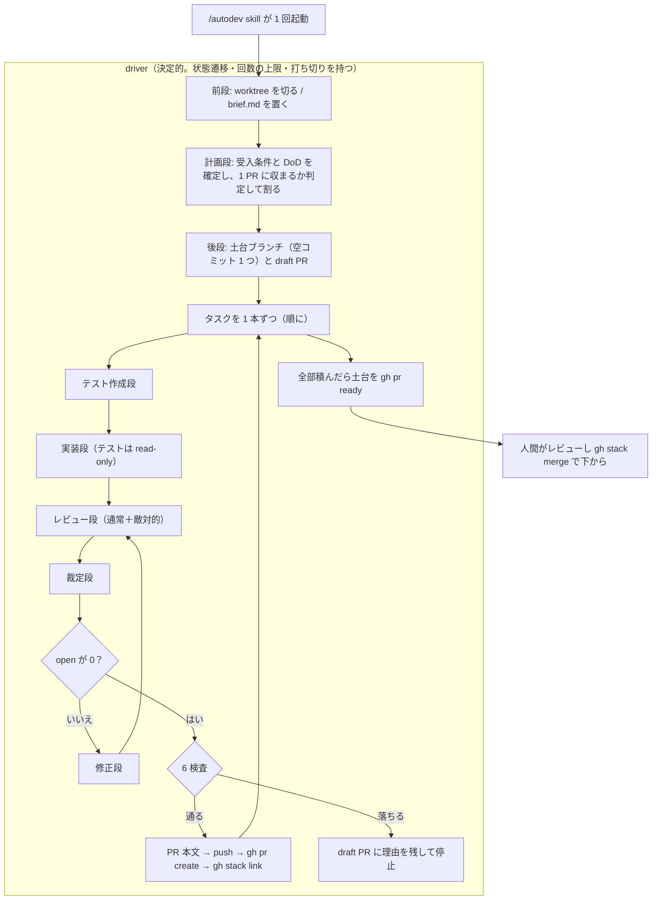

# autodev

指示 1 つを stacked PR まで無人で持っていく。**マージはしない**——人間がレビューして
`gh stack merge` で下から行う。

段はすべて `claude -p` を 1 プロセス起動して走らせ、**進行は driver が持つ**（run 1 回は
`scripts/autodevlib/app/drive.py`、段の順番と打ち切りは `scripts/autodevlib/app/` の
各ファイル）。モデルが決めるのは各段の中身だけである。

## 要るもの

| | 何に使うか | 無いと |
| --- | --- | --- |
| `claude`（ログイン済み） | 全段の起動 | 何も動かない |
| `gh`（＋ `gh stack` 拡張） | 後段の PR 操作 | PR を作れない |

**資格情報は `claude` 自身のログインである。** Anthropic Console の API キーは要らない。
driver は段を起動するとき `ANTHROPIC_API_KEY` / `ANTHROPIC_AUTH_TOKEN` /
`ANTHROPIC_BASE_URL` を**外す**。残っていると claude がサブスクリプションではなく従量課金に
切り替わる。無人のマシンでは `CLAUDE_CODE_OAUTH_TOKEN` を置く（`claude setup-token` で作る）。

## 使い方

起動するのは `/autodev` skill である。入口は `scripts/autodev.py`（`~/.claude/skills/autodev/`
の下）で、PATH には置かない。

```bash
scripts/autodev.py run --work add-cache --repo ~/ghq/github.com/foo/bar --instruction "…"
scripts/autodev.py run --work add-cache        # 続きから（state.json があれば再開）
scripts/autodev.py status --work add-cache
scripts/autodev.py list
scripts/autodev.py clean --work add-cache      # worktree を外す（記録は残す）
```

新しく始めるときは `--instruction` が要る（無ければ走らない）。長い指示は
`--instruction -` で標準入力から渡せる。**走り始めたら途中で口を出せない。**

**やり直すときは `autodev clean` を先に打つ。** run のディレクトリを手で消すと worktree の
実体は消えるが git 側の登録は残り、ブランチが「別の場所でチェックアウト中」として扱われる。
消してしまった場合は `git -C <対象> worktree prune` で外す（`autodev run` も起動時に
`prune` を通すので、作り直しは通る）。

## 進めなくなったとき、決めるのは呼んだ側

driver は理由を終了コードと `autodev status` に載せて終わる。**計画を引き直して呼び直すか
どうかを決めるのは呼んだ側**（`/autodev` skill を務めるエージェント）である。
driver は自分が呼び直されるかどうかを決めない。

| コード | 意味 |
| --- | --- |
| 0 | 全部積んだ |
| 1 | 走れなかった（起動前の確認・git・gh の失敗） |
| 2 | 計画段が `blocked`。前提が崩れているので指示を書き直す |
| 3 | 残課題がある（`blocked` / `failed` のタスクがある） |
| 4 | 段が答えを待って止まっている（下） |

`autodev status` の `outcome` は `planning` / `running` / `waiting` / `held` / `stacked`
を返す。

## 段は聞いて待てる。答えると続きから進む

計画段が受入条件の曖昧さに当たったら、**推測せずに聞いて止まる。**

```
<autodev> ask --id range-empty --question "空入力の range は None か 0.0 か"
```

フックが `defer` を返すので段はそこで止まり、driver は質問を出して終了コード 4 で返る。
答えを置いて呼び直すと、**同じツール呼び出しから続く**——読んだ内容も文脈も失われない。

```bash
scripts/autodev.py answer --work <作業名> --id range-empty --body "None。mean と揃える"
scripts/autodev.py run --work <作業名>
```

**止まった段を再開するときはプロンプトを渡さない**（渡すと新しいターンが始まって、止まった
ツール呼び出しが再開されない）。判断するのは**答えのファイルが在るかどうかだけ**なので、
何度呼び直しても同じ結果になる。

実測では、聞いて止まるまでが 9 往復 / $0.519、答えてから計画が終わるまでが 4 往復 /
$0.907 だった。同じ曖昧さで `blocked` を返して全部やり直した経路は 20 往復 / $1.204 を
2 回払っていた。

**いま聞けるのは計画段だけである。** タスクの途中の段（テスト作成・実装・修正・レビュー・
裁定）が止まると、そこまでの手順をやり直さずに再開する仕組みが要る——タスク 1 本の中の
どこまで進んだかを state.json に持たせる話になるので、別に切ってある。それらの段は
契約のとおり `blocked` か `testConflict` で申告する。

**答えを作るかどうか、呼び直すかどうかを決めるのは呼んだ側である。** driver は待っている
事実と質問だけを返す。

## 全体の流れ



## 崩してはいけない線引き

この 8 つは、どれか 1 つを崩すと**この仕組みが成り立たなくなる。**

1. **進行をモデルに持たせない。** どの段を何回呼ぶか、いつ打ち切るか、検査の合否は driver に
   ある。モデルが進行役になると、検査を飛ばすことも「通った」と言うこともできる。
2. **インフラと実装を混ぜない。** GitHub を触るのは driver の後段だけ。
   段は `gh` を叩かず、push もしない。コンテナで走らせたときに GitHub の
   資格情報を渡さずに済む。
3. **テストを書けるのはテスト作成段だけ。** 実装段はフック（`hooks/deny-writes.py`）で
   止まる。テストが仕様と矛盾していたら、直さずに `testConflict` で申告する。
4. **status を動かせるのは裁定段だけ。** driver が `AUTODEV_JUDGE_TOKEN` を裁定段の
   process にだけ渡す。他の段は名乗っても拒まれる。自分で閉じられると
   「open が 0 件」が自己承認になる。
5. **完了の根拠は段の自己申告ではない。** 6 検査（証拠を集めるのは
   `scripts/autodevlib/ports/evidence.py`、合否を決めるのは
   `scripts/autodevlib/core/verdict.py`）を
   driver が毎回通す。
   検証コマンドは driver が自分で流す。
6. **セッションを続けるのは実装と修正だけ。** レビューは毎ラウンドまっさらにする。1 巡目の
   結論を持ち込むと、それがフレーミングになって検出が落ちる。
7. **マージしない。** 土台 PR が draft のあいだは上のタスク PR もマージできない。
   全部積み終わってから `gh pr ready` に上げる。
8. **進行状態を agent に書かせない。** タスクの一覧・状態・PR 番号・残課題の出所は
   state.json だけで、driver がテンプレートのマーカーへ毎回組み立てて差す。agent が書くのは
   散文だけである。

## 段ごとに変えるもの

`scripts/autodevlib/config/stages.py` の `TABLE` にある。**体数の計算も打ち切りの条件も
ここには無い**（`scripts/autodevlib/core/review_policy.py` と driver にある）ので、
レビュアーを 1 体増やしても
完了判定のコードに手が入らない。

| | 効くもの |
| --- | --- |
| モデルと思考量 | 読んで決める段は `opus`、文章を組むだけの段（PR 本文・まとめ）は `sonnet` |
| 書き込みの範囲 | `edits` が偽の段は worktree の中を書き換えられない（フックが止める） |
| 往復の上限 | `--max-turns`。超えると段が失敗する |
| 環境変数 | 裁定の鍵とテストの解禁は、それが要る段にだけ渡す |

書き込みを止めるのは `hooks/deny-writes.py` で、**`--disallowedTools` は使わない。**
ツールごと消すと、読むだけの段が自分の結果の JSON を書けなくなる（`Write` が要る）。
フックなら宛先で分けられる——worktree の中は止め、結果を書く `<run>/` の下は通す。
Bash のリダイレクトも同じ 1 か所で見る。

それでも完全には止められないので、ソースが動いていないことは検査②（コミット数）と
検査⑤（テストの差分）で実物から見る。

## 走行中に driver が見て、打ち切る

段の JSONL は**走りながら 1 行ずつ**読む。読んだ行はその場でログへ落とすので、打ち切った
段にも記録が残る。

見ているのは 2 つで、**判断するのは driver のコードである。モデルは入らない。**

- **進行**——往復数と直前のツールを state.json の `running` に書く（5 秒ごと）。statusline と
  `autodev status` がこれを読む
- **ガードとの衝突**——フックに 10 回止められた段は打ち切る。契約を読み違えているので、
  往復の上限まで使い切っても直らない

打ち切りは**プロセスを kill せず、標準入力へ制御要求を送る。**

```json
{"type":"control_request","request_id":"…","request":{"subtype":"interrupt"}}
```

こうすると `result` イベントが返るので、usage と停止理由（`subtype:
error_during_execution` / `terminal_reason: aborted_streaming`）が残る。制限時間の超過も
同じ経路を通る。`cancel_queued` は `system/init` の `capabilities` に
`interrupt_cancel_queued_v1` があるときだけ付ける——**版の文字列で比べない**（公式もそう
指示している）。

**ツール 1 回ごとの承認はしない。** 同期の関門を挟むと、答える相手が生きていないと進めず、
無人で回せなくなる。ツール単位で止めるのはフック（`hooks/deny-writes.py`）の仕事で、
そちらは即答する。

## 文面はテンプレートにあり、数は state.json から入る

**Python の中に Markdown を書かない。** 文面は `templates/*.md` にあり、`${名前}` のマーカーを
driver が埋める。埋め方は 2 種類だけである。

| マーカー | 誰が用意するか | いつ |
| --- | --- | --- |
| `${tasks}` `${held}` `${decisions}` `${deferrals}` `${verify}` `${test_globs}` | **driver が state.json / config.json から組み立てる** | 書き出すたび |
| `${prose}`（土台 PR）・`${notes}`（brief）・タスク PR の本文 | **agent が書いたものを `<run>/prose/*.md` から読む** | agent を呼んだとき 1 回 |

こう分けるのは、**進行状態の出所を state.json 1 つに保つ**ためである。土台 PR の本文は
1 本積むたびに書き直すので（タスク 3 本なら 5 回）、表まで agent に書かせると
「state.json では保留なのに本文では進行中」がありえて、そのたびにモデルを呼ぶことになる。

散文を書く agent は 2 つある。

- **まとめ段**（`summary`）: 土台 PR の「何をする作業か」。**計画の直後と仕上げの 2 回だけ**
  呼ぶ。1 本積むたびの書き直しでは呼ばず、`<run>/prose/stack.md` を読み直す
- **計画段**: `briefNotes` を返すと、driver が `brief.md` の「気をつけること」に差す。
  テスト作成段から後の全部が読む

## 段の結果は schemas/ で形が決まる

driver は `schemas/<契約>.json` の本文を `claude --json-schema` に渡す。すると段に
`StructuredOutput` ツールが 1 つ増え、**最後の応答がその形の JSON になる。**

**形の出所はスキーマのファイル 1 か所である。** 契約（`contracts/*.md`）は各キーが何を意味
するかを書き、形そのものは書かない。

知っておくべきことが 3 つある。

- **生成時の制約ではなく事後の検証である。** 外れた出力はツールのエラーとして差し戻され、
  claude が言い直す。その言い直しが `--max-turns` の予算を食うので、結果を返す段の上限は
  多めに置いてある
- **検証に失敗しても終了コードは 0 のまま**という経路がある。満たせないスキーマを渡した
  実測では `subtype: success` / `is_error: false` で `structured_output` が空だった。だから
  driver は結果が在ることを別に確かめる
- **スキーマはファイルパスではなく JSON の本文を渡す。** パスを渡すと
  `--json-schema is not valid JSON` で起動前に落ちる。draft-07 だけで、`$schema` に
  2020-12 を書くと拒まれる

**結果をファイルに残すのは driver である。** 段に書かせないので、在ることと形が保証される
（`tasks/task<番号>/result-<段>-<ラウンド>.json`）。

## 段を足す・直す

段 1 つは 5 か所でできている。**足すのはこれだけで、完了判定のコードには手が入らない。**

| 置き場 | 何を書くか |
| --- | --- |
| `scripts/autodevlib/config/stages.py` の `TABLE` | 名前・契約・モデル・思考量・往復の上限・セッションを続けるか・鍵を渡すか・ソースを書き換えるか |
| `scripts/autodevlib/core/prompt.py` の `ROLE_KEY` | その段をどの役割の不変条件で走らせるか。**足さないと段の起動時に `KeyError` で落ちる**。役割ごと新しいなら `INVARIANTS` にも 1 項目足す |
| `contracts/<名>.md` | その段が何をするか。**段はここを自分で読む** |
| `schemas/<名>.json` | 結果の形（結果を返す段だけ）。driver が `--json-schema` に渡す |
| `templates/<名>.md` | 成果物の形。マーカーは driver が埋める（文面を出す段だけ） |

レビュー段を増やすときは、`scripts/autodevlib/ports/review_store.py` の `REVIEWERS` に
1 行足し、`scripts/autodevlib/core/review_policy.py` の `expected_reviewers()` が返す
並びに入れる。**体数は `review.json` の
`runs` から数えるので、期待する数をコードに埋める必要はない。**

契約の本文はプロンプトに入れない。利用者のメッセージに入るのは、前置き・契約への案内と
読み替え表・このタスクの値だけで、**不変条件は `--append-system-prompt` で system 側に置く**
（長い契約とコードを読む間も薄まらないようにする）。

## ランナーを差し替える

`claude` を別のものに替えるときに書き換えるのは `scripts/autodevlib/ports/runner.py`
1 本である。
次の 2 つの形を保てば driver には手が入らない。

- `Call`——プロンプト・cwd・結果の書き先・モデル・ツール・上限・環境変数・`watch`
- `Result`——終了コード・停止理由・最後の応答・usage・セッション id・`aborted`

`watch` はイベント 1 つごとに呼ばれ、**文字列を返すとその理由で段が打ち切られる。**
監視の中で例外が出ても段は止めない（監視の誤りで作業を落とさない）。

## 実測して分かっていること

- **`docker agent` では組めない。** `harness: type: claude-code` が受け付けるのは
  `type` / `effort` / `model` の 3 つだけで、`tools` / `output_format` /
  `structured_output` / `allowed_tools` / `settings` / `max_turns` は
  `unknown field` で弾かれる。段ごとのツール制限も往復の上限も指定できない。
- **`claude setup-token` のトークンは API キーとして使えない。** `Authorization: Bearer` で
  素の HTTP に出しても `HTTP 429: rate_limit_error`（`anthropic-ratelimit-*` ヘッダは付かず、
  message は `Error` の 1 語）が返る。Claude Code 以外のクライアントからは使えないので、
  `docker agent` の標準の agent をサブスクリプションで動かす道はここで閉じている。
- **`--settings <file>` でフックを外から渡せる。** worktree に
  `.claude/settings.local.json` を置かずに済む（置くと commit に混ざる危険があった）。
  `PreToolUse` が終了コード 2 を返すと書き込みは起きない。
- **`--disallowedTools` はツールをセッションから消す。** `bypassPermissions` でも効き、
  消したツールはモデルの手元に現れない。ただし宛先で分けられないので autodev では使わない。
- **プロンプトは標準入力から渡す。** `--allowedTools <tools...>` は可変長で、次のオプションが
  来るまで後ろの引数を全部取る。プロンプトを引数の末尾に置くとツール名として飲まれ、
  `Input must be provided either through stdin or as a prompt argument` で落ちる。
  **オプションの並び順しだいで通ることもある**ので、余計に見つけにくい。
- **`2>&1` を書き込みと数えない。** フックの正規表現が `>` を拾うので、
  `cat app.py 2>&1 | head` のような読むだけのコマンドが拒まれた。fd の複製
  （`\d*>&\d*`）を先に外してから書き込みを探す。
- **`--max-turns` は効く。** 超えると終了コード 1 と `subtype: error_max_turns` /
  `terminal_reason: max_turns` が返る。
- **`--permission-mode bypassPermissions` なら cwd の外も読み書きできる。** 段は
  `<run>/` の下に結果を書くので、これが要る（`--add-dir` は要らなかった）。
- **`--session-id` で id を呼ぶ側が決められる。** 出力から拾わなくてよい。続きは
  `--resume <id>`。
- **制御要求は標準入力に混ぜて送れる。** SDK 専用ではない。`interrupt` を送ると
  `{"subtype":"success","response":{"still_queued":[],"cancelled":[]}}` が同じ標準出力へ
  返り、会話には `[Request interrupted by user]` が残る。`still_queued` と `cancelled` に
  載るのは**こちらで `uuid` を振ったメッセージだけ**なので、送る user メッセージには必ず
  振る。
- **`--input-format stream-json` で起動したら、`result` を見て標準入力を閉じる。**
  閉じないと claude は次のメッセージを待って終わらない。
- **`system/init` はターンごとに出る。** 1 回だけ来る前提で待つと 2 ターン目以降で詰まる。
- **`session_id` は CLI が決める。** 入力に書いた値は無視される。
- **読むのは JSONL の `result` イベント 1 つでよい。** `subtype` / `is_error` /
  `stop_reason` / `num_turns` / `result` / `usage` / `total_cost_usd` /
  `permission_denials` が全部ここに載る。
- **段は 1 回あたり約 26k トークンの固定費がかかる**（Claude Code のシステムプロンプト）。
  ただし実際はずっと大きい。おもちゃのリポジトリ（4 ファイル）でも 1 段で in 238,000 前後
  だった。26k は下限であって典型値ではない。
- **`gh stack link` は local tracking state に依らない。** だから「`gh stack` の追跡情報は
  worktree ごとに別」という制約を踏まない。PR は `gh pr create` で自分のタイトルと本文で
  作り、link で連ねる。
- **順に 1 本ずつ積むので、積み替え（`gh stack rebase` ＋ force push）は 1 度も要らない。**
- **検査⑤の起点は `parent` ではなくテスト作成段のコミット**（`state.json` の `testsAt`）。
  テスト作成段はタスクのブランチに commit するので、`parent` を起点にすると、実装段が
  テストに触っていない run でも必ずテストの差分が出る。

## 置き場

```
~/.claude/skills/autodev/        このディレクトリ（install.sh が skill ごと symlink する）
  SKILL.md    skill の本体。`skill_root()` はこのファイルを探して置き場を決める
  scripts/    入口（`autodev.py`）と driver 本体（`autodevlib/`）
  contracts/  段が自分で読む契約
  schemas/    段が書く結果の形。driver が照らす
  templates/  文面。マーカーを driver が埋める
  hooks/      書いてはいけないファイルへの書き込みを止める PreToolUse
~/.config/autodev/repos/<repo>.json   検証コマンド・テストのパス・不可侵パス
~/.local/state/autodev/<作業名>/
  state.json          進行状態（driver だけが書く。段には渡さない）
  brief.md  map.md    段が読む前提と地図
  stack-pr-body.md    土台 PR の本文（テンプレート＋state.json＋prose/stack.md）
  guard.json          書き込みを止めるフックの設定（`claude --settings` で渡す）
  prose/              agent が書いた散文。書き出すたびに読み直す
  tree/               worktree。git と gh を叩くのはここだけ
  tasks/task<番号>/   review.json・段が返した result-*.json・pr-body.md
  logs/               claude の出力そのまま
```

**対象リポジトリには 1 行も足さない。** worktree もその外に作り、フックの設定も外から渡すので、
`.gitignore` の追加も後片付けも要らない。
