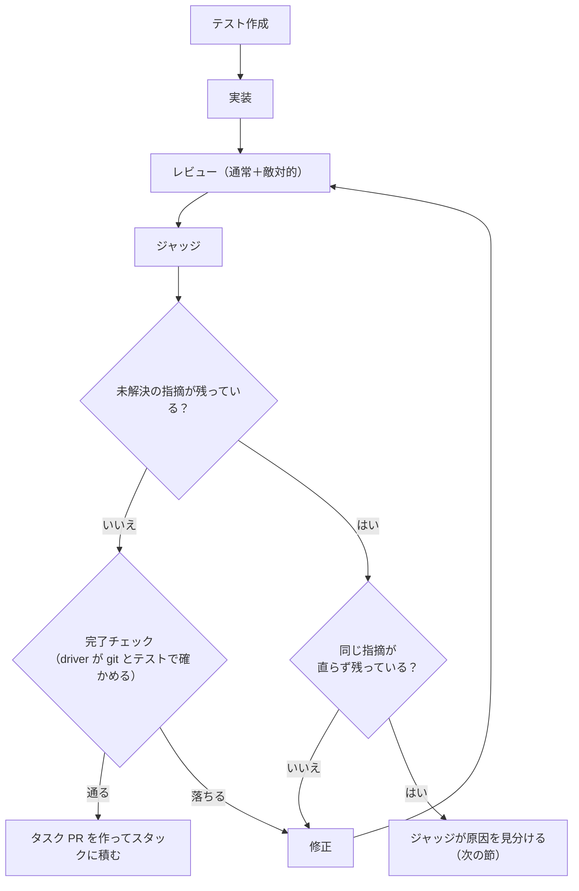
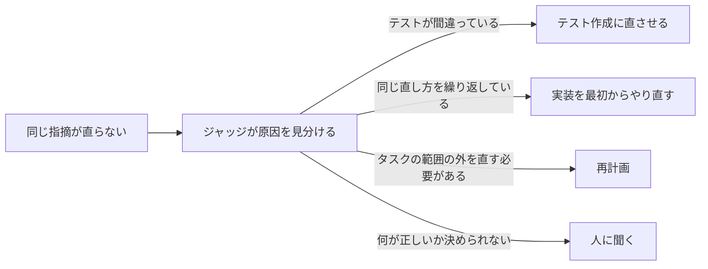

# autodev

指示を 1 つ渡すと、テストを書き、実装し、レビューを通して、GitHub の PR（stacked PR）まで
人の手を借りずに進めるスキル。**マージはしない。** 出来上がった PR を人がレビューしてマージする。

Claude Code で `/autodev` と打つと起動する。

## 何が起きるか

1. **計画**: 指示を読み、完了の条件（受入条件）を決める。大きければ、PR 1 本ずつの「タスク」に分ける
2. **タスクを 1 つずつ進める**: テスト作成 → 実装 → レビューと修正 → 確認 → PR
3. **PR を積み重ねる**: タスクの PR を順に上へ積む（下のタスクの上に次のタスクを作る）
4. **人に渡す**: 全部積み終えたら、人がレビューして下からマージする


作業はすべて、対象のリポジトリとは別の場所（git worktree）で行う。
手元のブランチや作業中のファイルには触らない。

## 登場するもの

| 名前 | 何か |
| --- | --- |
| ラン | `/autodev` 1 回ぶんの作業。名前（ラン名）で呼び分ける |
| タスク | ランを PR 1 本の大きさに分けたもの |
| ステージ | タスクの中の 1 工程。どれも Claude Code を 1 回起動して務めさせる |
| driver | ステージを順に呼び、結果を確かめて次を決める Python のプログラム。**進め方を決めるのはモデルではなくこれ** |
| 概要 PR | スタックの一番下に置く PR。ランの説明と進み具合を載せる |
| タスク PR | タスク 1 つの PR。概要 PR の上に積む |

ほかの用語は [GLOSSARY.md](GLOSSARY.md) にある。

## ステージ

| ステージ | すること | モデル / 思考量 |
| --- | --- | --- |
| 計画 | 受入条件を決め、タスクに分ける | opus / high |
| テスト作成 | 受入条件からテストを書く。**テストを書けるのはここだけ** | opus / medium |
| 実装 | テストが通るように書く | opus / medium |
| 通常レビュー | 差分を読んで問題（指摘）を挙げる | opus / medium |
| 敵対的レビュー | 「差分は間違っている」前提で読む。1 ラウンド目だけ | opus / medium |
| ジャッジ | 指摘が直ったか確かめ、閉じる・却下する。直らない原因も見分ける | opus / high |
| 修正 | 残った指摘を直す | opus / medium |
| 再計画 | タスクの分け方が合わず進めないとき、分け方を直す | opus / high |
| PR 本文・まとめ | PR の説明文を書く | sonnet / medium |

## タスクの流れ

タスク 1 つは次のように進む。レビュー → ジャッジ → 修正の 1 周を **ラウンド** と呼び、
指摘がなくなるまで回す。回数に上限はない。



- **指摘はすべてそのタスクの中で直す。** 後回しにはしない。ジャッジが「直さない」と決めてよいのは、
  指摘そのものが間違っているときと、ごく軽い指摘（nit）だけ
- **完了チェック** は、モデルの「できました」を信じずに driver が自分で確かめる 6 項目。
  コミットがある・指摘が残っていない・テストを後から書き換えていない・検証コマンド（テストや lint）が通る、など

## 直らないときの手

同じ指摘が 2 回修正しても直らなければ、ジャッジが原因を見分け、driver が打つ手を変える。



**再計画** では、次のどれかを選ぶ。

- 止まったタスクの範囲を広げる
- 指摘を後ろのタスクに回す（同じランの中で必ず直す）
- まだ始めていないタスクを組み直す
- 止まったタスクを捨てて分け直す

すでに PR にしたタスクには触らない。再計画はラン全体で 2 回まで。超えたら人に聞く。

## 人に聞くとき

進めるのに人の判断が要ると、ランは **回答待ち** で止まる。

- 受入条件が曖昧で、どちらとも決められない
- 再計画を 2 回しても進まない
- ステージが 2 回続けてエラーで終わった

回答を置いて呼び直すと、**止まったところから続く。** 最初からやり直しにはならない。
回答は「人が決めたこと」として、以後そのタスクのステージに毎回渡る。

```bash
autodev.py answer --name <ラン名> --id <質問 ID> --body "<回答>"
autodev.py run --name <ラン名>
```

`/autodev` から使うときは、スキルが質問をあなたに渡し、回答を置いて呼び直す。

## 使い方

要るもの:

| もの | 何に使うか |
| --- | --- |
| `claude`（ログイン済み） | 全ステージの起動。API キーは要らない |
| `gh` と `gh stack` 拡張 | PR を作り、積み重ねる |

ふだんは `/autodev` と打つだけでよい。スキルがリポジトリ・ラン名・指示を確かめて、次の入口を呼ぶ。

```bash
S=~/.claude/skills/autodev/scripts/autodev.py
$S run --name add-cache --repo ~/src/app --instruction "…"   # 始める
$S run --name add-cache      # 止まったランの続きから
$S status --name add-cache   # いまどうなっているか
$S list                      # ランの一覧
$S clean --name add-cache    # worktree を外す（記録は残す）
$S purge --name add-cache    # worktree・手元のブランチ・記録をすべて消す（PR は残す）
```

終わり方は終了コードで分かる。

| コード | 意味 |
| --- | --- |
| 0 | 全タスクを PR にして積んだ |
| 1 | 起動できなかった（`claude` や `gh` が無い など） |
| 2 | 計画の前提が崩れている。指示を書き直す |
| 4 | 回答待ち |

走っている様子は、statusline と `~/.claude/scripts/autodev-watch.py`（ラン → タスク → ステージを
たどって、渡した指示と出力を見る画面）で見られる。

## 崩してはいけない線引き

autodev を直すときに守ること。どれか 1 つを崩すと、仕組みが成り立たなくなる。

| 線引き | 崩すと |
| --- | --- |
| 進め方（何を何回呼ぶか・合否）は driver が決める | モデルが確認を飛ばして「通った」と言える |
| テストを書けるのはテスト作成だけ | 実装がテストを緩めて通せる |
| 指摘を閉じられるのはジャッジだけ | 直した本人が自分で閉じられる |
| 完了は driver が git とコマンドで確かめる | ステージの報告を鵜呑みにする |
| GitHub を触るのは driver だけ。ステージは push しない | ステージに GitHub の権限を渡すことになる |
| マージしない | 人のレビューを通らずに入る |

理由と実装の詳細、実際に動かして分かったことは [DESIGN.md](DESIGN.md) にある。

## 置き場

```
~/.claude/skills/autodev/          このスキル
  SKILL.md       スキルの本体（/autodev で読まれる）
  scripts/       driver（入口は autodev.py）
  contracts/     各ステージへの指示書
  schemas/       各ステージが返す結果の形
~/.local/state/autodev/<ラン名>/   ランの記録（進み具合・ログ・worktree）
```
