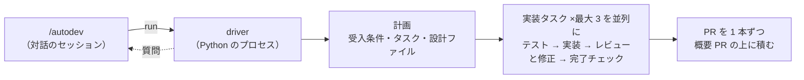

# autodev

指示を 1 つ渡すと、計画・テスト・実装・レビューを経て、GitHub の stacked PR まで人の手を借りずに進める。
**マージはしない。** 積み上がった PR を人がレビューし、下からマージする。


```mermaid
flowchart LR
    U["/autodev<br/>（対話のセッション）"] -->|"run"| D["driver<br/>（Python のプロセス）"]
    D --> P["計画<br/>受入条件・タスク・設計ファイル"]
    P --> T["実装タスク ×最大 3 を並列に<br/>テスト → 実装 → レビューと修正 → 完了チェック"]
    T --> S["PR を 1 本ずつ<br/>概要 PR の上に積む"]
    D -.->|"質問"| U
```

進め方と合否は driver が決める。ステージ（計画・実装・レビューなど）は、driver がそのつど `claude -p` を 1 回起動して務めさせる。
作業はタスクごとの git worktree で行い、手元のブランチと作業中のファイルには触らない。
用語・集約・状態の遷移は [DOMAIN.html](DOMAIN.html) にまとめてある（ブラウザで開く）。

## 使い方

Claude Code で `/autodev` と打ち、対象のリポジトリと指示を渡す。スキルが driver を裏で走らせる。
要るのは、ログイン済みの `claude` と、`gh` と `gh stack` 拡張。

人の判断が要ると、driver は質問を出す。スキルがその質問をあなたに渡すので、答えるとそのまま続く。
答えを待つ間も、質問に関係しないタスクは進む。

直接呼ぶときの入口は `~/.claude/skills/autodev/scripts/autodev.py`。

```bash
autodev.py run --name <ラン名> --repo <リポジトリ> --instruction-file -   # 始める（指示は標準入力）
autodev.py run --name <ラン名>                                           # 続きから
autodev.py status --json --name <ラン名>                                 # 状態
autodev.py answer --name <ラン名> --question <質問 ID> --answer-file -     # 答える
```

## 終了コード

| コード | 意味 | 次にすること |
| --- | --- | --- |
| 0 | ランを終えた（全部積んだとは限らない） | `status --json` で積んだタスクと止めたタスクを見る |
| 1 | 起動できなかった | 標準エラーの理由を直して呼び直す |
| 3 | 途中で止まった（利用枠の上限・SIGINT など） | 原因が消えたら `run --name` で続きから |
| 4 | 回答待ちで、進められるタスクが無い | 答えてから `run --name` で続きから |

## 置き場

| 置き場 | 中身 |
| --- | --- |
| `~/.local/state/autodev/<ラン名>/` | ランの記録（`events.db`・質問・ログ・worktree） |
| `~/.config/autodev/repos/<スラッグ>.json` | リポジトリごとの設定（検証コマンド・テストのパス・変更禁止のパス）。人が書く。無くても走る |

## 片付け

| コマンド | 消すもの |
| --- | --- |
| `autodev.py clean --name <ラン名>` | worktree だけ。記録は残す |
| `autodev.py purge --name <ラン名>` | worktree・手元のブランチ・記録。PR とリモートのブランチは残る |

## しないこと

- マージしない。概要 PR は全部積み終わるまで draft のまま
- 対象のリポジトリにファイルを足さない。記録も設定もリポジトリの外に置く
- ステージには GitHub を触らせない。push と PR は driver が行う
