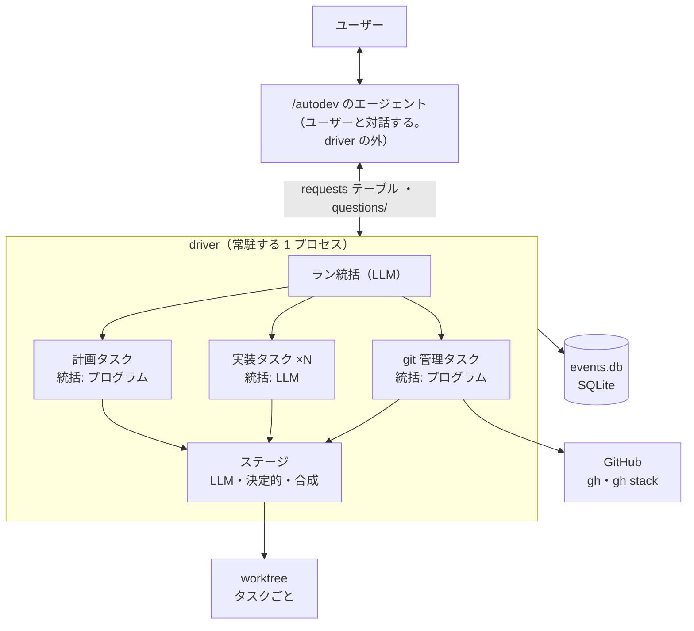
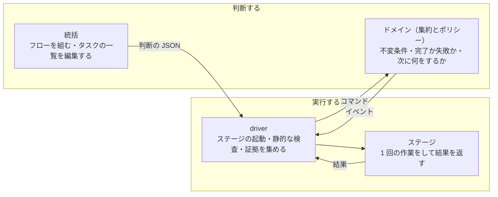
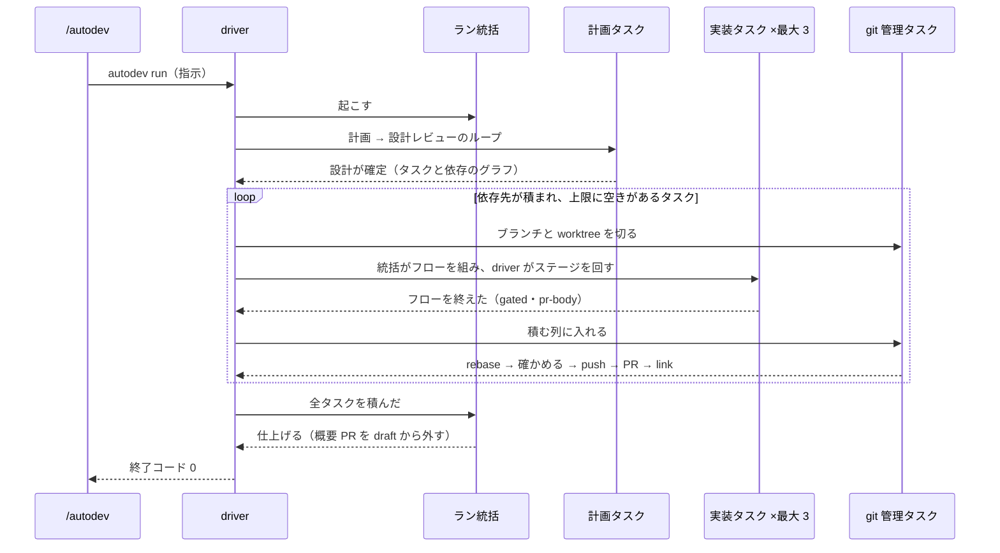
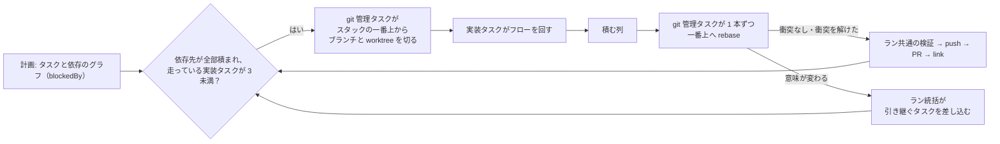
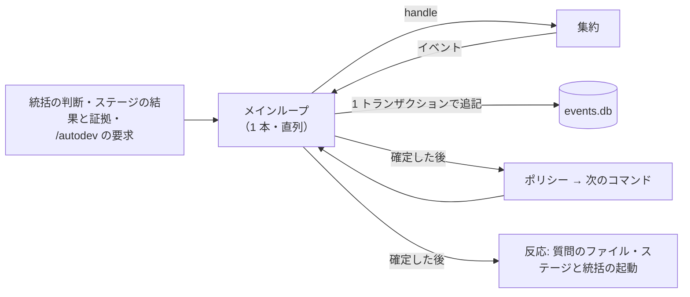

# autodev アーキテクチャ（再設計）

autodev を作り直すときの、全体の作りと決めた理由。集約・コマンド・イベントの定義は [DOMAIN_MODEL.md](DOMAIN_MODEL.md)（以下「ドメインモデル」）、付箋で並べた流れの図は [EVENT_STORMING.html](EVENT_STORMING.html) にある。

## 1. 要件

| 要件 | 中身 |
| --- | --- |
| 無人で進む | 指示 1 つから、テスト・実装・レビューを経て stacked PR まで進める。**マージはしない** |
| 互いに干渉しないタスクを並列に動かす | 同時に走る実装タスクは最大 3。PR は 1 本の線のスタックに積む |
| タスクに合わせて流れを変えられる | 例: ドキュメントだけのタスクはテスト作成を通らない |
| 対話のセッションが閉じても走り続ける | 日をまたいで回答しても、止まったところから続く |
| ユーザーへの質問は非同期 | 質問が上がったらすぐ答えられる。回答を待つ間も、関係しないタスクは進む |
| 統括のコンテキストを圧迫しない | 統括に渡すのは「何が起きたか」と「調べる先」だけ。詳細は統括が自分で読みに行く |

## 2. 構成要素



| 構成要素 | 何か | 何をするか |
| --- | --- | --- |
| `/autodev` のエージェント | ユーザーと対話する Claude Code のセッション | driver を起動する・質問をユーザーに渡す・回答を driver に届ける。**driver の管理の外にいる** |
| driver | 常駐する Python のプロセス | ラン・タスク・ステージのライフサイクルを管理する。フローを実行し、ステージごとの静的な検査を掛け、イベントを 1 段上へ渡す。**何をするかは決めない** |
| ラン統括 | `claude -p` のセッション | タスクの中で閉じない問題を処理する。再計画を頼む・タスクを差し込む・止める・自分で答える・ユーザーに聞く |
| タスク | 作業者の単位。統括とフローを持つ | 計画タスク・実装タスク・git 管理タスクの 3 種類。統括は LLM のことも、決定的なプログラムのこともある |
| タスク統括 | 実装タスクでは `claude -p` のセッション。計画タスクと git 管理タスクではプログラム | フローを組む・エスカレーションを受けて、フローを書き直すか上へ上げるかを決める。プログラムの統括は決まった並びを組み、自分で解けないエスカレーションはそのままラン統括へ上げる |
| ステージ | driver が起動し、結果を返して終わる 1 回の作業 | LLM（`claude -p` 1 回）・決定的（Python の関数）・合成（ステージを並べたサブフロー）の 3 種類 |

**タスク ＝ LLM ではない。** タスクは作業者の単位で、git 管理タスクのように LLM を使わないものもある。同じく、検証コマンドを流すような決定的な作業もステージである。

## 3. 誰が何を決めるか



- **統括は読むだけ。** worktree とランディレクトリを読めるが、書けない（書き込みを止めるフックを掛ける）。決めたことはターンの終わりに `--json-schema` の形の JSON で返し、driver が検査してから実行する。
- **ステージは作業の途中でコマンドを出さない。** 終わりに結果を返すだけ。今の `autodev review …` のように、ステージが Bash から driver の状態を書き換える入口は作らない。計画ステージの質問（ask）は PreToolUse のフックの `defer` でツール呼び出しを実行の前に止めて待つ仕組みで、止まった呼び出しから質問を読み取ってコマンドにするのは driver なので、これにも当たらない（ドメインモデル §11.1）。
- **判断はドメインに置く。** driver の実行器は、ステージの結果と証拠（コミット数・ファイルの有無・検証コマンドの結果）を集めて報告するだけ。完了・失敗・エスカレーションのどれにするかは、I/O をしない集約（`Task.handle`）が決める。
- **エスカレーションは段を飛ばさない。** ステージ → タスク統括 → ラン統括 → `/autodev` → ユーザーの順に 1 段ずつ上がり、回答は同じ経路を逆に下りる。

## 4. ラン 1 回の流れ



詳しい流れは図の ⓪〜⑨ にある。

## 5. フロー

**タスク統括がフローを組み、driver がパイプラインとして実行する。** dynamic workflow のように流れを組めるが、組める部品と並べ方は driver が決める。

- **部品はステージ。** 呼ぶ側から見れば、合成ステージも 1 つのステージである（例: review-loop は「実装を受け取り、レビュー済みの実装を返すステージ」）。中のステージにもそれぞれ静的な検査が掛かる。
- **ステージは `needs`（要るもの）と `produces`（作るもの）を宣言する。** 実物は worktree とランディレクトリにある。
- **driver は、実行の前と後に検査する。**
  - 実行前: `needs` / `produces` の照合と順番の制約（例: テスト作成は実装より前）で、フローの形を確かめる。最後に `gated` と `pr-body` が作られなければ差し戻す
  - 実行後: テスト作成を抜いたフローでは、変更がすべて「テストが要らないパス」（リポジトリごとの設定の glob）に収まっていることを、完了チェックで確かめる

```json
[{"stage": "TestGen"}, {"stage": "ConfirmRed"}, {"stage": "Impl"},
 {"stage": "ReviewLoop",
  "reviewers": {"first": ["Review", "AdversarialReview"], "later": ["Review"]}},
 {"stage": "Gate"}, {"stage": "WritePrBody"}]
```

ReviewLoop の `reviewers` には、1 ラウンド目（`first`）と 2 ラウンド目から（`later`）のレビューの顔ぶれを、ステージ名で書く。どう書くかはタスク統括が決める。

ステージの一覧と、1 回の実行の 6 段は、ドメインモデル §11 にある。

## 6. エスカレーションと非同期の質問

### 何を上げるか

ふつうに回るループ（指摘 → 修正、完了チェックの落ち → 修正）は、合成ステージの中で閉じる。**ループで解けないものだけを上げる。** 具体的には次のものである。

- 停滞
- 設計ファイルに無い形が要る（design-gap）
- テストが仕様と矛盾する（test-conflict）
- 計画ステージの質問（ask）
- テストが実装の前に全部通った
- テスト作成を抜いたのに範囲の外を変えた
- 2 回続けてエラー
- 統合の失敗

一覧はドメインモデル §8.2 にある。

### 通知と調べ方

- **エスカレーションはイベントの通知である。** 載せるのは「何が、どこで起きたか」と「調べる先（結果の JSON・ログ・worktree・セッション id）」と「どこから読めばよいかの手がかり」だけ。指摘の本文や出力そのものは載せない。
- **統括は、ファイルを読んで調べる。** 止まったステージのセッションを fork して質問はしない（返るのはモデルの説明で記録ではなく、費用もステージ 1 回分に近い）。

### 統括の動かし方

- **LLM の統括（ラン統括と実装タスクの統括）は `claude -p` のセッションで、イベントのたびに `--resume` で起こす。** フローを返したらターンを終え、プロセスは残らない。セッション id は driver が記録するので、日をまたいでも続きから起こせる。タスク統括は、前のイベントで何を調べてどう直したかを覚えているので、同じ直し方の繰り返しを見分けられる。
- **ラン統括を起こすのは、ランの節目と、上がってきたイベントのときだけ。** 節目は、ランの開始・再計画の確定・全タスクの完了である。うまく進んでいる間は、ラン統括の文脈に何も積もらない。実装タスクを始めるのは driver が自動で行う。

### ユーザーへの質問

- **受入条件の曖昧さは、ラン統括が判断する。** 計画ステージの ask、設計のジャッジの `ambiguous`（`design-ambiguous`）、ジャッジが `ambiguous` に分類した停滞は、どれもラン統括まで上がる。ラン統括は、答えが言えると判断したら自分で答え（`answer`）、言えないときだけユーザーに聞く（`ask-user`）。根拠にしてよいのは、起動時の指示とユーザーの回答だけで、自分が前に答えたことは根拠にしない。回答は出どころ（ユーザーかラン統括か）付きで残る。
- **質問は非同期。** ラン統括が質問を出すと、driver は止まらずに、質問のファイルを `questions/` に書く。`/autodev` のセッションが開いていれば Monitor がすぐ拾い、閉じていれば次に開いたときに拾う。回答は `autodev answer` が `requests` テーブルに足し、ラン統括 → タスク統括の順に下りる。回答を待つ間も、関係しないタスクは進む。
- **進められるタスクが無くなったら、driver は終了コード 4 で終わる。** 回答を置いたら、`/autodev` が `autodev run` を同じラン名で呼び直す（§9）。

## 7. 並列化とスタック



- **依存のグラフで始める。** 計画ステージがタスクごとに `blockedBy` を返す。依存先がすべてスタックに積まれ、走っている実装タスクが 3 未満なら、driver がそのタスクを始める。
- **タスクごとに worktree を分ける。** ブランチは、始めた時点のスタックの一番上から切る。
- **PR は 1 本の線に積み直す。** スタックの一番上を動かすのは git 管理タスクだけで、積む頼みを順番待ちの列で 1 本ずつ受ける。積む直前に、いまの一番上へ rebase する。
- **git 管理タスクは、イベントを受けて非同期に動き、実装タスクと並列に走る。**
  - 受けるイベントは `TaskStarted`・`StackRequested`・`TasksPlanned`・`TasksDiscarded`・`RunFinished` など
  - 同時に走る実装タスクの上限（3）には数えない
  - 中の仕事（ブランチを切る・積む・破棄する・概要 PR を書く）は、種類を問わず 1 本の列で 1 つずつ処理する。スタックの一番上・概要 PR の本文・リポジトリの ref を取り合わないためである
  - 時間のかかる仕事（ResolveConflict・WriteOverview の LLM）の間は、後ろの仕事（新しいタスクのブランチを切るなど）が待たされる。単純さを取ってこれを受け入れた
- **意味の変わらない衝突は、git 管理タスクの中で解く。** 例: 同じテストのファイルの末尾に、別々のテストを足した。
  - ResolveConflict（LLM）が解く。書けるのは衝突したファイルだけ
  - CheckUnion（決定的）が、両側が足した行を全部残し、他の行を消していないかを確かめる
  - 検証コマンドを流す
- **検証コマンドは、流す時点で選ぶ。** 他のタスクが足したコマンドは積み上げない。
  - 実装タスクの完了チェック（と、テストが実装の前に落ちるかの確認）では、そのタスクの `verify` だけを流す。タスクが確かめるのは、自分が手を付けた範囲である
  - 積む直前（rebase の後）に、git 管理タスクがラン共通の `verify`（リポジトリ全体のテスト・lint など）を流す。タスクが手を付けていない場所を壊した（回帰）なら、ここで止まる。積むのは 1 本ずつなので、どのタスクが壊したかも分かる
  - 計画ステージ（LLM）が返した検証コマンドも、driver の権限でそのまま流す。これは受け入れる（理由は §13）
- **意味が変わる統合は、タスクを差し込んで直す。** ResolveConflict が「両方は残せない」と返したとき、CheckUnion かラン共通の検証が落ちたときがこれに当たる。
  - git 管理タスクがラン統括へ上げる
  - ラン統括が、元のタスクを引き継ぐタスクを差し込む。元のタスクは `superseded` になり、依存は引き継ぎ先につなぎ替える
  - 引き継ぎ先の PR は先に積まれた PR の上に積むので、先のタスクのファイルを直してもスタックとして矛盾しない
- **再計画は、すべてのタスクを書き換えてよい。** 走っているタスクも、積んだタスクも含む。
  - 計画タスクはランに 1 つで、再計画のときも同じ計画タスクが `Replan → DesignLoop` を回す（設計のジャッジのセッションがランの間続く）
  - 再計画の前に、git 管理タスクがスタックの一番上を読むためだけの worktree（`trees/stack-top`。HEAD を固定して切り離した状態）を切り直し、Replan はそこを読む。積んだタスクの変更が working tree に見え、読む間に一番上が動いても中身は変わらない
  - 積んだタスクは再利用を優先する。破棄するなら、再利用できない理由を提案に書き、設計レビューで確かめる
  - 確定したら、ラン統括が、止める走っているタスクと、破棄する積んだタスクを決める。driver は即座に止める
  - 反映されたら、再計画のきっかけになったエスカレーション（`needs-replan` など。ラン統括が再計画を頼むときに id を載せる）を driver が自動で閉じる。止めずに残したタスクのうち範囲が変わったものと、きっかけのタスクには「範囲が変わった」と知らせ、そのタスク統括がフローを組み直す
- **積んだタスクを破棄したら、そこから上のスタックを作り直す。**
  - git 管理タスクが、破棄した中で一番下の PR から上をすべて閉じる
  - 閉じた所より上で破棄しないタスクは、積む列に戻し、残した一番上へ rebase し直して積む。push 済みのブランチは force push で書き換えず、新しいブランチ名で切り直す。PR の番号は変わる
  - スタックの途中から 1 本だけ外す `gh stack modify` は対話式の画面でしか使えず、スタックに入った PR の base は `gh pr edit --base` で付け替えられない。そのため、詰めるのではなく閉じて積み直す
  - **閉じるだけでは足りない。** GitHub の文書によれば、途中の PR を閉じてもスタックの関係は残り、その上の PR はすべてマージできなくなる。`gh stack link` は足すだけで外さない。そこで、閉じた後に `gh stack unstack`（対話なし）でスタックを解き、残した PR で `gh stack link --base` を使って作り直す。手順はドメインモデル §11.4 にある
  - この手順は文書から組み立てたもので、実測していない。スタックの番号を対話なしで得る方法も確かめていない

## 8. 状態と永続化

**イベントソーシングにする。** 状態の正本はイベントで、集約の状態はそのストリームを再生して作る。



- **書き込むのは driver のメインループ 1 本だけ。** ステージと統括は別のスレッドで走らせ、結果をメインループに渡す。集約の読み書きにロックは要らない。
- **集約は `handle`（コマンド → イベント）と `apply`（イベント → 状態）の 2 組の分岐でできている。**
  - 再生のときは `apply` だけを通る。規則を変えた後の driver でも古いランを再生でき、再生のたびに結果が変わることも無い
  - `apply` に書くのは、その集約が出すイベントだけでよい
- **SQLite（標準ライブラリの `sqlite3`）の `events.db` に、3 つのテーブルを置く。**
  - `events`: 状態の正本
  - `checkpoints`: 受け手（ポリシーと反応）ごとに、どこまで受けたか
  - `requests`: driver の外からの要求。処理したら消す（Inbox パターン）
- **コマンドは記録しない。** 拒んだコマンドは `logs/` に残す。
- **スナップショットは持たない。** 1 ラン分しか溜まらないので、起動時に頭から再生して足りる。
- **走っているステージの進み具合（ターン数・直前のツールなど）は、イベントにしない。** ステージ 1 回で数百の stream-json のイベントが流れるので、正本に入れると `events` が膨らむ。実行器のスレッドが正本の外の使い捨てのファイル（`<ランディレクトリ>/progress/<ExecutionId>.json`）に数秒ごとに書き、`autodev status --json` が混ぜて返す。消えても状態は変わらない。
- **監視するプロセスは置かない。** イベントを書くのは driver 自身なので、追記した直後に同じプロセスでイベントの受け手を呼ぶ。
- **イベントの受け手は、ポリシーと反応の 2 種類。**
  - ポリシー: コマンドを返す。I/O をしない
  - 反応: 外に副作用を起こす（ステージと統括の起動・質問のファイル）
  - どちらもチェックポイントを持ち、落ちたらその後ろから受け直す。反応は、2 回呼ばれても同じ結果になるように作る
  - `events` がそのまま Outbox を兼ねるので、別に outbox は作らない

詳細はドメインモデル §6.7 と §7.4 にある。

## 9. 障害と再開

| 障害 | 扱い |
| --- | --- |
| 利用枠の上限（429） | ビジネスロジックの外のインフラのエラーとして、driver をパニックさせる。走っているステージをすべて止め、終了コード 3 で終える |
| パニックの後に呼び直した | 止まったステージのセッションを `--resume` で続きから起こす。再開に失敗したら、そのステージを始めた時点のコミットに worktree を戻し、新しいセッションで最初からやり直す |
| driver のプロセスが落ちた | 起動時に `events` を再生して状態を作り、各受け手（ポリシーと反応）がチェックポイントの後ろから受け直す。同じコマンドが 2 回出ても id で弾き、反応は 2 回呼ばれても同じ結果になる |
| 決定的なステージの再開 | もう一度流す。2 回流しても同じ結果になるように作る（例: PR を作るステージは、同じブランチの PR があればそれを使う） |
| ステージが 2 回続けてエラー | タスク統括へ上げる |

終了コード: 0 = ランを終えた / 1 = 起動できなかった / 3 = パニック / 4 = 回答待ちで、進められるタスクが無い

- **0 は「ランを終えた」で、「全部積んだ」ではない。** 何本積んだか・どれを止めたかは `autodev status --json` で見分ける。何も積まずに終えたランも 0 である。
- **既にあるラン名に `--instruction` が付いていたら、終了コード 1 で止める。** 黙って捨てると、呼んだ側は指示を足したつもりになる。
- **2（指示が崩れている）は廃止する。** 計画ステージが決められないことは ask としてラン統括へ上がり、ほかの質問と同じく回答を待つ。終了コードで呼んだ側に返す場面が無い。
- **3 と 4 の後は、`/autodev` が `autodev run` を同じラン名で呼び直す。** 既にあるラン名なら、driver は `events` を再生して続きから進める（パニックなら止まったステージを `--resume` で続け、回答待ちなら届いた回答から進める）。`StartRun` を出すのは新しいラン名のときだけ。

## 10. 外とのつなぎ目

- **CLI**: `autodev run` / `status --json` / `events` / `answer` / `clean` / `purge`
- **状態を外から読むのは `autodev status --json` だけ。** HUD（statusline・`autodev-watch`）と `/autodev` はこれを呼ぶ。内部の集約の形を変えても外は壊れない。statusline から呼んだときの速さは、実装してから測る。
- **GitHub を触るのは、git 管理タスクの決定的なステージだけ。** ステージにも統括にも、GitHub の権限を渡さない。`gh` の認証も git の資格情報も同じユーザーの設定から読めてしまうので、LLM のステージと統括が `gh` と `git push` を叩くのをガードのフックで止める（文面で頼むだけにしない）。
- **ステージにも統括にも、worktree の外へ書かせない。** 結果は `--json-schema` で返すので、外に書く理由が無い。`bypassPermissions` で走るので、許すとランディレクトリの `events.db` まで書き換えられる。
  - 止めるのは、ランディレクトリ（`events.db` がある所。自分の worktree を除く）とホームディレクトリ（設定を含む）への書き込み
  - OS の一時ディレクトリ（`/tmp` と `$TMPDIR`）は許す。テストやツールが一時ファイルを置くからである
  - 止めるのはフックで、フックは Bash 越しの書き込みを全部は見つけられない（例: スクリプトの中からファイルを開いて書く）。フックだけでは穴が残る（worktree の中なら、最後に git の差分で確かめられる。外への書き込みにはその砦が無い）
- **計画ステージには、リポジトリの外の読める checkout が要る。** 対象リポジトリの手元には触らないので（下）、初回は概要ブランチの worktree（`trees/overview`）を、再計画ではスタックの一番上を固定した `trees/stack-top`（§7）を cwd にする。
- **`gh stack` のローカルの追跡は使わない。** 追跡は worktree ごとに別で、別の worktree で叩くと「not part of a stack」になる。`gh stack link` は追跡に依らないので、PR を `gh pr create` で作って link で連ねる。`gh stack link` / `unstack` は `trees/overview` から叩く。
- **PR の本文を書くのは 2 か所。** タスク PR は実装タスクのフローの最後（`WritePrBody`）、概要 PR は git 管理タスク（`WriteOverview`。計画の反映のたびと仕上げのとき）。どちらも LLM のステージで、書いた本文を PR に載せるのは git 管理タスクの決定的なステージである。
- **静的な検査は、フックを `claude --settings` で外から渡して掛ける。**
- **対象のリポジトリには 1 行も足さない。** worktree も設定もリポジトリの外に置く。
- **資格情報は `claude` 自身のログインである。** `ANTHROPIC_API_KEY` などは外して起動する。

## 11. 守る線引き

今の README にある線引きを、新しい作りのどこで守るか。

| 線引き | 新しい作りで守る所 |
| --- | --- |
| 進め方（何を何回呼ぶか・合否）は driver が決める | 統括が組めるのは検査を通ったフローだけ。完了・失敗の判断は集約 |
| テストを書けるのはテスト作成だけ | ステージの種類ごとのガード（書き込みを止めるフック）。例外は期待値を決めるステージ（テストだけ）と、衝突を解くステージ（衝突したファイルだけ） |
| 指摘を閉じられるのはジャッジだけ | `JudgeFinding` は、Judge・DesignJudge の実行の結果から出たものだけを受ける。出した者は driver が記録するので、名乗れない |
| 完了は driver が git とコマンドで確かめる | 実行器が証拠を集め、`Task.handle` が証拠で判断する。ステージの報告は信じない |
| GitHub を触るのは driver だけ | git 管理タスクの決定的なステージだけ。ほかのステージと統括の `gh` と `git push` はガードのフックで止める |
| マージしない | 概要 PR は全部積み終わるまで draft |
| 進行状態を agent に書かせない | 状態の正本は `events` で、書くのはメインループだけ |
| レビューは毎ラウンドまっさらにする | 今と同じ。続けるのは実装・修正とジャッジ・設計のジャッジのセッションだけ |

## 12. 作り直しの進め方

- **一から作り直す。** 戦術的な DDD のパターン（集約・値オブジェクトなど）は、不変条件がある所だけに使う。driver の規模（今は約 5,800 行）で全概念に揃えると、膨らむだけである。
- **先に「知見の台帳」を作る。** [LEDGER.md](LEDGER.md) に置いた。今の作りの文書・コード・テストから拾った知見を、持ち込むもの（外部の仕組みとインフラの事実と、モデルの扱い方として効いた契約書の書き方）と、持ち込まないもの（古い進め方の規則。新しい設計で決め直す）に分けてある。
- **テストは、ドメインの規則を確かめるものだけ書き直す。** 今のモジュールの形を確かめているだけのものは捨てる。
- **古い state.json は移さない。** 進行中のランは無い（2 本とも積み終わっている）。作り直しはブランチの上で行い、新しいものが動くまで main の autodev を使える状態に保つ。
- **HUD の読み口（`hud/ports/autodev.py`）を、`autodev status --json` を呼ぶ形に書き直す。**

## 13. 決定の記録

| 決めたこと | 選んだもの | 退けた案と理由 |
| --- | --- | --- |
| 並列の単位と PR の形 | ランの中でタスクを並列にし、1 本の線に積み直す | 兄弟の PR: `gh stack` が線しか扱えず、draft の栓も効かない。ランを分ける: スタックと概要 PR がまとまりの数だけできる |
| 並列にしてよいかの判定 | 計画ステージ（モデル）が依存のグラフ（`blockedBy`）を返す | 段（wave）: 段の中の一番遅いタスクを待つ |
| 進行役 | Python の driver を育てる | dynamic workflow: スクリプトから git や検証コマンドを流せない・同じセッションでしか再開できない・特定のセッションを続けられない・パスごとの書き込み制限が掛けられない |
| フローを組む者 | タスク統括が組み、driver がパイプラインとして実行する | 許された流れを選ぶだけ: タスクに合わせた組み方ができない |
| フローの部品 | ステージ＋合成ステージ（ループと停滞の振り分けは合成ステージの中） | 汎用の制御構文: 停滞の振り分けを毎回組み直すことになる。スクリプト: モデルが書いたコードを driver の権限で動かす |
| フローの検査 | 実行前に形（`needs` / `produces`）、実行後に前提（テストの要らないパス） | 形だけ: ロジックの変更でもテスト抜きが通る |
| エスカレーションの条件 | ループで解けないものだけ | ラウンドごと: 統括の文脈を圧迫する |
| 通知の中身 | 起きたことと調べる先だけ。統括はファイルを読む | セッションを fork して聞く: 返るのは説明で記録ではない・費用が大きい |
| 統括のプロセス | `claude -p` を `--resume` で起こす | ラン統括のサブエージェント: 対話のセッションが閉じると止まる |
| ユーザーへの質問 | 非同期（`questions/` と Monitor、`requests`） | 全体を止める: 回答を待つ間、全タスクが止まる |
| 統括の出力 | ターンの終わりに JSON で返す | driver のコマンドを叩かせる: 統括に操作の権限を渡す |
| git 管理 | タスク（統括はプログラム）。ランに 1 つ、積む順番待ちの列を持つ | 積むたびに作る: 一番上を取り合う |
| git 管理タスクの動き方 | イベントを受けて非同期に動き、実装タスクと並列に走る。中の仕事は種類を問わず 1 本の列で 1 つずつ | 仕事の種類ごとに 3 本の列（積む・ブランチ・概要 PR）に分ける: LLM の作業の間も他の仕事が進むが、列どうしの排他が要る。単純さを取った。仕事ごとに好きに並列: スタックの一番上と概要 PR の本文を取り合う |
| 統合で衝突したとき | 意味の変わらない衝突は git 管理タスクで解き、変わるならタスクを差し込む | 全部差し込む: 1 行の衝突でもタスクを立てる |
| 「意味が変わらない」の判定 | LLM が解き、driver が両側の変更を残したかと検証で確かめる | LLM の判断＋検証だけ: 片方の変更を落としても、テストが拾わなければ通る |
| 同時に走る実装タスク | 最大 3 | 上限なし: すぐ利用枠に当たる |
| 利用枠の上限 | パニック（インフラのエラー） | 待って再試行: ビジネスロジックの外の失敗を、中で隠す |
| パニックからの再開 | セッションを `--resume` で続きから | 最初からやり直す: 止まったステージの費用を捨てる |
| 差し込んだタスクと設計レビュー | 差し込みでは設計レビューを回さない。回すのは設計の提案が出たときだけ。設計を変える必要があるなら、差し込みではなく再計画を頼む | 差し込むたびに設計レビューを通す: タスクの差し込みと設計の変更は別の話で、設計が変わらないのにレビューの費用と時間を払う |
| 流す検証コマンド | タスクの完了チェックはそのタスクの `verify` だけ。ラン共通のものは積む直前に git 管理タスクが流す | 前のタスクが足したものを積み上げる（今の作り）: 並列・差し込み・積み直しで「前」の意味がスタックの順とずれる。ラン共通をどこでも流さない: 回帰に気づけない。全部積んだ後に 1 回: どのタスクが壊したか分からない |
| タスク PR の本文 | 実装タスクのフローの最後（`WritePrBody`）で書き、無いフローは差し戻す | git 管理タスクが PR を作る直前に書く: git 管理タスクにタスクの中身を読む LLM のステージが増え、積む列が本文を書く時間だけ待たされる |
| 概要 PR の本文 | git 管理タスクが丸ごと持つ。計画の反映（初回・再計画のたび）と仕上げのときに `WriteOverview` で書き直す | 初回は計画タスク・仕上げは git 管理タスク: 同じ本文を 2 つのタスクが書く。ラン統括が書く: 監督役が作業をし、文脈を圧迫する |
| 計画タスクの寿命 | ランに 1 つ。再計画も同じタスク | 再計画のたびに新しいタスク: 設計のジャッジのセッション（ランの間続く）をタスクの外に持つことになる |
| 計画タスクの統括 | 決定的なプログラム。並びは決まっていて、エスカレーションはラン統括へ上げる | LLM: 並びは決まっているので組む判断が無く、質問に答えてよいかの判断はラン統括が持つ。段が 1 つ増えるだけになる |
| 再計画で書き換えてよい範囲 | すべてのタスク（積んだタスクも、再利用を優先したうえで破棄できる） | 止まったタスクと未着手だけ: 走っているタスクが古い設計のまま進み、積むときの統合まで食い違いが見つからない |
| 積んだタスクの破棄の仕方 | 破棄した所から上を閉じ、スタックを解いて（`gh stack unstack`）残した PR で作り直し、再利用するものを積み直す | 閉じるだけ: 閉じた PR がスタックに残り、上の PR がマージできなくなる（GitHub の文書）。打ち消すタスクを上に積む: レビューで足して消す変更を両方読む（手順が通らなかったときの代わりの案）。人に `gh stack modify` を頼む: 無人の要件に反する |
| 境界づけられたコンテキスト | 1 つ。中はモジュール（進行・レビュー・設計・検証・ソース管理・質問）に分ける | 6 つのコンテキストに分ける: 言葉の意味も持ち主も 1 つで、翻訳の層を置いても守るものが無い |
| 作り直し方 | 一から DDD で作り直し、知見の台帳を先に作る | 骨組みを先に載せ替える: 設計を見直したい |
| 外から状態を読む | `autodev status --json` | 集約のファイルを直接読む: 内部の形を変えるたびに HUD が壊れる |
| Task の集約の境界 | Run とは別の集約 | Run の中: Task の不変条件は Task の中で閉じ、実行記録は上限なく増える |
| 状態の正本 | イベントソーシング | 状態を保存し、イベントは記録として残す: 37 種類（当時）のイベントに状態へ当てる処理が要らず単純だったが、イベントソーシングを選んだ。状態を当てる処理は集約ごとに自分のイベントの分だけで済むと分かった（§8） |
| ステージの書き込み | 作業の途中でコマンドを出さず、結果を返す | `autodev review` の CLI: ステージが driver の外から状態を書き換える |
| コマンドの出どころ | アクター（ユーザー・統括）・外部システムの変換層・ポリシー。判断はドメイン | ポリシーだけ: 技術的な事実がドメインイベントに混ざり、アクターの要求をその場で拒めない |
| イベントストア | SQLite の 1 ファイル（events・checkpoints・requests）。スナップショットなし | JSONL: 検索しにくく、1 コマンドのイベントを 1 回で書く工夫が要る |
| 落ちたときに受け手の取りこぼしを防ぐ方法 | 受け手ごとのチェックポイント（どのイベントまで処理したかの印）。落ちたらその後ろから受け直す | 今の状態から、やり残しを探し出す（リコンサイル）: ポリシー 1 つごとに「やり終えたか」を状態から判定する規則を書くことになり、受け手を足すたびに増える |
| 受入条件の曖昧さ（計画ステージの ask・設計のジャッジの `ambiguous`（`design-ambiguous`）・ジャッジの `ambiguous`） | ラン統括が判断する。指示とユーザーの回答から言えると判断したら自分で答え（`answer`）、必要なときだけユーザーに聞く（`ask-user`）。設計のジャッジの `ambiguous` も、計画タスクの統括（プログラム）がそのまま上げる | 必ずユーザーに聞く（今の作り）: 指示から読める答えでも、ユーザーが答えるまで止まる。ステージが自分で決める: 曖昧と気づいた本人が推測で進み、意図と違うものを作る |
| レビューの体数 | タスク統括が ReviewLoop の `reviewers` で自由に選ぶ。tier は持たない | tier（light / standard）で体数を決める（今の作り）: 統括がタスクを読んで決められることを、計画の時点の 2 値に縛る。StallPolicy が決める: 統括がフローを組むという決定とぶつかる |
| ラウンドごとのレビューの顔ぶれ | ReviewLoop の引数で、1 ラウンド目（`first`）と 2 ラウンド目から（`later`）を分けて書ける（例: `{"first": ["Review", "AdversarialReview"], "later": ["Review"]}`）。どう書くかはタスク統括が決める。値はステージ名で書き、`FlowValidator` がどちらも 1 つ以上で既知のステージ名だけかを確かめる | 全ラウンドで同じ顔ぶれ: 2 ラウンド目からは直した差分を読むだけのことが多く、1 ラウンド目と同じ体数を毎回払うかを統括が選べない。統括をラウンドごとに起こして選ばせる: ふつうに回るループで統括を起こすことになる（§6） |
| 設計レビューを飛ばすか | 飛ばさない。DesignLoop を常に回す | タスクがすべて light なら飛ばす（今の作り）: tier を持たないので判定できない。計画タスクの統括に判定させる: 統括はプログラムなので、飛ばす条件の規則を新しく作ることになる |
| 計画ステージの ask | PreToolUse のフックの `defer` で ask の呼び出しを止め、回答を渡して同じ呼び出しから続ける。回答のファイルの名前は、止めた呼び出しの `tool_use_id`（フックが呼び出しから決められ、`--resume` でも変わらない）。エスカレーションとの対応はドメインが持つ | 結果で ask を返して終える: ターンを閉じるので、同じ呼び出しからは続けられない。blocked を返して計画を全部やり直す経路は、実測で 20 ターン $1.204 を 2 回払った（defer は止まるまで 9 ターン $0.519、回答後 4 ターン $0.907） |
| 構造化出力の検証の失敗 | 実行器が結果の形を確かめ、空・形の違う結果は `StageFailed` にする | 構造化出力の検証に任せる: 検証に失敗しても終了コード 0・`subtype: success` のまま結果が空で返ることがある（実測） |
| 止まらないステージのプロセス | `interrupt` を送ってから一定時間で kill する | `interrupt` を送り直し続ける（今の作り）: result が返らないと、標準出力が開いている間いつまでも止まらない |
| ステージと統括の書き込みの範囲 | worktree の外では、ランディレクトリとホームディレクトリへの書き込みを止め、OS の一時ディレクトリ（`/tmp`・`$TMPDIR`）は許す。`gh` と `git push` も止める。どれもガードのフックで止めるので、Bash 越しの書き込みには穴が残る | 文面で頼むだけ（今の作り）: 守られる保証が無い。外への書き込みを許す（今の作り）: 結果をファイルで返す必要はもう無く、`events.db` を書き換えられる穴が残る。一時ディレクトリも止める: テストやツールが一時ファイルを置けず、ふつうの作業が落ちる |
| 計画ステージの cwd | 初回は概要ブランチの worktree（`trees/overview`）、再計画はスタックの一番上を HEAD で固定した読むためだけの worktree（`trees/stack-top`）。計画ステージにはリポジトリの外の読める checkout が要るからである | 対象リポジトリの手元を読ませる: 手元のブランチと作業中のファイルに触らない約束（§10）に反する。再計画も `trees/overview` を読む: 概要ブランチには積んだタスクの変更が無く、working tree で読めない |
| `gh stack` を叩く場所 | 概要ブランチの worktree（`trees/overview`）。ローカルの追跡は使わない | タスクの worktree で叩く: 追跡が worktree ごとに別で、別の worktree からは「not part of a stack」になる |
| 計画タスクと git 管理タスクを始める時 | どちらも `RunStarted` を受けて、ランの最初に 1 回だけ。概要ブランチもそのとき切る。再計画では計画タスクを始め直さず、`ReplanRequested` を受けて新しいフローを組ませる | 再計画のたびに計画タスクを `StartTask` する: 計画タスクはランに 1 つで終わらないので、始め直しが「同じタスクをもう一度始める」になり、状態の遷移が合わない |
| 走っているステージの進み具合 | 正本の外の使い捨てのファイル（`progress/`）。`status --json` が混ぜて返す | イベントにする: ステージ 1 回で数百のイベントが流れ、`events` が膨らむ |
| 破棄の後に積み直すタスクのブランチ | force push せず、新しいブランチ名で切り直す | force push で書き換える: push 済みのブランチと、人が見ているかもしれない PR の履歴を書き換える |
| 計画ステージが返した検証コマンド | driver の権限でそのまま流す（受け入れる） | 人が書いたリポジトリの設定のものだけを流す: 作業に合わせた検証コマンドを足せない。テストのコードもモデルが書いて ProcessRunner で流すので、コマンドだけ止めても守れる範囲は広がらない（「フローの部品」の行でスクリプトを退けたのは、driver の進行そのものをモデルのコードに任せるからである） |
| 回答待ちの後の再開 | `/autodev` が `autodev run` を呼び直し、既にあるラン名なら再開する。終了コード 2 は廃止する | `autodev answer` が driver を起こし直す: answer がプロセスの起動まで持ち、起動の経路が 2 つになる |
| 終了コード 0 の意味 | ランを終えた。何本積んだか・止めたかは `status --json` で見分ける（何も積まずに終えても 0） | 全タスクを積んだときだけ 0: ラン統括がタスクを止めて正しく終えたランが、失敗と見分けられない |
| ステージの結果が報告（designGap・testConflict など）のとき | 成果物の確認より先に見て、エスカレーションにする（失敗に数えない）。cursor は進めず、解けたら同じステージをもう一度走らせる（統括がフローを書き直したときはそのフローに従う） | 成果物の確認を先にする: 報告を返して何も作らなかったステージが失敗に数えられ、2 回で `stage-errors` になる。cursor を進める: 何も作っていないステージを済んだことにし、次のステージの `needs` が欠ける |
| Gate が落ちたとき | 失敗（`StageFailed`）と分けて `GateFailed` を出し、落ちた項目を must-fix の指摘にして、直前の ReviewLoop の Fix に戻す（Task の「cursor が戻るのはフローを書き直したときだけ」の例外）。新しい設計で採用（今の作りと同じ）。Gate の落ちの多くはコードを直せば解け、ふつうに回るループだからである | タスク統括を起こしてフローを書き直させる: ふつうに回るループで統括を起こすことになり、§6 の「ループで解けないものだけを上げる」に反する。`StageFailed` に数える: 正しく走った検査の不合格が、2 回で `stage-errors` になる |
| 回答の出どころ | 回答は `Decision` に出どころ（ユーザーかラン統括か）を付けて残す。ラン統括が答えるときの根拠は、指示とユーザーの回答だけ | 出どころを持たない: ラン統括の推測が「人が決めたこと」として以後のステージに渡り、次の推測の根拠にもなる |
| 回答以外でエスカレーションを閉じる | タスクを止めたとき、計画タスクの ask にラン統括が replan で応じたとき、再計画が反映されたとき（そのきっかけのエスカレーション）は、`EscalationClosed` で閉じる。ask で止まっていた実行は捨てる | 閉じる道を持たない: 回答の来ないエスカレーションが残り、そのタスクは新しいステージを起動できないまま止まる |
| `needs-replan` で上がったエスカレーション | その再計画が反映されたとき（`TasksPlanned`）に、driver が自動で閉じる。`RequestReplan` に、きっかけのエスカレーションの id を載せて対応をとる | ラン統括に、反映の後でそのタスクを止めるか `answer` させる: 再計画の結果から機械的に決まることのために統括を起こし、答え忘れるとタスクが止まったままになる |
| 再計画で範囲が変わって残ったタスク | 走っている・止まっていたタスクで止めなかったもののうち範囲が変わったもの（と、きっかけのタスク）に、ポリシーが `ScopeChanged` を送り、タスク統括がフローを組み直す。組み直すまで新しいステージは起動しない | 知らせない: 走っているタスクが古い範囲のまま進み、積むときの統合まで食い違いが見つからない。止めて始め直す: 作った成果物と統括の経緯を捨てる |
| 設計のラウンドの上限に回答があったとき | ラウンドの数を 0 に戻し（`DesignRoundsReset`）、回答を Revise の入力に足して DesignLoop を続ける | 数を戻さない: 回答しても次のラウンドですぐ上限に当たり、同じ質問に戻る。提案を捨てて計画をやり直す: 読んだコードと直した経緯を捨てる |
| 歯止めの値（`MAX_REPLANS_WITHOUT_STACK` = 2・`STALL_AFTER_FIXES` = 2・`MAX_DESIGN_ROUNDS` = 5） | 新しい設計で採用（ほどほどの値で止まらせる歯止め。進め方の形は縛らない）。値は今の作りと同じで、名前は新しくした | 歯止めを置かない: 統括が同じ直し方や再計画を繰り返したとき、利用枠を使い切るまで止まらない。統括に任せる: 回り続けていることに、回している本人は気づきにくい |
| 設計の must-fix 以外 | 新しい設計で採用（今の作りと同じ）。must-fix が 0 件なら確定し、should-fix と nit は設計ファイルの末尾に書き足して `rejected` にする | 全部直してから確定する: 設計は直すたびに細かい指摘が立ち、往復が終わらない（LEDGER の CT-17） |
| 続けるセッション | 新しい設計で採用（今の作りと同じ）。Fix は Impl の続き、Judge はタスクの間、DesignJudge はランの間、同じセッションを続ける。読んだコードと経緯を読み直させず、ジャッジは前のラウンドの判定を覚えていないと停滞の原因や前の版への戻りを見分けられないからである | 毎回新しいセッション: 読み直しの費用がかかり（LEDGER の AR-29）、ジャッジが経緯を失う |
| 指摘の移管 | 新しい設計で採用（今の作りと同じ）。再計画で指摘を別のタスクへ移すとき、移す元を `carried` にし、移した先に `open` で 1 回だけ立てる。再計画はタスクを書き換えるので、未解決の指摘をタスクと一緒に移さないと直す者がいなくなる | 移さない: 止めたタスクの未解決の指摘が消える。元も `open` のまま残す: 元のタスクの完了チェックが通らない |
| 期待値を決めるステージ（Expect）を走らせる時 | 新しい設計で採用（今の作りと同じ）。ReviewLoop の各ラウンドの頭で、期待値を決めるテストが落ちているときだけ走らせる。その場で流して決めるので進み具合を持たずに済み、レビューより前なのでレビューが期待値の差分も読める | 実装の直後に 1 回だけ: 修正で出力が変わったときに期待値が古いまま残る |
| 敵対的レビューに渡すもの | 新しい設計で採用（今の作りと同じ）。設計ファイルを渡さない。前提を持たずに差分だけを読む役で、設計を渡すとそれがフレーミングになる（LEDGER の CT-11・CT-15） | 通常レビューと同じものを渡す: 2 体が同じ前提で読み、敵対的レビューを置く意味が薄れる |
| コードマップを作る所 | Plan（LLM）が結果で返し、driver が書き出す。Prepare はブリーフだけを作る | Prepare（決定的）が作る: コードを読んで要点を書くのは LLM の仕事で、決定的なステージには書けない |

## 14. 未決

- `gh stack unstack` に渡すスタックの番号を、対話なしでどう得るか（REST API にスタックを一覧する口があると文書にある。実装のときに確かめる）
- `autodev status --json` を statusline から呼んだときの速さ（実装してから測る）
- `interrupt` で止めたセッションを `--resume` で再開するときに渡す、短い続きの指示で続きから進むか（実測が無い。実装のときに確かめる）
- `--resume` で続けるセッションが見つからないとき、claude が `system/init` を出さずに result も返さずに終わるか（実行器は、これを続けられなかった印にしている。ADDENDUM §12。段 6 で本物の claude で確かめる。init を出してから落ちるなら、標準エラーの `No conversation found` に印を替える）

次のものは、実装が前提にしているが本物の claude・gh で確かめていない。段 6 で確かめ、外れたら設計と ADDENDUM を直す。

- defer の後にプロンプト無しで `--resume` すると、同じ `tool_use_id` の PreToolUse がもう一度走り、回答のファイルを置いた ask が通るか（回答のファイルの名前がこの id に頼っている）
- 利用枠の上限に当たったことを、何で見分けるか（`rate_limit_event`・HTTP 429・文言。パニックの判定がこれに頼っている）
- stacks の REST API（`stacks?pull_request=`）の応答の形と、`gh stack unstack <番号>` が `trees/overview` から通るか
- `gh stack link --base` の後に、概要 PR の base が変わらないか
- `gh pr create --body-file -` と `--draft`、`gh pr list --head <ブランチ> --state open` で作り済みの PR を引けるか
- 本物の claude の構造化出力が、`adapters/schema.py` の照合を通るか（`schemas/` の全ステージ）
- ガードのフックが拒んだときに claude へ返る文面と、`--max-turns` を超えたときの終わり方
- `AUTODEV_GUARD` が、ステージの claude から Bash の子プロセスまで引き継がれるか
- LLM のステージから GitHub の認証を外したとき（偽の `GH_TOKEN`）に、`gh` が本当に通らないか。ssh の `git push` は、フックのほかに止める所が無いか