# autodev ドメインモデル（再設計）

autodev を DDD で作り直すときのドメインモデル。
イベントと集約のつながりを付箋で並べた図は [EVENT_STORMING.html](EVENT_STORMING.html)、全体の作りと決めた理由は [ARCHITECTURE.md](ARCHITECTURE.md) にある。
今の作りから持ち込む知見（外部の仕組みとインフラの事実と、モデルの扱い方として効いた契約書の書き方）と、持ち込まない古い進め方の規則は、[LEDGER.md](LEDGER.md)（知見の台帳）にある。

## 1. 前提

- **driver はラン・タスク・ステージのライフサイクルを管理する。** フローを実行し、ステージごとの静的な検査を掛け、イベントを 1 段上へ渡す。何をするかは決めない。
- **決めるのは統括。** タスク統括はフローを組み、ラン統括はタスクの一覧を編集する。統括はファイルを読むだけで、決めたことはターンの終わりに JSON で返す。実行するのは driver だけ。
- **エスカレーションは段を飛ばさない。** ステージ → タスク統括 → ラン統括 → `/autodev` → ユーザーの順に上がる。
- **LLM を使うかどうかで概念を分けない。** ステージにもタスクの統括にも、LLM のものと決定的なプログラムのものがある。
- **状態の正本はイベントである（イベントソーシング）。** 集約の状態は、その集約のイベントを再生して作る。イベントを書き込むのは driver のコマンドの列 1 本だけ。
- **ステージは作業の途中でコマンドを出さない。** 終わりに結果を返し、それを受けたポリシーがコマンドに変える。
- **判断はドメイン（集約とポリシー）に置く。** コマンドを出すのは、アクター（ユーザー・統括）の要求を受けたアプリケーションサービス、外部システム（ステージのプロセス・git・検証コマンド）の結果を翻訳する変換層、ポリシーの 3 つ。変換層とアプリケーションサービスは、外を見て証拠を集め、コマンドに変えるだけで、何が起きたことにするかは決めない。

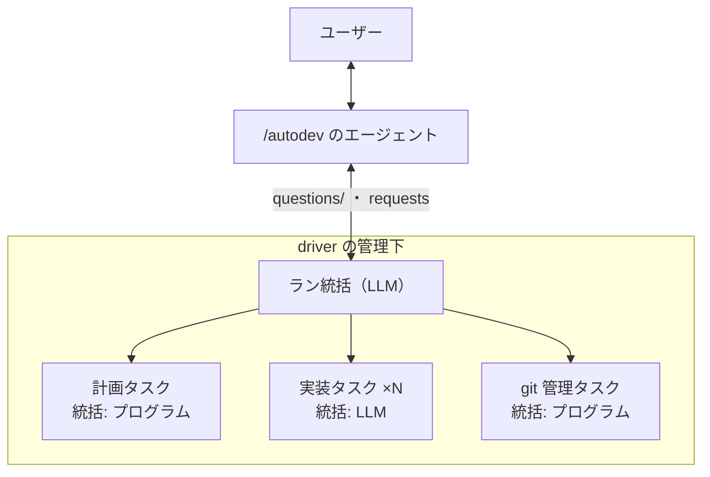

## 2. ユビキタス言語

コード上の名前は右の列に揃える。GLOSSARY.md はこの表で置き換える。

| 語 | 意味 | コード上の名前 |
| --- | --- | --- |
| ラン | `/autodev` 1 回ぶんの作業。指示 1 つから概要 PR と stacked PR の一式を作る | `Run` |
| タスク | 作業者の単位。統括とフローを持つ。種類は計画・実装・git 管理 | `Task` |
| 統括 | タスクとランの頭。フローを組む・イベントを受けて判断する。ステージではない | `Supervisor` |
| ステージ | driver が起動し、入力を受けて結果かイベントを返して終わる 1 回の作業 | `Stage` |
| 合成ステージ | ステージを並べたサブフローを持つステージ。呼ぶ側からは 1 つのステージに見える | `CompositeStage` |
| フロー | タスク統括が組む、ステージの並び | `Flow` |
| 成果物 | ステージが作り、後のステージが要るもの。実物は worktree とランディレクトリにある | `Artifact` |
| ガード | ステージの種類ごとの静的な検査。書いてよい範囲・ジャッジの権限など | `Guard` |
| 実行 | ステージを 1 回走らせた記録。セッション id と始めた時点のコミットを持つ | `StageExecution` |
| 指摘 | レビューが立てる問題 1 件 | `Finding` |
| 指摘の台帳 | タスク 1 つ（または設計）の指摘の一覧 | `ReviewLedger` |
| 停滞 | 同じ指摘が修正を `STALL_AFTER_FIXES`（2）回受けても未解決 | `Stall` |
| エスカレーション | ループで解けない問題が起きたことの、1 段上への通知 | `Escalation` |
| 引き継ぎ | 統合に失敗したタスクの作業を、差し込んだ新しいタスクが受け継ぐこと | `takesOver` / `superseded` |
| 破棄 | 確定した再計画で、積んだタスクをスタックから外すこと。その上の PR も閉じ、再利用するタスクは積み直す | `discarded` |
| スタック | 概要 PR を一番下にした、1 本の線の stacked PR | `Stack` |
| 積む | 完了したタスクを、スタックの一番上へ rebase して PR にし、つなぐこと | `stack()` |

## 3. 境界づけられたコンテキストとモジュール

**境界づけられたコンテキストは 1 つ（autodev）にする。** 分けるのは、同じ言葉が場所によって違う意味になるときや、持ち主が分かれるときである。autodev では「タスク」「指摘」「ステージ」はどこでも同じ意味で、書く人も 1 人、driver は 1 プロセス、データベースも 1 つなので、コンテキストの間で言葉を翻訳する層を置いても守るものが無い。

コンテキストの中は、次のモジュール（パッケージ）に分ける。モジュールの間は、集約を id で参照し合うだけで、翻訳の層は置かない。

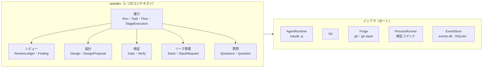

| モジュール | 責任 | 集約 |
| --- | --- | --- |
| 進行 | ランとタスクのライフサイクル、フローの検査と実行、エスカレーションの経路 | `Run`・`Task` |
| レビュー | 指摘の状態遷移、停滞の検知、指摘の移管 | `ReviewLedger` |
| 設計 | 設計の提案・版・確定 | `Design` |
| 検証 | 完了チェック・検証コマンドの選び方・両側の変更を残したかの確認 | なし（ドメインサービスだけ） |
| ソース管理 | スタックの形、積む順番待ちの列 | `Stack` |
| 質問 | ユーザーへの質問と回答 | `Questions` |

## 4. 値オブジェクト

どれも不変で、等しさは値で決まる。作るときに形を検査し、不正な値はその場で拒む。

### 識別子

| 名前 | 中身 | 作るときの検査 |
| --- | --- | --- |
| `RunName` | ラン名 | 英小文字・数字・`-` だけ（今の `paths.check_name()`） |
| `TaskId` | `task<番号>` | 番号は使ったことのある番号と重ねない（捨てたタスクのブランチが残るため） |
| `ExecutionId` | `TaskId` ＋ `StageKind` ＋ ラウンド ＋ 試行回数 | — |
| `FindingId` | `R<番号>`（設計は `D<番号>`） | 台帳の中で一意 |
| `QuestionId` | 質問の id | 英小文字・数字・`-` |
| `SessionId` | claude のセッション id | UUID。driver が `--session-id` で決める |
| `CommitSha` | コミットの SHA | 40 桁の 16 進 |
| `BranchName` | `stack/<ラン名>--task-<番号>` など。破棄の後に積み直すタスクは、新しい名前で切り直す（形は実装で決める） | ブランチの規約に合う。使ったことのある名前と重ねない |
| `PrNumber` | PR 番号 | 正の整数 |
| `StreamId` | 集約 1 つぶんのイベントの列。`run` / `task/<TaskId>` / `review/<TaskId>`・`review/design` / `design` / `stack` / `questions` | — |
| `CommandId` | コマンドの id | ポリシーが出すものは「元のイベントの id ＋ ポリシーの名前」から決める（反応し直しで同じコマンドが 2 回出ても、2 回目を弾ける） |
| `EventId` ・ `Seq` | イベントの id と、ラン全体の通し番号 | `Seq` は追記の順に 1 ずつ増える |

### ステージとフロー

| 名前 | 中身 | 備考 |
| --- | --- | --- |
| `StageKind` | ステージの種類（§11 の一覧） | 列挙 |
| `ArtifactKind` | `brief`・`codemap`・`design`・`tests`・`red-tests`・`impl`・`reviewed`・`gated`・`pr-body` | 列挙 |
| `ArtifactRef` | `ArtifactKind` ＋ 実物の在りか（例: `tests` なら `testsAt` の `CommitSha`） | — |
| `Guard` | 書いてよい範囲（`none` / `non-tests` / `tests-and-stubs` / `tests-only` / パスの一覧）・ジャッジの権限の有無・設計ファイルを渡すか | 今の `config/stages.py` の `edits` / `tests_only` / `judge` / `reads_design`。範囲はどれも worktree の中。worktree の外では、ランディレクトリ（自分の worktree を除く）とホームディレクトリへの書き込みを止め、OS の一時ディレクトリ（`/tmp`・`$TMPDIR`）は許す。`gh` と `git push` も止める。どれもフックで止めるので、Bash 越しの書き込みには穴が残る（ARCHITECTURE §10） |
| `StageSpec` | `StageKind` ＋ `needs` ＋ `optional` ＋ `produces` ＋ `before`（この種類より前になければならない種類）＋ `Guard` ＋ モデルと思考量 | ステージの種類ごとに 1 つ。コードに定義を置く |
| `FlowStep` | `StageKind` ＋ 引数（例: ReviewLoop の `reviewers`） | — |
| `Reviewers` | ReviewLoop の引数。`first`（1 ラウンド目に並列で走らせるレビュー）と `later`（2 ラウンド目から。省くと `first` と同じ）。値はステージ名の `Review` / `AdversarialReview` | 顔ぶれはタスク統括が選ぶ。tier は持たない。`FlowValidator` が、どちらも 1 つ以上で既知のステージ名だけかを確かめる |
| `Flow` | `FlowStep` の並び ＋ 版の番号 | 書き直すと新しい `Flow` になる。driver が検査を通したものだけが作られる |
| `Cursor` | フローのどこまで進んだか（合成ステージの中の位置を含む） | — |

### レビュー

| 名前 | 中身 |
| --- | --- |
| `Rating` | `must-fix` / `should-fix` / `nit` |
| `FindingStatus` | `open` / `closed` / `rejected` / `carried`（再計画で別のタスクへ移した元。未解決に数えない） |
| `Location` | `path:line` |
| `StallCause` | ジャッジの分類。`tests`（テストが誤り）/ `approach`（堂々巡り）/ `scope`（範囲の外）/ `ambiguous`（受入条件が曖昧） |
| `DesignCause` | 設計のジャッジの分類。`reverted`（前の版の形に戻った）/ `ambiguous` |
| `JudgeCapability` | 指摘の状態を動かす権限。「Judge・DesignJudge の実行の結果から出したコマンドである」ことで表す。出す者は driver が `Issuer` に記録するので、ステージは名乗れない（環境変数のトークンは使わない） |

### タスクとラン

| 名前 | 中身 |
| --- | --- |
| `TaskKind` | `planning` / `implementation` / `git` |
| `TaskStatus` | §9.1 の状態の一覧 |
| `TaskSpec` | 件名・DoD・受入条件・範囲・入口・境界の形・このタスクで足す検証コマンド |
| `Dependency` | `blockedBy` の `TaskId` の集合 |
| `Decision` | 回答で決めたこと ＋ 出どころ（`origin`: `user` / `run-supervisor`）。そのタスクのステージに毎回渡す |
| `HumanDecision` | `origin` が `user` の `Decision`。ユーザーの回答だけがこれになる |
| `ParallelLimit` | 同時に走る実装タスクの上限。既定 3 |
| `VerifyCommand` | 検証コマンド 1 本の文字列 |
| `GlobPattern` | テストのパス・変更禁止パス・テストが要らないパス |

### 歯止めの値

回り続けるループを、ほどほどの所で止めて上へ上げるための値。進め方の形（どのステージを並べるか）は縛らない（ARCHITECTURE §13）。

| 名前 | 値 | 使う所 |
| --- | --- | --- |
| `MAX_REPLANS_WITHOUT_STACK` | 2 | タスクを 1 本も積まないまま続けた再計画の数の上限（§6.1） |
| `STALL_AFTER_FIXES` | 2 | 同じ指摘が修正をこの回数受けても `open` なら停滞（§6.3） |
| `MAX_DESIGN_ROUNDS` | 5 | 1 つの提案で回す設計のラウンドの上限（§6.4） |

### 検証とソース管理

| 名前 | 中身 |
| --- | --- |
| `GateReport` | 完了チェックの項目ごとの合否と、落ちた理由 |
| `VerifyResult` | コマンド・終了コード・出力の末尾 |
| `UnionVerdict` | 衝突したファイルごとに「両側が足した行を残し、どちらも消していない行を消していない」かの合否 |
| `StackEntry` | `TaskId` ＋ ブランチ ＋ PR 番号 ＋ base |

### イベント

| 名前 | 中身 |
| --- | --- |
| `Issuer` | コマンドを出した者。統括（どのセッションか）・ポリシー（どのポリシーが、どのイベントを受けて）・ステージの実行（`ExecutionId`）・`/autodev` の CLI |
| `EscalationKind` | §8.2 の一覧 |
| `Pointers` | 調べる先の場所。タスクのディレクトリ・結果の JSON・ログ・worktree・セッション id |
| `Hint` | どこから読めばよいかの手がかり。指摘の id・ジャッジの分類など。**本文は載せない** |

## 5. エンティティ

同一性は id で決まり、状態が変わる。どれもいずれかの集約の中にあり、集約の外から直接は変えない。

| エンティティ | 属する集約 | 同一性 | 変わる状態 |
| --- | --- | --- | --- |
| `Supervisor` | `Run`・`Task` | `SessionId`（プログラムの統括は種類名） | 起こした回数・最後に返した判断 |
| `StageExecution` | `Task` | `ExecutionId` | `running` → `completed` / `reported` / `failed` / `interrupted` / `deferred` など（§9.2）。セッション id・始めた時点のコミット・結果の在りか。`deferred` なら止めたツール呼び出しの `tool_use_id` |
| `TaskEntry` | `Run` | `TaskId` | `TaskStatus`・依存・引き継ぎ元と引き継ぎ先 |
| `OpenEscalation` | `Task`・`Run` | イベントの id | 受けた・処理した・上へ上げた |
| `Finding` | `ReviewLedger` | `FindingId` | 状態・コメント・修正を受けた回数・移管元 |
| `StackRequest` | `Stack` | `TaskId` | 待ち → 処理中 → 積んだ / 上げた |
| `Question` | `Questions` | `QuestionId` | `open` → `answered`。経路（どの統括から上がってきたか） |

## 6. 集約

1 つの集約が 1 つの整合性の境界で、**イベントのストリームも集約ごとに 1 本。** 集約をまたぐ整合は、ポリシーがイベントを受けてコマンドを出して合わせる。集約の書き方は §6.7 にある。

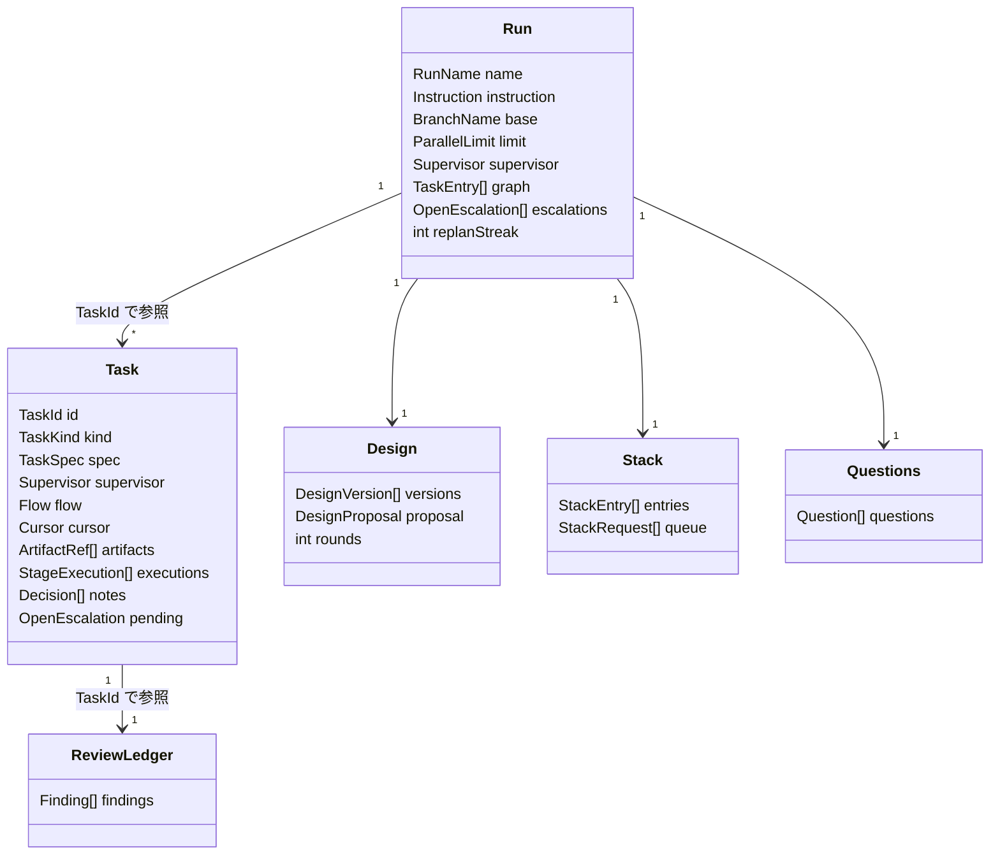

集約の間は id で参照し、オブジェクトを持ち合わない。

### 6.1 Run（進行）

ランの全体と、タスクの依存のグラフを持つ。**タスクをいつ始め、いつ止めるかはここで決まる。**

不変条件:

- 依存のグラフに循環が無い。`blockedBy` は存在するタスクだけを指す
- `dropped`・`superseded`・`discarded` のタスクは書き換えない
- `stacked` のタスクを変えてよいのは、確定した再計画が破棄を提案したときだけ（`discarded` にする）。積んだタスクは再利用を優先し、破棄するなら提案に理由がある
- 破棄したタスクより上に積んであったタスクのうち、破棄しないものは積む列に戻す（`gated` に戻す）
- `running` の実装タスクは `ParallelLimit` 以下
- 計画タスクと git 管理タスクは、ランに 1 つずつ。どちらもランが終わるまで続き、再計画のときも同じ計画タスクを使う
- 実装タスクを始めてよいのは、`blockedBy` に挙がったタスクがすべて `stacked` のときだけ
- `superseded` のタスクには、必ず引き継ぎ先がある。引き継ぎ元に依存していたタスクは、引き継ぎ先に依存し直す
- タスクを 1 本も積まないまま続けた再計画の数（`replanStreak`）が `MAX_REPLANS_WITHOUT_STACK` に達したら、それ以上は再計画を受けない。積むたびに 0 に戻す。上限に達した後は、ユーザーの回答（`QuestionId`）を添えた `RequestReplan` だけを受け、受けたら 0 に戻す（ラン統括はユーザーに聞いてから頼み直す）

操作: `start` / `applyPlan` / `replan` / `startTask` / `insertTask` / `supersede` / `stopTasks` / `discardTasks` / `returnToQueue` / `markStacked` / `raise`（ユーザーへ上げる）/ `panic` / `finish`

ストリーム: `run`

### 6.2 Task（進行）

タスク 1 つの中身。種類（計画・実装・git 管理）は `TaskKind` で分け、集約の形は共通にする。

不変条件:

- `flow` は、`FlowValidator` を通ったものしか入らない
- `cursor` が進むのは `StageCompleted` を受けたときだけ。報告（`StageReported`）では進めず、エスカレーションが解けたら同じステージをもう一度走らせる（統括がフローを書き直したときは、そのフローに従う）
- `cursor` が戻るのは、統括がフローを書き直したときだけ。例外は `GateFailed` で、直前の ReviewLoop の Fix に戻る（§11.3。ふつうに回るループなので、統括を起こさない）
- 未処理のエスカレーションがある間は、新しいステージを起動しない。エスカレーションが閉じるのは、回答が届いたとき（`EscalationResolved`）、統括がフローを書き直したとき（`FlowAccepted`）、回答以外の手で片付いたとき（`EscalationClosed`。下）のどれか
- 範囲が変わった（`ScopeChanged`）後は、統括が新しいフローを返す（`FlowAccepted`）まで、新しいステージを起動しない。走っているステージは、終わるまで走らせる
- 同時に走るステージは 1 つ。例外は、合成ステージが並列に走らせると宣言した中のステージ（ReviewLoop の `reviewers` に挙げた複数のレビュー）
- 成果物は、それを `produces` に持つステージが完了したときだけ増える
- `notes`（回答で決めたこと。`Decision`）は足すだけで、消さない
- 統括はセッションを続ける。フローを書き直すたびに新しいセッションにはしない

**回答以外でエスカレーションを閉じる（`CloseEscalation` → `EscalationClosed`）:**

- タスクを止めた（`TasksStopped`）。止めたタスクの未処理のエスカレーションを閉じる
- ラン統括が、計画タスクの ask に `answer` ではなく `replan` で応じた（`RequestReplan` に、きっかけのエスカレーションの id を載せる）。止まっていた実行（`deferred`）は捨てて（`abandoned`）、計画タスクの統括は `ReplanRequested` を受けて Replan のフローを組む
- タスクが `needs-replan` で上げたエスカレーションは、その再計画が反映されたとき（`TasksPlanned`）に閉じる。ラン統括は `RequestReplan` に、きっかけのエスカレーションの id を載せ、`TasksPlanned` を受けたポリシーがその id で対応をとって `CloseEscalation` を出す。Run の側の同じエスカレーションも、`TasksPlanned` で処理済みになる

**再計画で範囲が変わって残ったタスク（`ChangeScope` → `ScopeChanged`）:**

- 再計画が反映されたとき（`TasksPlanned`）、走っているタスクと止まっていた（`escalated`）タスクのうち、止めずに残したものの範囲（`TaskSpec`）が変わっていたら、ポリシーが `ChangeScope` を出す。きっかけのエスカレーションを上げたタスクには、範囲が変わらなくても出す（再計画が済んだことを知らせる）
- `ScopeChanged` は新しい `TaskSpec` と設計の版を持ち、そのタスクの統括を起こす。統括は `Pointers` をたどって新しい範囲と設計を読み、フローを組み直す（`run-flow`）。作った成果物は残るので、使えるものはそのまま使える（§11.5）

操作: `acceptFlow` / `beginStage` / `reportStageResult` / `interruptStage` / `resumeStage` / `escalate` / `resolveEscalation` / `closeEscalation` / `changeScope` / `addNote` / `finish`

ストリーム: `task/<TaskId>`

**計画タスクと git 管理タスクは、ランの最初に 1 回だけ始める。** `RunStarted` を受けたポリシーが、2 つの `StartTask` を出す。どちらもランが終わるまで続き、始め直さない。再計画でも計画タスクを `StartTask` し直さない（`ReplanRequested` を受けて、計画タスクの統括が新しいフローを組む。§11.1）。実装タスクを始めるのは `TaskScheduler` だけである。

git 管理タスクの `flow` は、統括（プログラム）が `StackRequest` を 1 件取り出すたびに、決まった並び（§11.4）を組む。

**git 管理タスクは、イベントを受けて非同期に動き、実装タスクと並列に走る。** 統括（プログラム）は `RunStarted`・`TaskStarted`・`ReplanRequested`・`StackRequested`・`TasksPlanned`・`TasksDiscarded`・`RunFinished` などを受けて、§11.4 の並びを組む。ステージはメインループとは別のスレッドで走る。同時に走る実装タスクの上限（3）には数えない。**git 管理タスクの中の仕事は、種類を問わず 1 本の列に並べ、1 つずつ処理する**（ブランチを切る・積む・破棄する・概要 PR を書く、のすべて）。スタックの一番上・概要 PR の本文・リポジトリの ref を取り合わないためである。時間のかかる仕事（ResolveConflict や WriteOverview の LLM）の間は、後ろの仕事が待たされる。

計画タスクの統括もプログラムで、初回は `Prepare → Plan → DesignLoop`、再計画のときは `Replan → DesignLoop` を組む（§11.1）。上がってきたエスカレーション（`ask`・`design-ambiguous`・`design-reverted`・`design-rounds-exhausted`）は自分では解かず、ラン統括へ上げる。並びは決まっているので、統括に LLM を置いても判断することが無い。`ask` に答えるかどうかはラン統括が決める（§8.2）。

**計画タスクのステージの cwd:**

- 計画ステージにはコードを読む checkout が要るが、対象リポジトリの手元には触らない（ARCHITECTURE §10）。そこで、リポジトリの外に切った worktree を cwd にする
- 初回（Prepare・Plan と DesignLoop）は、概要ブランチの worktree（`trees/overview`）。git 管理タスクの統括が `RunStarted` を受けて、最初の仕事として CutBranch で切る（ランの最初の 1 回だけ。在れば何もしない）。計画タスクの統括は、その `WorktreeReady` を受けてからフローを組む
- 再計画（Replan と、その続きの Revise）は、スタックの一番上を読むためだけの worktree（`trees/stack-top`）。git 管理タスクの統括が `ReplanRequested` を受けて、そのときのスタックの一番上で HEAD を固定し、切り離した状態（detached）で切り直す。積んだタスクの変更が working tree に見え、読む間に一番上が動いても中身は変わらない。計画タスクの統括は、その `WorktreeReady` を受けてから `Replan → DesignLoop` を組む
- `gh stack link` / `unstack` は、どのときも `trees/overview` から叩く（`gh stack` のローカルの追跡は worktree ごとに別。§11.4）

### 6.3 ReviewLedger（レビュー）

タスク 1 つ（または設計）の指摘の一覧。今の `review.json` に当たる。

不変条件:

- 状態の遷移は、`open` → `closed` / `rejected` / `carried` と、`closed` / `rejected` → `open` だけ。`carried` は終端
- 状態を動かす `JudgeFinding` は、Judge・DesignJudge の実行の結果から出たものだけを受ける（`JudgeCapability`）
- 状態を変えるときは、コメントを必ず残す
- 修正を受けるたびに、そのとき `open` の指摘の、修正を受けた回数（`fixesReceived`）を 1 足す。`STALL_AFTER_FIXES` に達したら停滞
- 再計画で指摘を別のタスクへ移すときは、移す元を `carried` にし（未解決に数えない）、移した先の台帳に `open` で 1 回だけ立てる（2 回移すと同じ指摘が 2 件立つ）。再計画はタスクを書き換えるので、未解決の指摘をタスクと一緒に移さないと、直す者がいなくなる

操作: `raise` / `comment` / `judge` / `countFix` / `carry`

ストリーム: `review/<TaskId>`、設計は `review/design`。`reviewers` に挙げた複数のレビューは同時に走るが、結果はコマンドの列で順に入るので、ロックは要らない。

### 6.4 Design（設計）

設計ファイルの版と、確定前の提案。

不変条件:

- 提案を確定してよいのは、設計の台帳に `open` の must-fix が 0 件のときだけ（確かめる前の割り方でタスクを動かさない）。should-fix と nit は設計ファイルの末尾に書き足し、`rejected` にする（設計は直すたびに細かい指摘が立ち、must-fix 以外で直し続けると往復が終わらない。LEDGER の CT-17）
- 版は消さない（`design/v<版>.md`。DesignJudge が過去の版と見比べる）
- 1 つの提案で `MAX_DESIGN_ROUNDS` 回っても must-fix が残ったら、上へ上げる（`DesignRoundsExhausted`）。回答が下りてきたら、ラウンドの数を 0 に戻し（`DesignRoundsReset`）、回答を Revise の入力に足して DesignLoop を続ける。もう一度 `MAX_DESIGN_ROUNDS` まで回せる

操作: `propose` / `revise` / `settle` / `markReverted` / `resetRounds`

ストリーム: `design`。版の本文は `design/v<版>.md` に書き、イベントは版の番号と在りかだけを持つ（本文をイベントに入れると、イベントが設計ファイルの全文で膨らむ）。

### 6.5 Stack（ソース管理）

スタックの形と、積む順番待ちの列。git 管理タスクだけが変える。

不変条件:

- 積むのはスタックの一番上だけ
- 積んだ `StackEntry` を変えるのは、破棄したタスクから上を閉じるとき（`UnstackFrom`）だけ。閉じた所より下は変えない
- `entries[n]` の base は `entries[n-1]` のブランチ。一番下は概要ブランチで、その base はランの base
- 処理中の `StackRequest` は同時に 1 件
- 概要 PR は、全タスクが積み終わるまで draft のまま

操作: `enqueue` / `takeNext` / `append` / `reject`（統合に失敗して上げる）/ `unstackFrom`（破棄したタスクから上を閉じる）

ストリーム: `stack`

### 6.6 Questions（対話）

ラン統括から `/autodev` へ上げた質問と、その回答。

不変条件:

- 回答できるのは `open` の質問だけ
- 回答は、上がってきた経路を逆にたどって 1 段ずつ下りる

操作: `post` / `answer`

ストリーム: `questions`。`QuestionPosted` を受けた反応が `<ランディレクトリ>/questions/<QuestionId>.json` を書き、`/autodev` は Monitor でそこを見る。回答は `autodev answer` が `requests` テーブルに足し、driver が `AnswerQuestion` のコマンドにする（§7.4）。

### 6.7 集約の書き方（handle と apply）

集約は、コマンドを受ける `handle` と、イベントを当てる `apply` の 2 組の分岐でできている。どちらも引数の型で振り分ける（`match` 文か `functools.singledispatchmethod`）。

```python
class Task(Aggregate):
    def handle(self, command: Command) -> list[Event]:
        """不変条件を確かめ、出すイベントを決める。状態は変えない。"""
        match command:
            case BeginStage():
                if self.pending_escalation:
                    raise Rejected("未処理のエスカレーションがある")
                if missing := self.missing_needs(command.step):
                    raise Rejected(f"{command.step.kind} に要る {missing} が無い")
                return [StageStarted(execution=command.execution_id, start_commit=command.head)]
            case ReportStageResult():
                # 実行器は証拠を集めて渡すだけ。完了・失敗・エスカレーションのどれにするかはここで決める
                if deferred := command.evidence.deferred:
                    # 計画ステージの ask が defer で止まった（§11.1）。止まると結果は空なので、形を見るより先に見る
                    return [
                        StageDeferred(
                            execution=command.execution_id, tool_use_id=deferred.tool_use_id
                        ),
                        EscalationRaised(kind="ask", pointers=command.pointers),
                    ]
                if not command.evidence.result_valid:
                    # 構造化出力の検証に落ちても、終了コード 0・success のまま結果が空で返ることがある
                    return [
                        StageFailed(execution=command.execution_id, reason="結果が空か、形が違う")
                    ]
                if report := command.result.report():
                    # designGap・testConflict などの報告。報告を返したステージは何も作らないことがあるので、
                    # 成果物の実物を確かめる前に見る。失敗には数えず、cursor も進めない
                    return [
                        StageReported(execution=command.execution_id, kind=report.kind),
                        EscalationRaised(kind=report.kind, pointers=command.pointers),
                    ]
                if gate := command.evidence.gate_report:  # Gate（決定的）のときだけ在る
                    if gate.untested_change:
                        return [
                            StageReported(execution=command.execution_id, kind="untested-change"),
                            EscalationRaised(kind="untested-change", pointers=command.pointers),
                        ]
                    if not gate.passed:
                        # 不合格はステージの失敗ではない。直前の ReviewLoop の Fix へ戻る（§11.3）
                        return [
                            GateFailed(execution=command.execution_id, failed=gate.failed_items)
                        ]
                if missing := self.unproven_products(command.evidence):
                    return [
                        StageFailed(
                            execution=command.execution_id, reason=f"{missing} の実物が無い"
                        )
                    ]
                events = [
                    StageCompleted(
                        execution=command.execution_id, produced=command.evidence.products
                    )
                ]
                if self.cursor.is_last():
                    events.append(TaskGated())  # 1 つのコマンドから 2 つ出ることもある
                return events
            # …Task が受けるコマンドの分だけ
            case _:
                raise Rejected(f"{type(command).__name__} は Task が受けるコマンドではない")

    def apply(self, event: Event) -> None:
        """イベントを状態に当てる。再生のときもここだけを通る。"""
        match event:
            case StageStarted():
                self.executions[event.execution] = StageExecution.running(event.start_commit)
            case StageCompleted():
                self.executions[event.execution].complete()
                self.artifacts |= set(event.produced)
                self.cursor = self.cursor.next()
            case StageReported():
                self.executions[event.execution].report(event.kind)  # cursor は進めない
            case GateFailed():
                self.executions[event.execution].complete()
                self.cursor = self.cursor.back_to_fix()  # 直前の ReviewLoop の Fix
            case FlowRejected():
                pass  # 状態は変えない。差し戻しはポリシーが行う
            # …Task が出すイベントの分だけ
            case _:
                raise UnknownEvent(type(event).__name__)
```

- **判断する `handle` と、状態を変える `apply` を分ける。** 再生のときに判断を走らせ直すと、規則を変えた後の driver で古いランを再生したときに、昔は通ったコマンドが拒まれて状態を作り直せない。判断が時刻や git を見ていれば、再生のたびに結果も変わる
- **`apply` に書くのは、その集約が出すイベントだけ**（§8.3）。他の集約のイベントは、そのストリームに入ってこない。他の集約のイベントに反応するのはポリシーである
- **`apply` の最後は例外にする。** 「知らないイベントは何もしない」にすると、状態を変えるイベントの分岐を書き忘れても再生が黙って通り、その変化が再生のたびに消える。状態を変えないイベントは、何もしない分岐として明示的に書く
- **状態を変えるコマンドは、必ずイベントを出す。** イベントにしない変化は、再生すると消える
- **`handle` は外の世界に触らない。** git の HEAD や時刻のような外の値は、コマンドの中身として受け取る（例: `BeginStage.head`）
- 全てのコマンドとイベントのクラスに分岐があるかを確かめるテストを 1 本置く。`match` も `singledispatchmethod` も、分岐の漏れを型検査では見つけられない

## 7. コマンド

コマンドは「〜せよ」という命令で、宛先の集約は 1 つ。§6 の「操作」は、コマンドを受ける集約のメソッドである。

### 7.1 コマンドが処理される流れ

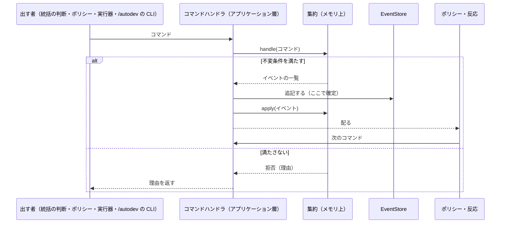

- **イベントを追記した時点で確定する。** 配るのは追記の後。逆にすると、追記の前に落ちたとき、起きていないことにポリシーが反応する。
- **拒否は、出した者に理由を返す。** 統括の判断から来たものは、同じセッションに差し戻す。ステージの結果から出たもの（例: 存在しない指摘の id を判定した）は、そのステージのセッションを `--resume` で起こして理由を渡す。`/autodev` の CLI から来たもの（`requests` に足した要求）は、driver が止まっている間に足されることもあるので、その場では返さない。拒んだ理由を `logs/` に残し、`autodev status` に出す。
- **コマンドを出せる者は決まっている（下の表の「出す者」）。** 外れた者が出したら拒む。出す者（`Issuer`）は driver が記録するので、ステージや統括が名乗りで偽ることはできない。
- **ステージは作業の途中でコマンドを出さない。** 今の `autodev review …` のように、ステージが Bash から driver の状態を書き換える入口は作らない。ステージは終わりに結果を `--json-schema` の形で返す。
  - 構造化出力の検証に失敗しても、終了コード 0・`subtype: success` のまま結果が空で返ることがある（実測）。検証には任せず、空の結果・形の違う結果は実行器が ⑤ で見つけて報告し、`Task.handle` が `StageFailed` にする（§6.7）。ただし defer で止まったときも結果は空なので、`Task.handle` は defer かどうかを形より先に見る
  - 計画ステージの ask は、PreToolUse のフックの `defer` でツール呼び出しを実行の前に止めて待つ（§11.1）。止まった呼び出しから質問を読み取り、コマンドにするのは driver なので、ステージが driver にコマンドを出すことにはならない

### 7.2 一覧

| コマンド | 出す者 | 宛先 | 中身 | 拒む条件 | 通ったときのイベント |
| --- | --- | --- | --- | --- | --- |
| `StartRun` | `/autodev`（CLI。`autodev run` を新しいラン名で呼んだとき。既にあるラン名なら出さずに再開する。既にあるラン名に `--instruction` が付いていたら、出さずに終了コード 1 で止める） | Run | `RunName`・指示・リポジトリ・base | 同じ名前のランがある | `RunStarted` |
| `StartTask` | ポリシー（実装タスクは `TaskScheduler`。計画タスクと git 管理タスクは `RunStarted` を受けて、ランの最初に 1 回だけ） | Run | `TaskId` | `blockedBy` に積まれていないタスクがある・実装タスクの `running` が上限に達している・計画タスクか git 管理タスクがすでに始まっている | `TaskStarted` |
| `ApplyPlan` | ポリシー（`DesignSettled` を受けて。再計画なら、ラン統括が止める・破棄するタスクを確かめた後） | Run | 確定した提案 | 依存のグラフに循環がある・破棄していない積み済みのタスクを書き換える | `TasksPlanned` |
| `RequestReplan` | ラン統括 | Run | 理由・きっかけのエスカレーションの id（任意。`needs-replan` や計画タスクの ask に応じるとき）・ユーザーの回答（`QuestionId`。上限に達した後だけ要る） | `replanStreak` が `MAX_REPLANS_WITHOUT_STACK` に達していて、回答が添えられていない | `ReplanRequested` |
| `InsertTask` | ラン統括 | Run | `TaskSpec`・`blockedBy`・引き継ぎ元（任意） | 循環ができる・引き継ぎ元が積まれている | `TaskInserted`（引き継ぎ元があれば `TaskSuperseded` も）。設計レビューは回さない（下の注） |
| `StopTasks` | ラン統括 | Run | `TaskId` の一覧 | 積み済みのタスクを含む | `TasksStopped` |
| `DiscardTasks` | ラン統括（判断の JSON からは出さない。破棄は `apply-plan` の `ApplyReplan` が行う） | Run | 破棄する積んだタスクの `TaskId` の一覧 | 積んでいないタスクを含む・確定した再計画が破棄を提案していない | `TasksDiscarded` |
| `ReturnToQueue` | ポリシー（`StackCutBack` を受けて） | Run | 積み直すタスクの `TaskId` の一覧 | 閉じた所より上に積んであったタスクでない | `TasksReturnedToQueue` |
| `MarkStacked` | ポリシー（`TaskStacked` を受けて） | Run | `TaskId`・PR 番号 | そのタスクが `stacking` でない | `TaskMarkedStacked`（全部終端なら `AllTasksStacked` も） |
| `EscalateToRun` | タスク統括・git 管理タスクの統括 | Run | `EscalationKind`・`Pointers`・`Hint` | — | `EscalationRaised` |
| `Panic` | アプリケーション層（`RateLimited` を受けて） | Run | 原因 | — | `RunPanicked` |
| `FinishRun` | ラン統括 | Run | 概要 PR を draft から外すか | 終端でないタスクがある | `RunFinished` |
| `AcceptFlow` | タスク統括（`run-flow`） | Task | `Flow` | `FlowValidator` に落ちる・統括がラン統括へ上げて回答を待っている（上がってきたエスカレーションへの応答としてのフローは受け、そのエスカレーションを閉じる） | `FlowAccepted`（拒んだら `FlowRejected`） |
| `BeginStage` | ポリシー（実行器） | Task | `FlowStep` | `needs` の成果物が無い・同じタスクで別のステージが走っている（合成ステージの並列を除く）・未処理のエスカレーションがある | `StageStarted` |
| `ReportStageResult` | 実行器（外部システムの変換層。証拠を集めて） | Task | 結果の JSON・証拠（作った成果物の実物・コミット数・検証コマンドの結果・終了の仕方）・`Pointers` | その実行が `running` でない | Task が証拠を見て決める。見る順は §6.7 のとおり: ① defer で止まったなら `StageDeferred`（止めた呼び出しの `tool_use_id` を載せる）＋ `EscalationRaised`（`ask`）。止まると結果は空なので、形より先に見る ② 結果が空・形が違うなら `StageFailed` ③ 結果が `designGap` などの報告なら、実物を確かめる前に `StageReported` ＋ `EscalationRaised`（失敗に数えず、cursor も進めない） ④ Gate が不合格なら `GateFailed`（範囲の外を変えたなら `StageReported` ＋ `EscalationRaised`（`untested-change`）） ⑤ 実物が無い・エラーで終わったなら `StageFailed`（2 回続けば `EscalationRaised` も） ⑥ 完了なら `StageCompleted`（CutBranch なら `WorktreeReady`、フローの終わりなら `TaskGated` も） |
| `InterruptStage` | ポリシー（`RunPanicked`・`TasksStopped` を受けて） | Task | `ExecutionId` | 走っていない | `StageInterrupted` |
| `ResumeStage` | `/autodev`（`autodev run` で呼び直す。`interrupted` の実行）・反応（`ask` の回答のファイルを書き終えた後。`deferred` の実行） | Task | `ExecutionId` | `interrupted` でも `deferred` でもない | `StageStarted` |
| `Escalate` | ポリシー（`FindingStalled`・`DesignReverted`・`DesignRoundsExhausted`、DesignJudge の `ambiguous` などを受けて） | Task | `EscalationKind`・`Pointers`・`Hint` | — | `EscalationRaised` |
| `ResolveEscalation` | ラン統括（`answer`。上げてきたタスクに回答を渡す） | Task | エスカレーションの id・回答・出どころ（ユーザーの回答を渡すなら、その `QuestionId`。無ければラン統括の回答） | そのエスカレーションが未処理でない・`QuestionId` の質問が回答済みでない | `EscalationResolved` |
| `CloseEscalation` | ポリシー（`TasksStopped` を受けて、止めたタスクに。計画タスクの ask にラン統括が `replan` で応じた `ReplanRequested` を受けて、計画タスクに。`TasksPlanned` を受けて、その再計画のきっかけのエスカレーションを上げたタスクに） | Task | エスカレーションの id・理由 | そのエスカレーションが未処理でない | `EscalationClosed`（`deferred` の実行があれば `abandoned` にする） |
| `ChangeScope` | ポリシー（再計画の `TasksPlanned` を受けて、範囲が変わって残ったタスクと、きっかけのエスカレーションを上げたタスクに） | Task | 新しい `TaskSpec`・設計の版・`Pointers` | そのタスクが終端の状態にある | `ScopeChanged` |
| `AddNote` | ポリシー（`EscalationResolved` を受けて） | Task | `Decision`（出どころは `ResolveEscalation` から写す。`QuestionId` があれば `user`、無ければ `run-supervisor`） | — | `NoteAdded` |
| `RaiseFinding` | ポリシー（Review・AdversarialReview・DesignReview の `StageCompleted` を受けて。`GateFailed` を受けて、落ちた項目ごとに。`FindingCarried` を受けて、移した先の台帳に） | ReviewLedger | `Rating`・`Location`・本文・移管元（任意） | `Rating` の綴りが違う | `FindingRaised` |
| `CommentFinding` | ポリシー（Impl・Fix・Plan・Judge の `StageCompleted` を受けて） | ReviewLedger | `FindingId`・本文 | 指摘が無い | `FindingCommented` |
| `JudgeFinding` | ポリシー（Judge・DesignJudge の `StageCompleted` を受けて。`JudgeCapability`） | ReviewLedger | `FindingId`・行き先の状態・コメント | Judge・DesignJudge の結果から出たものでない・許されない遷移・コメントが無い | `FindingClosed` / `FindingRejected` / `FindingReopened` |
| `CountFix` | ポリシー（Fix が完了したら） | ReviewLedger | — | — | `FixCounted`（`STALL_AFTER_FIXES` に達した指摘ごとに `FindingStalled` も） |
| `CarryFinding` | ポリシー（`TasksPlanned` が移管を含むとき） | ReviewLedger（移す元） | `FindingId`・移す先の `TaskId` | すでに移した・`open` でない | `FindingCarried`（移す元を `carried` にする） |
| `ProposeDesign` | ポリシー（Plan・Replan が完了したら） | Design | 提案 | 確定していない提案がすでにある | `DesignProposed` |
| `ReviseDesign` | ポリシー（must-fix が残ったら） | Design | 直した提案 | — | `DesignRevised`（`MAX_DESIGN_ROUNDS` を超えたら `DesignRoundsExhausted`） |
| `ResetDesignRounds` | ポリシー（`design-rounds-exhausted` の `EscalationResolved` を受けて） | Design | 回答 | ラウンドを使い切っていない | `DesignRoundsReset` |
| `SettleDesign` | ポリシー（must-fix が 0 件になったら） | Design | — | must-fix が残っている | `DesignSettled` |
| `MarkReverted` | ポリシー（DesignJudge の `StageCompleted` が「前の版に戻った」を返したとき） | Design | 戻った先の版 | — | `DesignReverted` |
| `EnqueueStack` | ポリシー（`TaskGated` を受けて） | Stack | `TaskId`・ブランチ | すでに列にある | `StackRequested` |
| `TakeNextRequest` | git 管理タスクの統括 | Stack | — | 処理中の頼みがある・列が空 | `StackRequestTaken` |
| `RecordConflict` | git 管理タスクの統括（Rebase が衝突したら） | Stack | 衝突したファイル | 処理中の頼みでない | `RebaseConflicted` |
| `AppendEntry` | git 管理タスクの統括（StackLink の後） | Stack | `StackEntry` | base が一番上のブランチでない | `TaskStacked` |
| `RejectRequest` | git 管理タスクの統括 | Stack | 理由・衝突したファイル | 処理中の頼みでない | `IntegrationFailed` |
| `UnstackFrom` | git 管理タスクの統括（ClosePRs → Unstack → Relink が完了したら） | Stack | 閉じた中で一番下の `StackEntry` | 積んでいない・処理中の頼みがある | `StackCutBack` |
| `PostQuestion` | ラン統括（`ask-user`） | Questions | 質問・経路 | — | `QuestionPosted` |
| `AnswerQuestion` | `/autodev`（CLI） | Questions | `QuestionId`・回答 | 質問が `open` でない | `QuestionAnswered` |

**タスクの差し込みと設計レビューは別の話である。** 設計レビュー（DesignLoop）が回るのは、Design 集約に提案が出たとき（`DesignProposed`）だけで、タスクを差し込んだことはきっかけにならない。差し込んだタスクは今の設計ファイルの範囲で作業する。設計を変える必要があるなら、ラン統括は差し込みではなく再計画を頼む（`RequestReplan`）。差し込んだタスクが作業の途中で設計ファイルに無い形が要ると分かったときは、ほかのタスクと同じく `design-gap` を上げる。

### 7.3 統括の判断とコマンドの対応

統括が返す JSON（§12）は、アプリケーション層が 1 つのコマンドに置き換える。

| 統括 | `decision` | コマンド |
| --- | --- | --- |
| タスク統括 | `run-flow` | `AcceptFlow` |
| タスク統括 | `escalate` | `EscalateToRun` |
| ラン統括 | `replan` | `RequestReplan` |
| ラン統括 | `insert-task` | `InsertTask` |
| ラン統括 | `stop-tasks` | `StopTasks` |
| ラン統括 | `apply-plan` | `ApplyReplan`（止める・破棄する・反映するを 1 回で。ADDENDUM §3） |
| ラン統括 | `answer` | `AnswerEscalation`（Run が経路を確かめ、回答を渡すタスクへ下ろす） |
| ラン統括 | `ask-user` | `PostQuestion` |
| ラン統括 | `finish` | `FinishRun` |

### 7.4 コマンドの列とイベントの配達

**監視するプロセスは置かない。** イベントを書き込むのは driver だけなので、driver は自分が追記したことを知っている。追記した直後に、同じプロセスの中でイベントの受け手を呼べば足りる。

イベントの受け手は 2 種類ある。

| 受け手 | すること | 例 |
| --- | --- | --- |
| ポリシー | イベントを受けてコマンドを返す。I/O をしない | `FindingStalled` → `Escalate` |
| 反応 | イベントを受けて外の世界に副作用を起こす。副作用を終えた後に続きが要るときだけ、その結果をコマンドにしてメインループに渡す（実行器と同じく外の世界の変換層） | `StageStarted` → ステージを起動する。`QuestionPosted` → `questions/` に質問のファイルを書く。`EscalationResolved`（ask）→ `answers/` に回答のファイルを書き終えてから `ResumeStage` を渡す |

どちらも受け手ごとにチェックポイント（どのイベントまで処理し終えたかの印。DDD ではなくインフラの概念で、Kafka のオフセットにあたる）を持ち、落ちてから起きたらその後ろから受け直す。**`events` テーブルがそのまま Outbox を兼ねる**（状態の変更と外に知らせるものが、同じ 1 回の書き込みで確定する。受け手のチェックポイントが中継役にあたる）。外から受ける側の Inbox は `requests` テーブルである。

#### 保存するもの

1 つの SQLite のデータベース（`<ランディレクトリ>/events.db`）に、3 つのテーブルを置く。**正本は `events` だけ**で、残りの 2 つは処理し終えたら意味がなくなるインフラの記録である。

```sql
-- 正本。追記だけ
CREATE TABLE events (
  seq        INTEGER PRIMARY KEY AUTOINCREMENT,   -- ラン全体の通し番号
  stream     TEXT NOT NULL,                       -- StreamId（task/task2 など）
  version    INTEGER NOT NULL,                    -- ストリームの中の番号
  type       TEXT NOT NULL,
  v          INTEGER NOT NULL,                    -- イベントの形の版
  command_id TEXT NOT NULL,                       -- このイベントを出したコマンド
  at         TEXT NOT NULL,
  data       TEXT NOT NULL,                       -- JSON
  UNIQUE (stream, version)
);
CREATE INDEX events_by_stream ON events (stream, version);
CREATE INDEX events_by_command ON events (command_id);

-- 受け手（ポリシー・反応）ごとに、どのイベントまで受けたか
CREATE TABLE checkpoints (subscriber TEXT PRIMARY KEY, seq INTEGER NOT NULL);

-- driver の外（/autodev の CLI）から届いた要求（Inbox）。処理したら消す
CREATE TABLE requests (id TEXT PRIMARY KEY, type TEXT NOT NULL, data TEXT NOT NULL, at TEXT NOT NULL);
```

- **コマンドは記録しない。** 受け付けたコマンドはイベントとして残り、拒んだコマンドは運用のログ（`logs/`）に理由と一緒に残す。コマンドを再生すると判断を走らせ直すことになるので、正本にはしない（§6.7）。
- **1 つのコマンドが出したイベントは、1 つのトランザクションで書く。** 半分だけ確定することが無い。
- **スナップショットは持たない。** ランを消せば記録も消えるので、イベントは 1 ラン分しか溜まらない。起動時に頭から再生して足りる。
- WAL モードにして、`autodev status --json` が driver の書き込みを待たずに読めるようにする。
- この環境には `sqlite3` コマンドが無い。中を人が見るには `autodev events --name <ラン名>` で JSON に書き出す。
- データベースを Windows 側のディスク（`/mnt/c` の下）に置かない。WSL からはファイルのロックが当てにならない。ランの置き場の `~/.local/state` は Linux 側である。

#### メインループ

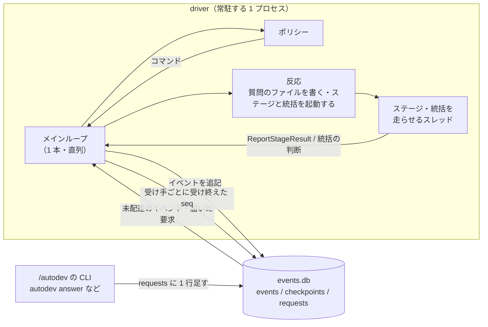

```python
def main_loop():
    aggregates = replay(db)  # 起動時: events を頭から読み、各集約を作る
    while not finished:
        if delivery := next_delivery(
            db
        ):  # 受け手への未配達（チェックポイントより後ろ）を先に片付ける
            event, subscriber = delivery
            if subscriber.is_policy:
                for command in subscriber(event):
                    process(command)
            else:
                subscriber(event)  # 反応。2 回呼ばれても同じ結果になるように作る
            db.set_checkpoint(subscriber.name, event.seq)
        else:
            request = next_request(db)  # 外からの要求・実行器と統括のスレッドの結果
            process(request.command)
            request.done(db)  # requests から来たものなら消す


def process(command):
    if db.produced_events(command.command_id):
        return  # 受け直しで 2 回目に来たものは何もしない
    aggregate = aggregates[command.target]
    try:
        events = aggregate.handle(command)
    except Rejected as r:
        log.rejected(command, r)
        notify(command.issuer, r)  # 統括なら同じセッションに差し戻す
        return
    with db:  # 1 コマンド = 1 トランザクション
        db.insert_events(command.command_id, events)
    for event in events:
        aggregate.apply(event)
```

コマンドの出どころは 5 つあり、どれも最後はメインループ 1 本を通る。そのため、集約の読み書きにロックは要らない。

| 出どころ | 届き方 |
| --- | --- |
| ポリシー | 未配達のイベント（チェックポイントより後ろ）を順に渡され、コマンドを返す |
| 実行器 | ステージを走らせるスレッドが、ステージのプロセスが終わったら、証拠を集めた `ReportStageResult` をメインループに渡す |
| 反応 | 副作用を終えた後に続きが要るときだけ渡す（例: 回答のファイルを書き終えてから `ResumeStage`）。2 回呼ばれて同じコマンドを 2 回渡しても、`CommandId` が元のイベントから決まるので 2 回目は弾かれる |
| 統括 | 統括を起こしたスレッドが、`claude -p` の返した判断を §7.3 でコマンドに置き換えて渡す |
| `/autodev` の CLI | `requests` テーブルに 1 行足す。driver が止まっていても足せて、次に起きたときに拾われる |

- **落ちてから起きたときに取りこぼさない。** 受け手は、自分のチェックポイントより後ろのイベントから受け直す。ポリシーが受け直して同じコマンドが 2 回出ても、そのコマンドの id のイベントがすでに `events` にあれば何もしない（ポリシーが出すコマンドの id は、元のイベントの id から決まる。`CommandId`）。
- **反応は、2 回呼ばれても同じ結果になるように作る。** チェックポイントを進める前に落ちると、同じ反応がもう一度呼ばれる。
  - 質問のファイルは、丸ごと書き直す
  - ステージや統括の起動は、そのセッションがすでに始まっていれば新しく起動せず、`--resume` で続ける（§9.2）
- **メインループの中では時間のかかることをしない。** 反応はステージと統括の起動を別のスレッドに渡すだけで、メインループは状態の遷移だけを行う。同時に走るのは、実装タスク最大 3 本ぶんのステージと統括である。
- **実行器と統括のスレッドの結果はメモリで渡す。** 渡す前に driver が落ちたら、走っていたステージは `interrupted` として扱い、`--resume` で続ける（§9.2）。
- **外から読むだけの者は、配達には関わらない。** `autodev status --json` は `events` を読んで自分で再生する。HUD はそれを呼ぶ。`/autodev` の Monitor は、反応が書いた `questions/` を見る。
- **走っているステージの進み具合（ターン数・直前のツールなど）は、イベントにしない。** ステージ 1 回で数百の stream-json のイベントが流れるので、正本に入れると `events` が膨らむ。実行器のスレッドが `<ランディレクトリ>/progress/<ExecutionId>.json` に数秒ごとに書き（一時ファイルから置き換える）、`autodev status --json` が再生した状態に混ぜて返す。使い捨てで、消えても状態は変わらない。

## 8. ドメインイベント

### 8.1 一覧

過去形で名付ける。集約が出し、他の集約やアプリケーション層が受けて動く。

| イベント | 出す集約 | 受けて動くもの |
| --- | --- | --- |
| `RunStarted` | Run | 計画タスクと git 管理タスクを始める（ランの最初の 1 回だけ）。git 管理タスクが、最初の仕事として概要ブランチと `trees/overview` を切る |
| `DesignProposed` / `DesignRevised` | Design | 設計レビューの合成ステージを回す |
| `DesignReverted` / `DesignRoundsExhausted` | Design | 計画タスクが `Escalate` して、計画タスク統括へ上げる（`design-reverted` / `design-rounds-exhausted`） |
| `DesignRoundsReset` | Design | 計画タスクの統括が、回答を Revise の入力に足して DesignLoop を続ける |
| `DesignSettled` | Design | `ApplyPlan`（再計画なら、先にラン統括に、止める走っているタスクと破棄する積んだタスクを確かめさせる） |
| `TasksPlanned` | Run | `TaskScheduler` が始められるタスクを選ぶ。git 管理タスクが概要 PR のまとめを書く（初回は概要 PR を draft で作り、再計画なら本文を差し替える）。再計画なら、きっかけのエスカレーションを `CloseEscalation` で閉じ、範囲が変わって残ったタスクに `ChangeScope` |
| `TaskStarted` | Run | 実装タスクなら、git 管理タスクがブランチと worktree を切る |
| `WorktreeReady` | Task（git） | その worktree を使うタスクの統括を起こしてフローを組ませる（計画タスクなら `trees/overview` で初回の並び、`trees/stack-top` で再計画の並び） |
| `FlowAccepted` / `FlowRejected` | Task | 受けたらステージを起動する。拒んだら理由を付けて同じ統括に差し戻す |
| `StageStarted` / `StageCompleted` / `StageFailed` / `StageInterrupted` | Task | 次のステージを起動する・2 回続けて落ちたらエスカレーション・再開する |
| `StageDeferred` | Task | なし（計画ステージが ask で止まった。止めた呼び出しの `tool_use_id` を持つ） |
| `StageReported` | Task | なし（報告を返して終わった。cursor は進めない。一緒に出た `EscalationRaised` が統括を起こす） |
| `GateFailed` | Task | 落ちた項目ごとに `RaiseFinding`（must-fix）。cursor は直前の ReviewLoop の Fix に戻っているので、実行器がそこから続ける |
| `FindingRaised` / `FindingClosed` / `FindingRejected` / `FindingReopened` | ReviewLedger | review-loop が次の手を決める |
| `FindingCommented` / `FixCounted` | ReviewLedger | なし（状態を残すため。ジャッジが読む・停滞の数え方に使う） |
| `FindingStalled` | ReviewLedger | review-loop がエスカレーションを出す |
| `FindingCarried` | ReviewLedger | 移した先の台帳に `RaiseFinding`（移管元つき）。移した先のタスクの受入条件に、移した指摘を書き足す |
| `EscalationRaised` | Task・Run | 1 段上の統括を起こす（§8.2） |
| `EscalationResolved` | Task | `AddNote`。統括がフローを書き直すか、止まったステージを続きから進める（ask なら、反応が `answers/<tool_use_id>.json` を書き終えてから `ResumeStage` を渡す） |
| `EscalationClosed` | Task | なし（回答以外で片付いた。`deferred` の実行は `abandoned` になっている） |
| `ScopeChanged` | Task | そのタスクの統括を起こし、新しい範囲でフローを組み直させる |
| `NoteAdded` | Task | なし（以後のステージに毎回渡す） |
| `TaskGated` | Task | フローを終えた（`gated` と `pr-body` が揃った）。`Stack.enqueue` |
| `StackRequested` | Stack | 処理中が無ければ、git 管理タスクが次を取り出す |
| `StackRequestTaken` | Stack | git 管理タスクが Rebase を走らせる |
| `RebaseConflicted` | Stack | ResolveConflict → CheckUnion → Verify を走らせる |
| `TaskStacked` | Stack | `MarkStacked`・概要 PR の本文を更新 |
| `IntegrationFailed` | Stack | git 管理タスクがラン統括へ上げる |
| `ReplanRequested` | Run | git 管理タスクが `trees/stack-top` を切り直し、その `WorktreeReady` で計画タスクの統括が `Replan → DesignLoop` を組む（`StartTask` はしない）。計画タスクの ask に応じたものなら `CloseEscalation` |
| `TaskInserted` / `TaskSuperseded` / `TasksStopped` | Run | 起動する・止める（走っているステージに `interrupt` を送る。止めたタスクの未処理のエスカレーションは `CloseEscalation`） |
| `TasksDiscarded` | Run | git 管理タスクが、破棄した中で一番下の PR から上を閉じ、スタックを解いて、残した PR で作り直す（ClosePRs → Unstack → Relink） |
| `StackCutBack` | Stack | 閉じた所より上に積んであって、破棄しないタスクを積む列に戻す（`ReturnToQueue`） |
| `TasksReturnedToQueue` | Run | `EnqueueStack`。git 管理タスクが、残した一番上へ rebase し直して積む |
| `TaskMarkedStacked` | Run | `TaskScheduler` が次に始められるタスクを選ぶ |
| `QuestionPosted` / `QuestionAnswered` | Questions | `/autodev` がユーザーに聞く・ラン統括を起こして回答を渡す |
| `AllTasksStacked` | Run | ラン統括を起こして仕上げさせる |
| `RunFinished` | Run | git 管理タスクが仕上げのまとめを書き、概要 PR を draft から外し（外すと決めたとき）、driver が終了コード 0（ランを終えた）で終える |
| `RunPanicked` | Run | 走っているステージをすべて止め、終了コード 3 で終える |

### 8.2 エスカレーション

エスカレーションは「ループで解けない問題が起きた」という通知である。**統括が知るのは、起きたことと調べる先だけ。** 詳細は、統括が `Pointers` をたどってファイルを読んで調べる。

```json
{
  "id": "esc-task2-7",
  "kind": "stall",
  "from": {"task": "task2", "stage": "judge", "round": 4},
  "pointers": {
    "taskDir": "tasks/task2/",
    "result": "tasks/task2/results/judge-r4.json",
    "log": "logs/task2-judge-r4.jsonl",
    "tree": "trees/task2/",
    "session": "<ジャッジのセッション id>"
  },
  "hint": {"findingIds": ["R3"], "cause": "tests"}
}
```

| `EscalationKind` | 出す所 | 受ける統括 |
| --- | --- | --- |
| `stall` | review-loop（停滞。ジャッジの `StallCause` を `hint` に付ける） | タスク統括 |
| `design-gap` | テスト作成・実装（設計ファイルに無い形が要る） | タスク統括 |
| `test-conflict` | 実装・修正（テストが仕様と矛盾する） | タスク統括 |
| `ask` | 計画ステージ（受入条件が曖昧。defer で止まって待つ） | 計画タスクの統括（プログラム。そのままラン統括へ上げる） |
| `red-check-failed` | ConfirmRed（テストが実装の前に全部通った。書き直させるかはタスク統括がフローで決める） | タスク統括 |
| `untested-change` | Gate（testgen を抜いたのに、テストが要らないパスの外を変えた） | タスク統括 |
| `stage-errors` | どのステージでも（2 回続けてエラー） | タスク統括 |
| `design-ambiguous` | 計画タスク（DesignJudge が `DesignCause` の `ambiguous` を返したのを受けて。設計の受入条件が曖昧） | 計画タスクの統括（プログラム。そのままラン統括へ上げる） |
| `design-reverted` / `design-rounds-exhausted` | 計画タスク（Design の `DesignReverted` / `DesignRoundsExhausted` を受けて） | 計画タスクの統括（そのままラン統括へ上げる） |
| `integration-failed` | git 管理タスク（CheckUnion かラン共通の検証が落ちた・ResolveConflict が「両方は残せない」と返した） | ラン統括 |
| `needs-replan` / `needs-human` | タスク統括（自分では解けない） | ラン統括 |
| `question` | ラン統括（ユーザーの判断が要る） | `/autodev` |

ふつうに回るループ（指摘 → 修正、gate の項目落ち → 修正）はエスカレーションにしない。

**受入条件の曖昧さは、ラン統括が判断する。** 計画ステージの `ask`、設計のジャッジの `ambiguous`（`design-ambiguous`）、ジャッジが `ambiguous` に分類した停滞（タスク統括が `needs-human` で上げる）は、どれもラン統括まで上がる。ラン統括は、答えが言えると判断したら自分で答え（`answer`）、言えないときだけユーザーに聞く（`ask-user`）。

- 根拠にしてよいのは、起動時の指示と、ユーザーの回答（`origin` が `user` の `Decision`）だけ。ラン統括が前に自分で答えたこと（`origin` が `run-supervisor`）は根拠にしない。推測が推測を呼んで、ユーザーの意図から離れていかないためである
- 回答は出どころ付きでタスクの `notes` に残る（§4 `Decision`）。ユーザーの回答を渡すときは、その `QuestionId` を `ResolveEscalation` に添える

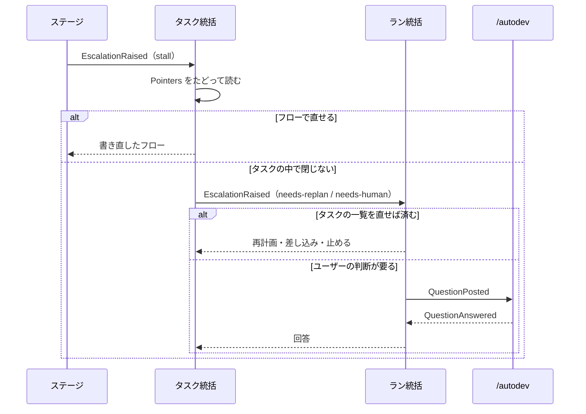

### 8.3 集約ごとのイベント

各集約の `apply` に書くのは、この表の自分の行のイベントだけである（§6.7）。

| 集約（ストリーム） | 出すイベント | 数 |
| --- | --- | --- |
| Run（`run`） | RunStarted・TaskStarted・TasksPlanned・ReplanRequested・TaskInserted・TaskSuperseded・TasksStopped・TasksDiscarded・TasksReturnedToQueue・TaskMarkedStacked・EscalationRaised・AllTasksStacked・RunFinished・RunPanicked | 14 |
| Task（`task/<TaskId>`） | FlowAccepted・FlowRejected・StageStarted・StageCompleted・StageFailed・StageInterrupted・StageDeferred・StageReported・GateFailed・WorktreeReady・TaskGated・EscalationRaised・EscalationResolved・EscalationClosed・ScopeChanged・NoteAdded | 16 |
| ReviewLedger（`review/…`） | FindingRaised・FindingCommented・FindingClosed・FindingRejected・FindingReopened・FixCounted・FindingStalled・FindingCarried | 8 |
| Design（`design`） | DesignProposed・DesignRevised・DesignSettled・DesignReverted・DesignRoundsExhausted・DesignRoundsReset | 6 |
| Stack（`stack`） | StackRequested・StackRequestTaken・RebaseConflicted・TaskStacked・IntegrationFailed・StackCutBack | 6 |
| Questions（`questions`） | QuestionPosted・QuestionAnswered | 2 |

`EscalationRaised` は Run と Task の両方が出すので、種類は全部で 51 である。

イベントには版の番号（`v`）を付ける。形を変えたら、古い形を新しい形に読み替える処理（アップキャスタ）を足し、古いランの `events.db` も再生できるようにする。

## 9. ライフサイクル

### 9.1 タスク（`Run` が持つ `TaskStatus`）

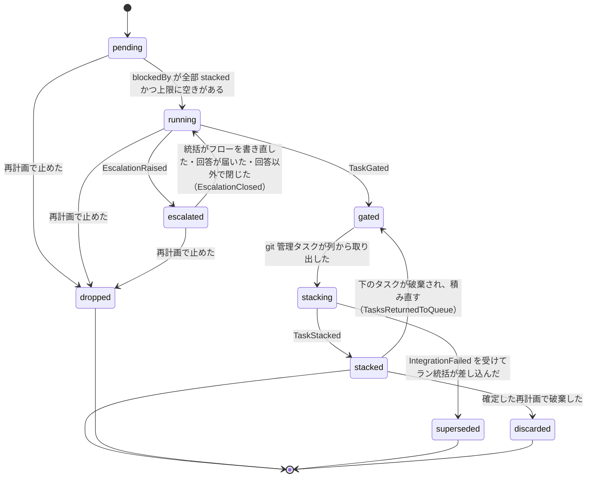

### 9.2 ステージの実行（`StageExecution`）

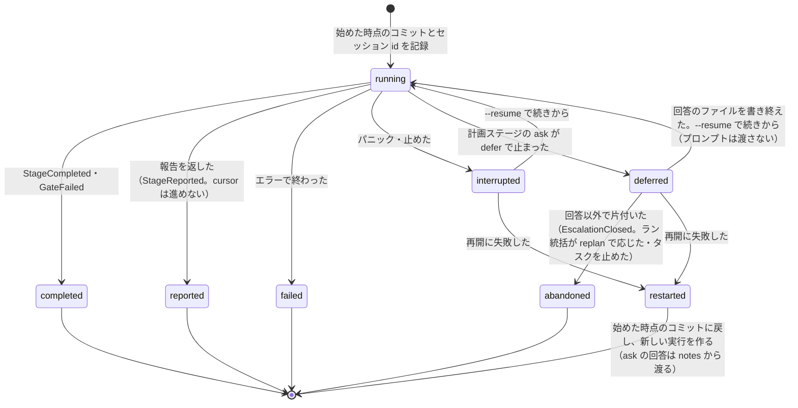

決定的なステージにセッションは無い。再開とは「もう一度流す」ことなので、2 回流しても同じ結果になるように作る（例: CreatePR は同じブランチの PR があればそれを使う）。

### 9.3 指摘（`Finding`）

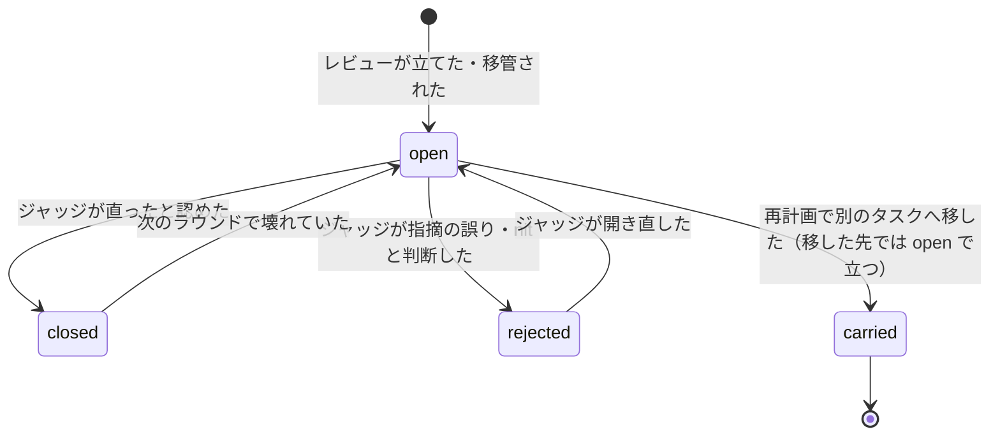

## 10. ドメインサービス

1 つの集約に収まらない判断を置く。どれも状態を持たない。

| サービス | すること | 今の置き場 |
| --- | --- | --- |
| `FlowValidator` | `needs` / `produces` の照合、`before` の順番の制約、終わりに `gated` と `pr-body` が作られるか、ReviewLoop の `reviewers` の `first`・`later` がどちらも 1 つ以上で、既知のステージ名（`Review` / `AdversarialReview`）だけか | 新規 |
| `TaskScheduler` | 始められるタスクを選ぶ（依存と上限） | `core/task_order.next_pending()` |
| `GateEvaluator` | 完了チェック（証拠で合否を決める。項目は今の 6 項目をなぞらず、新しいフローに合わせて決め直す）と、testgen を抜いたフローの前提（変更がテストの要らないパスに収まるか） | `core/verdict.py` |
| `StallPolicy` | 停滞の判定（`STALL_AFTER_FIXES`）。レビューの体数は決めない（ReviewLoop の `reviewers` でタスク統括が選ぶ） | `core/review_policy.py` |
| `UnionChecker` | 衝突したファイルで、両側の変更を残したか | 新規 |
| `VerifySelector` | 流す検証コマンドを、流す時点で選ぶ。実装タスクの ConfirmRed と Gate では、そのタスクの `verify`（そのタスクが手を付けた範囲）だけ。git 管理タスクの Verify（積む直前、rebase の後）では、ラン共通の `verify`（リポジトリ全体のテスト・lint など）。他のタスクが足したコマンドは積み上げない。計画ステージ（LLM）が返したコマンドも driver の権限で流す（ARCHITECTURE §13） | `core/task_order.verify_commands()`（今はラン共通＋番号の小さいタスクが足したものを積み上げているが、それをやめる） |
| `PlanApplier` | 確定した提案を `Run`・`Task`・`ReviewLedger` に反映する（タスクの差し替え・積んだタスクの破棄・指摘の移管・検証コマンドの置き換え） | `core/task_order.apply_replan()` |
| `EscalationRouter` | イベントの出所から、1 段上の統括を決める | 新規 |

## 11. ステージの一覧

### 11.1 計画タスク

| ステージ | 種類 | needs | produces | ガード |
| --- | --- | --- | --- | --- |
| Prepare | 決定的 | — | `brief` | — |
| Plan | LLM | `brief` | 提案・`codemap` | worktree は読むだけ。ask で聞ける（下） |
| Replan | LLM | `design` ＋ 再計画の入力（下） | 提案 | `trees/stack-top` は読むだけ。ask で聞ける |
| DesignLoop | 合成 | 提案 | `design` | 中のステージによる |
| ├ DesignReview | LLM | 提案 | 設計の指摘 | 読むだけ。却下済みの指摘の一覧は渡す |
| ├ DesignJudge | LLM | 設計の指摘 | 判定 | 読むだけ・`JudgeCapability` あり。ランの間は同じセッション（前の版の形に戻ったかを見分けるのに、経緯が要る） |
| └ Revise | LLM（Plan か Replan の続きのセッション） | 判定（ラウンドの上限に回答があれば、その回答も） | 提案の新しい版 | 読むだけ。ask で聞ける。設計の全文を返す（空なら形の誤りで `StageFailed`） |

統括はプログラムで、フローは決まった並びで組む。初回は `Prepare → Plan → DesignLoop`、再計画のときは `Replan → DesignLoop`。

- **コードマップは Plan が作る。** コードを読んで、次のステージが読み直さずに済む入口を書くのは LLM の仕事で、決定的な Prepare には書けない。Plan は結果の JSON で返し、driver がランディレクトリに書き出す（ステージは worktree の外に書けない）。Prepare が作るのは、指示とリポジトリごとの設定から組むブリーフだけである。
- **DesignLoop は、提案が出るたびに必ず回す。** tier を持たないので「すべて light なら飛ばす」は判定できず、統括はプログラムなので、飛ばす条件を誰かが判断する場所も無い。常に回すのが最も単純である。

**計画ステージの ask（PreToolUse のフックの `defer`）:**

1. 計画ステージ（Plan・Replan・Revise）は、受入条件が一意に定まらないと、質問を引数にした ask のコマンドを、そのターンで単独に呼ぶ（ほかのツールと同じターンで呼ぶと `defer` が効かない）
2. ガードのフックは、回答のファイル（`answers/<tool_use_id>.json`）が無ければ `defer` を返す。`tool_use_id` は止めたツール呼び出しの id で、フックの入力に載っており、`--resume` しても同じ呼び出しなので変わらない。claude は終了コード 0 で終わり、result に `stop_reason: tool_deferred` と止まった呼び出し（`deferred_tool_use`）が載る
3. 実行器がそれを証拠に載せて報告し、Task が `StageDeferred`（`tool_use_id` を載せる）と `EscalationRaised(ask)` を出す。エスカレーションの id と `tool_use_id` の対応は、Task が持つ。計画タスクの統括は、エスカレーションをラン統括へ上げる
4. 回答が下りてきたら（`EscalationResolved`）、反応が `answers/<tool_use_id>.json` を書き（一時ファイルから置き換える）、書き終えてから `ResumeStage` を渡す。セッションは `--resume` で起こし、プロンプトを渡さない（渡すと新しいターンが始まり、止まった呼び出しが再開されない）。同じ呼び出しで PreToolUse がもう一度走り、今度は回答のファイルがあるので通す。コマンドは回答を出力するだけである
5. 回答ではなく、ラン統括が replan で応じたときは、止まった実行を捨てる（`EscalationClosed` → `abandoned`。§6.2）。`--resume` に失敗したときは、ほかの再開と同じく始めた時点のコミットから新しい実行を作り、回答は `notes` から渡す（§9.2）

止まった呼び出しは実行される前にフックが止めているので、ステージが driver の状態を書き換えることは無い。質問を読み取ってコマンドにするのは driver で、§7.1 の「ステージは作業の途中でコマンドを出さない」と矛盾しない。

**Replan への入力:**

- ラン統括が `RequestReplan` に書いた理由
- 元のエスカレーションの `Pointers`
- 今のタスクの一覧と状態（積んだ・走っている・未着手・エスカレーション中）
- 今の設計ファイルと過去の版

**Replan が書き換えてよい範囲は、すべてのタスク。** 走っているタスクも、積んだタスクも含む。

- 積んだタスクは再利用を優先する。破棄するなら、再利用できない理由を提案に書き、DesignLoop で確かめる
- 確定したら、ラン統括が、止める走っているタスク（`StopTasks`）と、破棄する積んだタスク（`DiscardTasks`）を確かめてから、計画を反映する

### 11.2 実装タスク

| ステージ | 種類 | needs | produces | before | ガード |
| --- | --- | --- | --- | --- | --- |
| TestGen | LLM | `design` | `tests` | `impl` | テストと設計にあるシグネチャのスタブだけ |
| ConfirmRed | 決定的 | `tests` | `red-tests` | `impl` | — |
| Impl | LLM | `design`（`red-tests` は任意） | `impl` | — | テスト以外 |
| ReviewLoop | 合成 | `impl` | `reviewed` | — | 中のステージによる |
| ├ Expect | LLM | `impl` | — | — | テストだけ。期待値を決めるテストが落ちているときだけ走る（各ラウンドの頭でその場で流して決めるので、進み具合を持たずに済む。レビューより前に置くので、レビューが期待値の差分も読める） |
| ├ Review | LLM | `impl` | 指摘 | — | 読むだけ |
| ├ AdversarialReview | LLM | `impl` | 指摘 | — | 読むだけ。設計ファイルを渡さない（前提を持たずに差分だけを読む役で、設計を渡すとそれがフレーミングになる。LEDGER の CT-11・CT-15） |
| ├ Judge | LLM | 指摘 | 判定 | — | 読むだけ・`JudgeCapability` あり。タスクの間は同じセッション（停滞の原因を分類するのに、前のラウンドで何を判定したかが要る） |
| └ Fix | LLM（Impl の続きのセッション。読んだコードと直した経緯を読み直させない） | 判定 | — | — | テスト以外 |
| Gate | 決定的 | `reviewed` | `gated` | — | — |
| WritePrBody | LLM | `gated` | `pr-body` | — | 読むだけ |
| ResolveConflict | LLM | — | — | — | 衝突したファイルだけ（差し込んだタスクが統合をやり直すとき） |

フローの例:

```json
[{"stage": "TestGen"}, {"stage": "ConfirmRed"}, {"stage": "Impl"},
 {"stage": "ReviewLoop",
  "reviewers": {"first": ["Review", "AdversarialReview"], "later": ["Review"]}},
 {"stage": "Gate"}, {"stage": "WritePrBody"}]
```

ドキュメントだけのタスク:

```json
[{"stage": "Impl"}, {"stage": "ReviewLoop", "reviewers": {"first": ["Review"]}},
 {"stage": "Gate"}, {"stage": "WritePrBody"}]
```

### 11.3 ReviewLoop の中

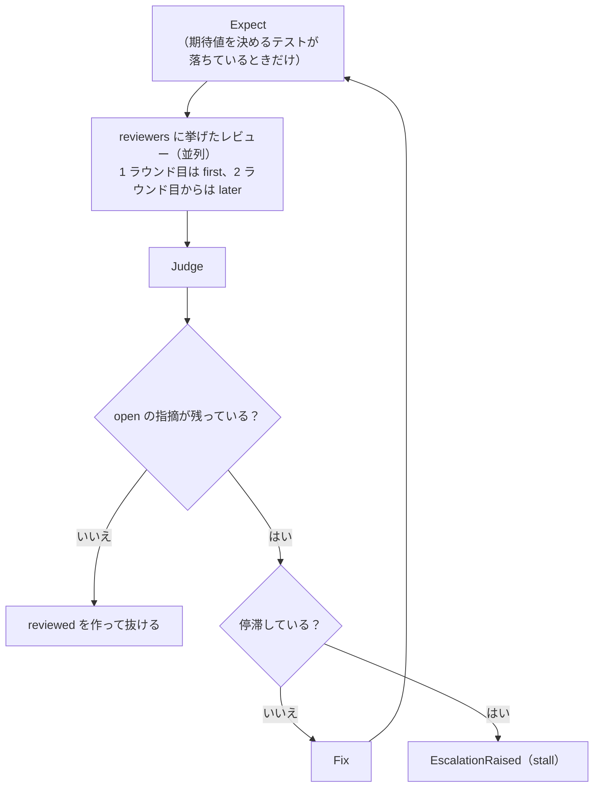

Gate が不合格なら、Task は `StageFailed` ではなく `GateFailed` を出す（Gate は正しく走り終えており、落ちたのはタスクの中身である）。`GateFailed` を受けたポリシーが、落ちた項目ごとに must-fix の指摘を台帳に立て、`cursor` は Gate から直前の ReviewLoop の中の Fix へ戻る。これは Task の不変条件「`cursor` が戻るのは統括がフローを書き直したときだけ」の例外で（§6.2）、ふつうに回るループなので統括は起こさない。Gate の落ちの多くはコードを直せば解けるからである。コードを直しても解けない落ち（テスト作成を抜いたのに範囲の外を変えた）は `GateFailed` にせず、`untested-change` でタスク統括へ上げる。

### 11.4 git 管理タスク

| ステージ | 種類 | すること |
| --- | --- | --- |
| CutBranch | 決定的 | 切る前に `git worktree prune` を通す。切るものは 3 通り。① 実装タスク（`TaskStarted` を受けて）: スタックの一番上から、タスクのブランチと `trees/<TaskId>` を切る ② ランの開始（`RunStarted` を受けて、ランの最初に 1 回だけ）: ランの base から概要ブランチと `trees/overview` を切り、空のコミットを 1 つ載せる（base との差分が 0 だと `gh pr create` が落ちる）。`trees/overview` が在れば何もしない ③ 再計画（`ReplanRequested` を受けて）: そのときのスタックの一番上で HEAD を固定し、切り離した状態（detached）の `trees/stack-top` を切り直す（読むためだけで、ブランチは作らない） |
| Rebase | 決定的 | タスクのブランチを、スタックの一番上へ rebase する |
| ResolveConflict | LLM | 衝突したファイルだけ書ける。両方を残せないと判断したら、解かずにそう返す |
| CheckUnion | 決定的 | `UnionChecker` で、両側の変更を残したか確かめる |
| Verify | 決定的 | ラン共通の検証コマンドを流す（`VerifySelector`）。タスクが手を付けていない場所を壊していないか（回帰）を、積む前に止める。落ちたら意味が変わる統合として扱う |
| Push | 決定的 | — |
| CreatePR | 決定的 | 同じブランチの PR があればそれを使う |
| StackLink | 決定的 | `gh stack link --base <ランの base>` に、概要 PR から一番上までの PR を**全部、下から順に**渡す。`link` は足すだけで外さないので、全部渡しても今のスタックは崩れず、スタックが無いとき（破棄で解いた後）は作り直しになる。つないだ後に概要 PR の base を確かめる |
| RefreshOverview | 決定的 | 概要 PR の本文のマーカー（タスクの一覧・PR 番号など）を、状態から埋め直す |
| WriteOverview | LLM | 概要 PR のまとめ（ランの説明・割り方の意図）を書く。マーカーは入れたまま残し、埋めるのは RefreshOverview |
| CreateOverviewPR | 決定的 | 概要ブランチを push し、概要 PR を draft で作る。同じブランチの PR があればそれを使う |
| ReadyOverview | 決定的 | 概要 PR を draft から外す（`gh pr ready`） |
| ClosePRs | 決定的 | 破棄したタスクの中で一番下の PR から上を、すべて閉じる（`gh pr close`） |
| Unstack | 決定的 | スタックを GitHub 上で解く（`gh stack unstack <スタックの番号>`。対話なし）。閉じた PR はスタックに残り、上の PR をマージできなくするので、閉じただけでは足りない |
| Relink | 決定的 | 残した PR（概要 PR と、閉じた所より下）で、スタックを `gh stack link --base <ランの base>` で作り直す。残したのが概要 PR だけなら、次に積むタスクの StackLink が作り直す（スタックは 2 本以上の PR から成る） |

積むときの並び: `Rebase → ResolveConflict（衝突したときだけ）→ CheckUnion（衝突したときだけ）→ Verify → Push → CreatePR → StackLink → RefreshOverview`

破棄するときの並び: `ClosePRs → Unstack → Relink → UnstackFrom → RefreshOverview`。閉じた所より上で破棄しないタスクは、積む列に戻って、ふつうに積むときの並びで積み直す（新しい PR を作るので、PR の番号は変わる）。積み直すタスクは、push 済みのブランチを force push で書き換えず、新しいブランチ名で切り直してから rebase する。

`gh stack link` / `unstack` は、概要ブランチの worktree（`trees/overview`）を cwd にして叩く。`gh stack` のローカルの追跡は worktree ごとに別で、autodev はそれを使わない（`link` は追跡に依らない）。

この手順は、GitHub の文書から組み立てたもので、実測していない（2026-10-02 時点。stacked PR は public preview）。拠り所にした記述:

- 途中の PR を閉じると、その上の PR はすべてマージできなくなる。スタックの関係は残り、構造を変えるにはスタックを解いて作り直す（[Troubleshooting stacked pull requests](https://docs.github.com/en/pull-requests/how-tos/merge-and-close-pull-requests/troubleshooting-stacked-pull-requests)）
- `gh stack link` は足すだけで、すでにスタックにある PR を外さない。`gh stack unstack` は対話なしでスタックを GitHub 上で解く。マージ済み・マージ中・キューに入った PR は外せない（[Stacked pull requests CLI commands](https://docs.github.com/en/pull-requests/reference/stacked-prs-cli-commands)）
- スタックを解くと、開いている・draft・閉じた PR がスタックから外れ、それぞれ今の base のまま、互いのつながりが無くなる（[Managing stacked pull requests](https://docs.github.com/en/pull-requests/how-tos/create-pull-requests/managing-stacked-pull-requests)）
- 1 本だけ外す `gh stack modify` は対話式の画面である（同じ文書）

わかっていないこと:

- `gh stack unstack` に渡すスタックの番号を、対話なしでどう得るか（autodev は `gh stack` のローカルの追跡を使わない。REST API にスタックを一覧する口があると書かれているので、そこから引く見込み）
- 解いた後の PR の base を `gh pr edit --base` で付け替えられるか（スタックに入っている間は付け替えられない、という実測はある。この手順では付け替えないので使わない）

autodev はマージしないので、「マージ済みの PR は外せない」には当たらない。

**概要 PR は、git 管理タスクが丸ごと持つ。** 作る・まとめを書く・マーカーを埋め直す・draft から外す、のすべてを git 管理タスクが行う。

| きっかけ | 並び |
| --- | --- |
| 計画が初めて反映された（`TasksPlanned`） | `WriteOverview → CreateOverviewPR → RefreshOverview` |
| 再計画が反映された（`TasksPlanned`） | `WriteOverview → RefreshOverview`（割り方が変わったので、まとめも書き直す） |
| 1 本積んだ・破棄した | `RefreshOverview` |
| ランが終わった（`RunFinished`） | `WriteOverview → RefreshOverview → ReadyOverview`（ラン統括が draft から外すと決めたときだけ ReadyOverview） |

**タスク PR の本文は、実装タスクが書く。** フローの最後の `WritePrBody` が書き、`pr-body` が作られないフローは実行前の検査で差し戻す。本文の材料（受入条件・回答で決めたこと・指摘の経緯）を持っているのは実装タスクだからである。git 管理タスクは、書かれた本文で PR を作るだけで、rebase の後に書き直さない（git 管理タスクの中で直すのは意味の変わらない衝突だけ）。破棄して積み直すときも、同じ本文を使う。

ResolveConflict が「両方は残せない」と返したとき、CheckUnion か Verify が落ちたときは、rebase を取りやめて `IntegrationFailed` を出す。

### 11.5 ステージの実行

タスク 1 つにつき、driver の**実行器**が 1 つ回る。実行器は、`Cursor` が指すステージを 1 つずつ走らせる。並列に動く実装タスクが 3 本なら、実行器も 3 つ同時に回る。

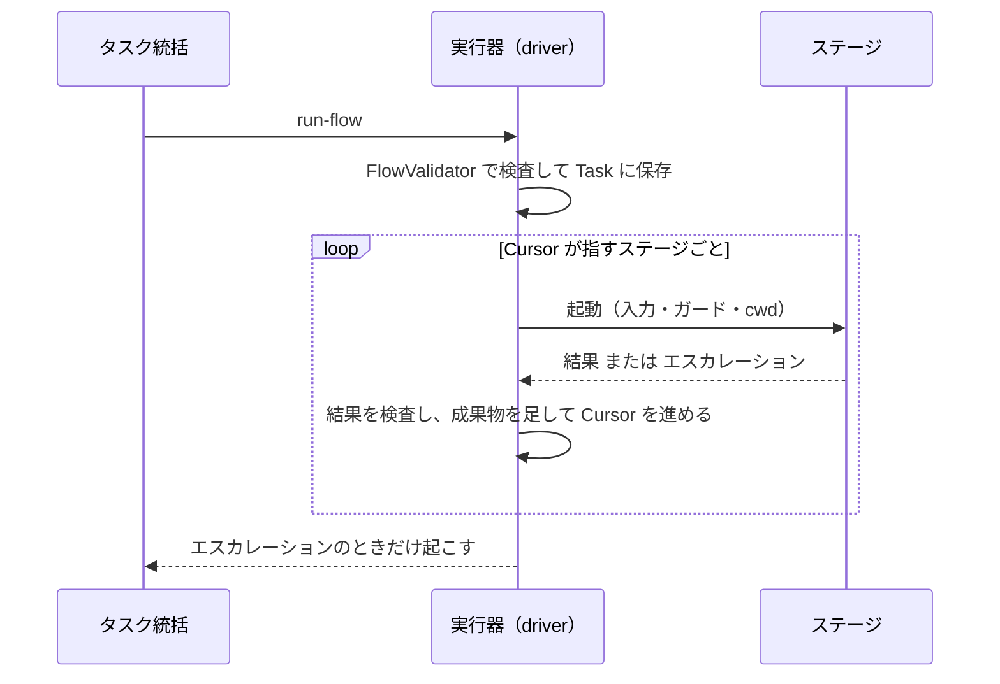

ステージ 1 回は、種類（LLM・決定的・合成）にかかわらず次の 6 段を通る。種類で違うのは ④ だけである。

| 段 | 実行器がすること | Impl の例 |
| --- | --- | --- |
| ① 前提を確かめる | `StageSpec.needs` の成果物が `Task.artifacts` に在るか | `design` が在る |
| ② 実行を記録する | `BeginStage` を出し、HEAD のコミットとセッション id を `StageStarted` に載せて確定させる | 再開とやり直しの基準になる |
| ③ 入力とガードを用意する | 指示書・成果物の在りか・`notes` から入力を組み、`Guard` から書き込みの範囲を決める | テストへの書き込みを止めるフックを設定する |
| ④ 走らせる | 種類ごとのアダプタで実行する | `claude -p` を worktree を cwd にして起動する。プロンプトは標準入力、結果の形は `--json-schema` |
| ⑤ 証拠を集める | 結果の JSON の形を確かめ、`produces` の実物（コミット・ファイル）と検証コマンドの結果を git とファイルから集める。判断はしない | 親からのコミットの数を数える |
| ⑥ 報告する | `ReportStageResult` を出す。完了・失敗・エスカレーションのどれにするかは `Task.handle` が証拠を見て決める（エラーは 1 回やり直し、2 回続けば `stage-errors`） | `designGap` を返したら、Task が `design-gap` を上げる |

**Task はステージの報告を信じない。** 「できました」と返しても、証拠に実物が無ければ完了にしない。証拠を集める（I/O）のは実行器、判断するのは I/O をしない `Task.handle` なので、判断は証拠を組み立てるだけでテストできる。

```python
class LLMStage(Stage):
    def execute(self, ctx, execution):
        return agent_runtime.run(
            prompt=build_prompt(self.spec, ctx),
            cwd=ctx.tree,
            session=execution.session_id,  # --session-id。再開なら --resume
            schema=self.spec.result_schema,  # --json-schema
            guard=self.spec.guard,  # --settings のフックと環境変数
        )


class ProgramStage(Stage):  # Gate・ConfirmRed・Push など
    def execute(self, ctx, execution):
        return self.compute(ctx)  # セッションは無い。② と ⑤ は通す


class CompositeStage(Stage):  # ReviewLoop・DesignLoop
    def execute(self, ctx, execution):
        while True:
            for step in self.subflow(ctx):
                outcome = executor.run_stage(step, ctx)  # 中のステージも ①〜⑥ を通る
                if outcome.is_escalation:
                    return outcome
            if self.done(ctx):
                return Completed(produces=self.spec.produces)
            if self.stalled(ctx):
                return Escalation("stall", hint=...)
            executor.run_stage(self.fix_step(ctx), ctx)
```

- **合成ステージは自分では何もしない。** 中のステージを 1 つずつ実行器に渡すので、中のステージにもそれぞれガードと ⑤ の検査が掛かる。
- **フローを書き直しても、作った成果物は残る。** 書き直したフローは先頭から回り直すが、`tests` などがすでに在れば、それを `needs` に持つステージから並べられる。
- **パニックしたら、走っている `StageExecution` をすべて `interrupted` にして終わる。** 呼び直すと ② のセッションを `--resume` で続け、失敗したら ② のコミットに戻して新しい実行を作る（§9.2）。

## 12. 統括の判断

統括は、ターンの終わりに次のどれか 1 つを JSON で返す（`--json-schema` で形を固定する）。driver は検査を通してから実行し、通らなければ理由を付けて同じセッションに差し戻す。

### タスク統括

| `decision` | 中身 | driver の検査 |
| --- | --- | --- |
| `run-flow` | フロー | `FlowValidator` |
| `escalate` | `needs-replan` / `needs-human` ＋ 理由 ＋ `Pointers` | — |

### ラン統括

| `decision` | 中身 | driver の検査 |
| --- | --- | --- |
| `replan` | 再計画を頼む理由 ＋ きっかけのエスカレーションの id（任意。反映されたときに閉じる）＋ ユーザーの回答の `QuestionId`（上限に達した後だけ） | `replanStreak` が `MAX_REPLANS_WITHOUT_STACK` に達していたら、回答済みの `QuestionId` があるか |
| `insert-task` | `TaskSpec` ＋ `blockedBy` ＋ 引き継ぎ元（任意） | 循環が無い・引き継ぎ元が積まれていない |
| `stop-tasks` | 止める `TaskId` の一覧 | 積み済みのタスクを含まない |
| `apply-plan` | 確定した設計の版 ＋ 止めるタスクと破棄する積んだタスクの一覧（ADDENDUM §3） | 確定した再計画が止める・破棄すると提案したタスクだけ |
| `answer` | 回答 ＋ ユーザーの回答を渡すなら、その `QuestionId`（無ければラン統括自身の回答として残る） | 経路が合っている・`QuestionId` の質問が回答済み |
| `ask-user` | ユーザーへの質問 | — |
| `finish` | 概要 PR を draft から外すか | 全タスクが終端の状態にある |

## 13. 層とポート

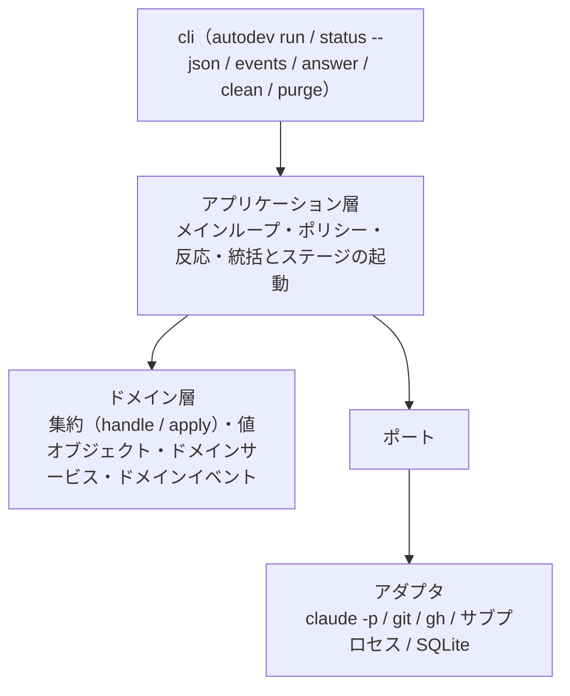

| ポート | 役目 | 知っておくこと |
| --- | --- | --- |
| `AgentRuntime` | LLM のステージと統括を起動・再開・中断する | `ANTHROPIC_API_KEY` などを外して起動する。プロンプトは標準入力から渡す。`--session-id` で id を決め、`--resume` で続ける。利用枠の上限は `RateLimited` として返し、アプリケーション層がパニックにする。止めるときは標準入力に `interrupt` の制御要求を送って result を待ち、一定時間で返らなければ kill する（`interrupt` が効かず止まらないことがある）。defer で止まったセッション（計画ステージの ask）の再開ではプロンプトを渡さない。`interrupt` で止めたセッションの再開では、短い続きの指示を渡す（こちらは実測が無く、実装のときに確かめる） |
| `Git` | ブランチ・worktree・rebase・差分 | — |
| `Forge` | PR・`gh stack link` | 触るのは git 管理タスクのステージだけ。`gh stack` は `trees/overview` から叩く（§11.4） |
| `ProcessRunner` | 検証コマンドを流す | — |
| `EventStore` | `events.db` の `events` への追記と、ストリームごとの読み出し。`checkpoints` の読み書き | 1 つのコマンドのイベントを 1 つのトランザクションで書く。書くのはメインループの接続 1 つだけ（Python の `sqlite3` の接続は、既定ではスレッドをまたげない）。手で書き換えない |
| `RequestBox` | driver の外（`/autodev` の CLI）からの要求を `requests` で受ける | driver が止まっていても足せる。処理したら消す |
| `StatusQuery` | `autodev status --json` が返す、外向けの状態 | `events` を読んで再生し、走っているステージの進み具合（`progress/`）を混ぜる。HUD と `/autodev` はこれだけを読む |

終了コード: 0 = ランを終えた（何本積んだか・止めたかは `status --json` で見分ける。何も積まずに終えたランも 0）/ 1 = 起動できなかった（既にあるラン名に `--instruction` を付けて呼んだときも）/ 3 = パニック（原因を取り除いて同じコマンドで呼び直す）/ 4 = 回答待ちで、進められるタスクが無い（回答を置いて同じコマンドで呼び直す）。2 は使わない（ARCHITECTURE §9）。既にあるラン名で `autodev run` を呼ぶと、`StartRun` を出さずに再開する。

## 14. ランディレクトリ

```
~/.local/state/autodev/<ラン名>/
  events.db             SQLite。events（状態の正本）・checkpoints・requests（§7.4）
  questions/            QuestionPosted を受けた反応が書く質問のファイル（/autodev が Monitor で見る）
  answers/              計画ステージの ask への回答（<tool_use_id>.json。ガードのフックが見る。questions/ と分ける）
  progress/             走っているステージの進み具合（<ExecutionId>.json。正本ではない・使い捨て）
  codemap.md            Plan が返したコードマップ（driver が書き出す）
  design/v<版>.md       設計ファイルの版
  tasks/<TaskId>/
    results/            ステージの結果の JSON（Pointers が指す先。書くのは driver だけ）
  trees/overview/       概要ブランチの worktree（初回の計画タスクの cwd。gh stack を叩く所）
  trees/stack-top/      再計画のたびに切り直す、スタックの一番上の読むためだけの worktree（detached。Replan の cwd）
  trees/<TaskId>/       実装タスクの worktree
  logs/                 claude の出力そのまま
  guard.json            ガードのフックの設定（claude --settings で渡す）
```

## 15. この文書で新たに置いた案

会話で合意していない点。知見の台帳と照らしながら決める。

- 状態を変えるのにイベントが無かったコマンドに、イベントを足した（`StackRequestTaken`・`FixCounted`・`NoteAdded`・`FindingCommented`・`TaskMarkedStacked`）。衝突の記録は `RecordConflict` → `RebaseConflicted` に分けた
- 未処理のエスカレーションを `OpenEscalation` として集約に持たせ、再開したときに取りこぼさない
- 計画ステージの ask（defer）を表すため、`StageExecution` に `deferred` と `abandoned` を、Task に `StageDeferred` を足した。回答はフックが見る `answers/<tool_use_id>.json` に書き、書き終えた反応が `ResumeStage` を渡す（§11.1・§7.4）
- 反応が、副作用を終えた後の続きをコマンドにして渡せるようにした（§7.4）
- 報告で cursor を進めない `StageReported`、Gate の不合格を失敗と分ける `GateFailed`、回答以外でエスカレーションを閉じる `CloseEscalation` / `EscalationClosed` を足した（§6.2・§6.7）
- 再計画で移した元の指摘の状態に `carried` を足した（§6.3）
- 回答の出どころを持つ `Decision` を足し、`HumanDecision` をユーザーの回答だけにした（§4・§8.2）
- 設計のラウンドの上限への回答で数を 0 に戻す `ResetDesignRounds` / `DesignRoundsReset`、再計画で範囲が変わったタスクに知らせる `ChangeScope` / `ScopeChanged` を足した（§6.2・§6.4）
